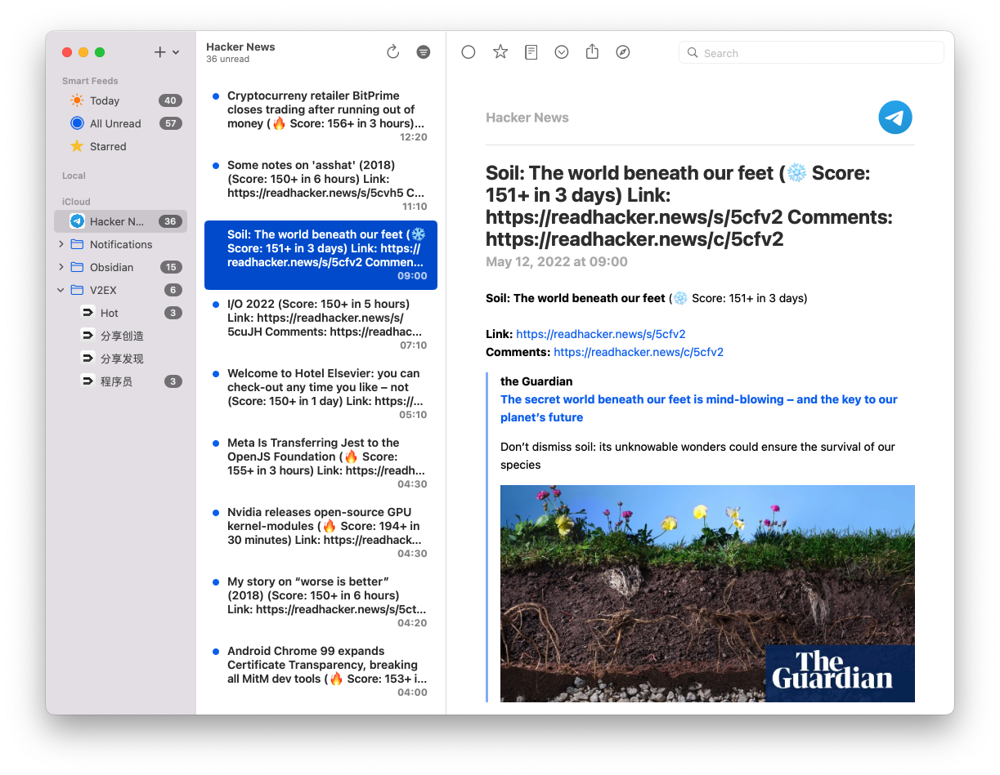
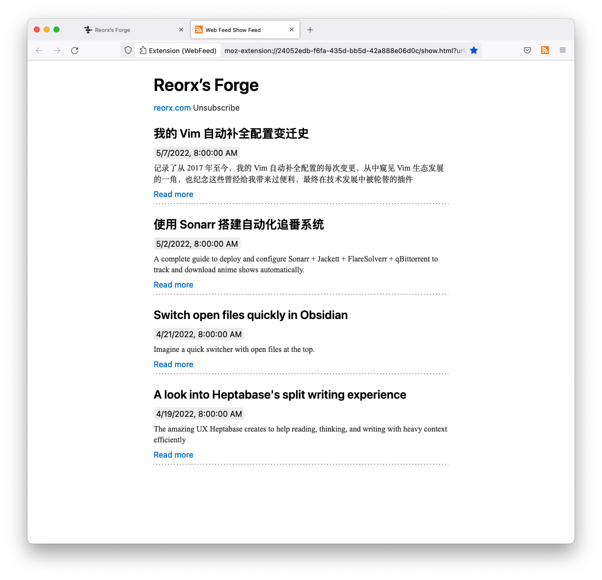

## 不算成功的开端

我曾经是一个糟糕的 RSS 用户。

早在 Google Reader 流行的时期，我就热衷于将我感兴趣的资讯网站和博客订阅到 Google Reader 中 [^1]，期盼着能从这些信息中获得有价值的东西，却总是因为懒或者忘了而不能及时查看。随着未读数的增多，焦虑感越来越强烈，最后索性不再打开阅读器，安慰自己以后总会去看的，只要订阅了就行，沉浸在虚假的满足感中。

我就像一个喜欢屯书的人，在 RSS 阅读器这个书架上摆满了放上去就再也没动过的书[^2]。

后来我认识到，自己得了信息资源的囤积病，经过长时间的反思后，我下决心清理 RSS 订阅源。

我删除了所有资讯类网站，只留下个人博客；去掉长期未更新的，并重新审视每个博客是否是我真正想要去阅读的。最终留下大约 30 多个 RSS 源，每周的更新量被控制在 10-20 之间。自此以后，我才真正做到阅读每篇更新，也没有再因为未读数量而焦虑了。

再之后，我看到许多人分享自己的 RSS 使用经验[^3]，将 RSS 作为获取信息的效率工具，聚合和筛选资讯，甚至成为 all-in-one 的信息输入渠道。这些文章偶尔会让我蠢蠢欲动，但因担心摄入压力过大而重蹈覆辙，我总是很快熄灭了尝试的想法。

就这样，我从一个糟糕的 RSS 用户，变成了一个克制但低效的用户，不再每天使用，只在有提醒时打开看看博客的更新。生活继续。

## 重新发现 RSS

最近我开始经常逛 V2EX 。我最早的活跃时期是 2010~2013，后来因为沉迷工作，和陌生人的交流欲降低，兴趣转移到 Twitter。今年自由工作后，思维又活跃起来，回过头来发现经过 10 年时间，V2EX 依然是国内最好的开发者社区。

V2EX 有着丰富的 RSS 支持，在 [V2EX  ›  提醒系统](https://v2ex.com/notifications) 页面可以获得提醒的 RSS 订阅源。为了及时收到消息通知，我开始琢磨如何利用这一功能，于是整理了下需求：

- 直接订阅 RSS，不需要借助第三方服务
- 支持 macOS 和 iOS，同步未读条目
- 简洁清爽的界面

很快，我锁定了完美满足这三点的 [NetNewsWire](https://github.com/Ranchero-Software/NetNewsWire)



NetNewsWire 发布于 20 年前，是 macOS 上历史最悠久的 RSS 阅读器。我虽然很早就知道它，却一直没有尝试，使用的是更受追捧的 Reeder，但 Reeder 最近的几次付费更新有些令人失望，没有什么有趣的变更，我也厌倦了它那软绵绵的 UI 风格。

NetNewsWire 让我眼前一亮，它使用 macOS 原生的 UI 组件，适应起来没有任何障碍。打开就算经典的三栏布局，没有多余的选项，让我感觉真正在使用一个信息组织工具，而非另一个漂亮的玩具。

Minimal and no distraction, 这是我对 NetNewsWire 的整体印象。我很快就爱上了它，逐渐把我其他几个正在摄取的信息源也添加了上去。

现在我的 RSS 订阅结构是这样的：

- V2EX
    - 节点

        我只对一些特定的节点有逐条浏览的兴趣，V2EX 每个节点都可以输出 RSS，只需要将 `https://v2ex.com/feed/{node}.xml` 的 `{node}` 替换为节点的英文名即可。
        - [分享创造](https://v2ex.com/feed/create.xml)
        - [分享发现](https://v2ex.com/feed/share.xml)
        - [程序员](https://v2ex.com/feed/programmer.xml)
    - [Top Topics](https://rsshub.app/v2ex/topics/hot)

        V2EX 本身没有最热话题的 RSS，幸运的是，RSSHub 提供了一个公开的源。
- [Hacker News](https://rsshub.app/telegram/channel/hacker_news_feed)

    Hackers News 的信息量太大，不适合直接订阅，好在 [hacker_news_feed](https://t.me/hacker_news_feed) 这个 Telegram 频道对内容进行了筛选，只推送分数大于 100 的条目。同样要感谢 RSSHub，用它将 Telegram 频道转换成了 RSS feed。
- Obsidian

    作为 Obsidian 重度使用者和插件维护者，我非常关注社区的动向。Obsidian 社区信息主要来自于[官方 Discourse 论坛](https://forum.obsidian.md/)和 [subreddit](https://www.reddit.com/r/ObsidianMD/)。两者都是通过在 URL 后面加上 `.rss` 即可获得订阅源（如 [Showcase](https://forum.obsidian.md/c/share-showcase/9.rss) 和 [ObsidianMD](https://www.reddit.com/r/ObsidianMD.rss)）
- 提醒
    - V2EX
    - [Reddit Unread](https://www.reddit.com/prefs/feeds/)

经过一段时间的使用，我开心地发现，自己已经能每日有效摄入上百条信息而没有焦虑。我通常是在碎片时间打开手机观看，比如早上蹲马桶时、运动后和睡前。当遇到有趣的信息时，就点击 Star 收藏，如果特别需要关注或后续调研，就在 TickTick 添加一个对应的 TODO 项。要是忙起来积攒了许多未读，我就快速划过快速 Star，然后一次性 Mark All as Read。

## 进一步优化

V2EX 的程序员节点中经常出现 Java 相关的话题，但我的技能体系与 Java 无关，因此我想过滤掉这些对我而言无用的信息。

NetNewsWire 有一个相关的 [issue](https://github.com/Ranchero-Software/NetNewsWire/issues/1864)，却并没有实现。Inoreader 和 Tiny Tiny RSS 等聚合器虽然支持，但我希望保持目前直接订阅原始 RSS 源的工作流，不想引入另一个工具增加复杂度。怎么办呢？

我决定自己开发一个轻量的 serverless 服务: [rss-filter](https://github.com/reorx/rss-filter)。（现在还没有完成，所以读者朋友们可以不急着 star 鼓励。）

rss-filter 的大致设计如下：

- 部署在 serverless 平台
- 通过 url 参数使用
    - `rss`: rss url
    - `exclude_text[]`: regex to exclude items from text (title, description, content)
    - `exclude_text[]`: regex to include items from text
        - if both include and exclude are provided, apply include before exclude.
    - `cache_seconds`: seconds to cache the result
    - `debug`: if true, return a json to debug
    - `token`: prevent abuse by anonymous users
    - `full_content`: fetch full content of each item

我设想  rss-filter 完成后，只需要简单的设定参数即可创造一个过滤后的 RSS 源。比如我想要从程序员节点过滤掉 Java 相关的条目，那么新的 RSS 源应为:

```
https://rss-filter.reorx.com/filter?rss=https%3A%2F%2Fv2ex.com%2Ffeed%2Fprogrammer.xml&exclude_text=java%7Cspring+%3Fboot%7Clog4j&cache_seconds=600
```

其中 `exclude_text` 为 `java|spring ?boot|log4j`，用正则匹配多种不同的关键词。

## 一些思考

RSS 的用法因人而异，这篇文章主要目的是分享我个人的探索过程，希望带给读者一些借鉴。选择适合自己的，不要盲目追求别人看起来「高效」「强大」的工作流。

前几天 [涛叔](https://taoshu.in/) 向我推荐了他的 [WebFeed](https://taoshu.in/webfeed/web-feed.html) 插件 (for Firefox)，它把浏览器变成 RSS 阅读器，并能自动发现网站的 RSS 源。



我很喜欢它的 Web 与 RSS 一体的使用体验，这让我开始思考一个问题，为何近些年来 RSS 逐渐式微，主流浏览器厂商没有做任何相关的支持[^3]，只有少部分开源爱好者还在坚持使用并为 RSS 社区做出贡献。

我能想到的答案之一是，商业公司在控制和引导互联网生态，将公开流量变成自己的私域流量。而主流浏览器背后正好也都是商业公司。想象一下，如果所有内容都来自于独立博客的 RSS，作者可以直达受众，那内容分发市场的商业价值就没他们什么事了，更不用说将用户绑定在自己的平台上。

另一个原因可能是内容农场的肆虐，独立创作者很难靠自己将原创内容推广，内容农场却通过 SEO 技术将自己洗稿后的文章顶在了搜索结果的前面。关于这个问题，少数派有一篇文章值得一读： [少数派思考 007：关于 RSS](https://sspai.com/post/71637)。

这是一场没有硝烟的战争，商业巨头们就像[地理大发现](https://zh.wikipedia.org/wiki/%E5%9C%B0%E7%90%86%E5%A4%A7%E5%8F%91%E7%8E%B0)时期的西方文明，在开放互联网的蒙昧之地大肆开拓殖民地。国外近些年来还有 Medium、Newsletter 等多种形式的内容分发模式百花齐放，国内已经被头条、微信、微博、百度完成瓜分和镇压，沦为没有生机的焦土。

但即使在这样的环境下，我还是希望能成为一个纯粹的内容创作者，为别人带来启发和帮助，为自己实现学习和思考的价值。

欢迎你来订阅我的博客:


https://reorx.com/feed.xml


最后推荐一篇文章 [RSS Feed Best Practises](https://kevincox.ca/2022/05/06/rss-feed-best-practices/)， 如果你也是一名维护自己博客的 webmaster，可以了解下如何优化自己网站输出的 RSS。

比如加上 `<link>` tag 使 RSS URL 可以被主流工具自动发现:

```
<link rel=alternate title="Blog Posts" type=application/atom+xml href="/feed.atom">
```

比如最好在 RSS 中附带全文：

> It is generally recommended to provide the full content of your posts in the feed. This is what most readers prefer. Atom has both `<summary>` element for readers that prefer it. For RSS and the Atom `<content>` element the full article should be included.


[^1]: 当时使用了一款 Chrome 插件，会自动检测当前网页可用的 RSS 源，如果有的话，会在地址栏里显示 RSS 图标，点击图标就能看见 Google Reader 中的目录分类，勾选即是将 RSS 订阅到指定分类中。我非常喜欢这个插件，可惜后来 Chrome 去掉了地址栏图标的 API，再也无法实现相似的功能了。

[^2]: 亦像一个喜欢在 Steam 屯游戏的人，买了上千个游戏，但每天玩的还是 Dota 2, CS GO, GTA 5

[^3]: Chrome 背后的 Google，在手机 app 上实现了自己的 [Discover Feed](https://support.google.com/websearch/answer/2819496?hl=en&co=GENIE.Platform%3DAndroid) ; Edge 有一个叫 [Collections](https://support.microsoft.com/en-us/microsoft-edge/organize-your-ideas-with-collections-in-microsoft-edge-60fd7bba-6cfd-00b9-3787-b197231b507e) 的功能，可以 “Follow” 一个网站的更新。那为什么我要说没有支持呢？因为这些都不是真正的 RSS，它们背后的技术可能还是 RSS ，但在产品上都刻意忽略 RSS、强调自己的名词。他们各造轮子实现自己的私有功能，仍是为了将用户关在自己的信息茧房中。