作为一个懒人，我很少折腾 self-hosted 服务，对于追番这种娱乐化的需求，更是有什么用什么将就度日。所以许多年来一直是用 Bilibili 观看新番，中途也尝试过 ebb.io 这类小众服务，但最后都因为连接不畅或数据滞后等原因放弃了。

去年为了实现 Home Assistant 家电自动化 ([tweet](https://twitter.com/novoreorx/status/1450334462177263618))，我购买了一台 QNAP NAS，使家里有了 24 小时常驻的 Linux server 和 Docker host。年初由于 Bilibili 迟迟不上架《鬼滅之刃遊郭篇》，我又在 NAS 上安装了 Plex，将从 [dmhy](https://share.dmhy.org/) 手动下载的影片串流到电视上观看。最近又逢 4 月新番播出，想到家里的基础设施逐渐完备，便动起了搭建自动追番系统的心思。以下便是对这次尝试的记录和总结，希望能帮助有同样需求的人解决问题、节省时间。

## 使用 QNAP Download Station

本着尽量不增加新的系统来解决问题的思想，我首先研究了 QNAP 的下载器 Download Station，发现它自带 RSS 订阅功能，在进行一些手动配置后，即可完成自动追番和下载。

如果这一章节不感兴趣，你也可以直接跳到 [使用 Sonarr 和它的朋友们](#使用-sonarr-和它的朋友们)。

### 1. 找到番剧的 RSS URL

[Bangume Moe](https://bangumi.moe/) 是我经常使用的资源站，它提供基于 tag 的 RSS 搜索功能，可以非常精确地定位到番剧在特定字幕组、语言、分辨率瞎的视频发布链接。

-  首先在右上角的搜索框中输入想看的番剧名称，这里我使用「夏日重现」作为例子，可以看到下方自动匹配了 `Summertime Render` 这个 tag。
    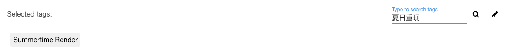
- 点击这个 tag，搜索结果中会出现许多不同字幕组发布的资源，我们选择其中一个字幕组「喵萌奶茶屋」的资源，在 Torrent Details 中，可以看到其标注的 tags，有 `喵萌奶茶屋`, `720p`, `chs-jpn` 等，妥善使用这些 tags 能够帮助我们缩小搜索结果范围
    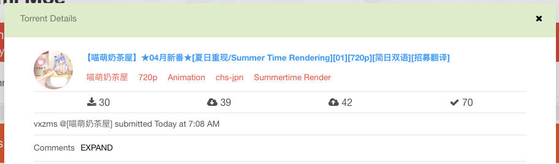
- 将 `喵萌奶茶屋`, `chs-jpn` 添加到 Selected tags 中，现在我们一共有 3 个 tags，搜索结果缩短到了 2 条，已经非常清晰了，点击右上角的 RSS 图标即可得到用于订阅的链接。（美中不足的是，喵萌奶茶屋将 1080p 的资源错标为了 `720p`，不过这点我们可以在后面的下载管理器中解决）
    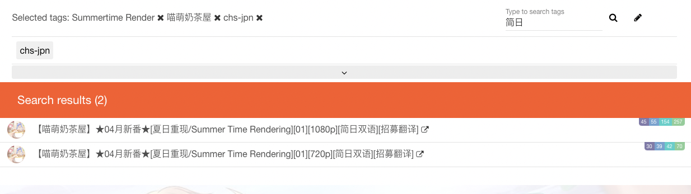

### 2. 将 RSS URL 添加到下载器

RSS 订阅是许多下载管理器的通用功能，如 Synology、qBittorrent 也都具有，使用方式与 Download Station 大同小异。

- 打开 RSS Download Manager，将上一步得到的订阅链接复制到 Feed URL 中。Label 填写番剧名称，两个 Location 根据自己 NAS 的目录结构选择。点击 Apply 添加。
    
- 添加完成后，打开 Filter Settings，它可以用于进一步过滤 RSS 返回的结果，避免下载不需要的资源。之前在进行资源搜索时，我们没能通过 tag 过滤掉 720p 的结果，在 Filter Settings 中，我们选择 1080p，这样 720p 就被忽略了。
    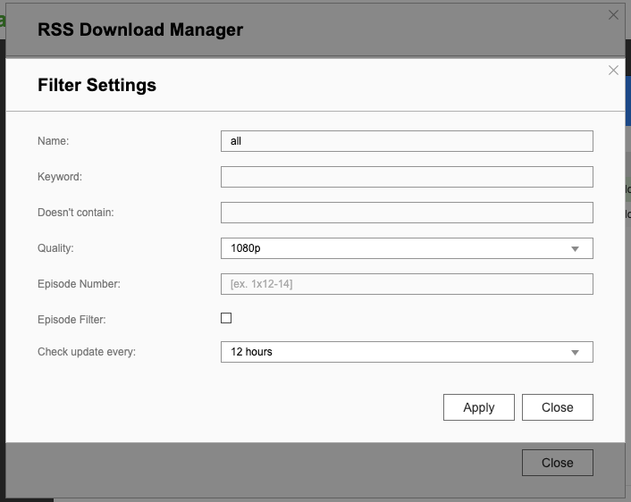
- 回到主界面，刷新添加的 RSS，可以看到两条结果中只有 1080p 被加入到下载列表。Status 为 Finished 代表下载完成，New 代表新添加到 RSS，但不在下载列表中。

### 小结

**Pros**
- 无需配置和增加新系统
- 操作过程透明清晰，可控性强

**Cons**
- 步骤较为繁琐，需要在多个服务之间切换
- 下载的文件因为不符合 Plex 的格式需求，需要手动重命名才能在 Plex 上观看。但如果你使用 DLNA 这类基于文件系统定位视频的方式，倒是可以忽略这个缺点。

## 使用 Sonarr 和它的朋友们

Download Station RSS 虽然解决了基本的温饱问题，但与真正的自动化之间显然还有很大差距，如果你想充分利用 NAS 的功能，在家庭多媒体设施上更进一步，请继续向下阅读，走进 Sonarr 和它的朋友们的世界。

### Sonarr

 > Sonarr is a PVR (Personal Video Recorder) for Usenet and BitTorrent users. It can monitor multiple RSS feeds for new episodes of your favorite shows and will grab, sort and rename them.

[Sonarr](https://wiki.servarr.com/sonarr) 是一个 PVR 系统，它可以监控多种信息源的剧集发布信息，对剧集进行自动下载、刮削和重命名。

Sonarr 是 Sick Beard 的继任者，Sick Beard 基于 Python 开发，曾经是最著名的 PVR 系统，但后来逐渐式微，后续虽然有 Sick Gear 等 fork，但最终都没能满足人们日益增长的看片需求，最后被一群 C# 爱好者们开发出 Sonarr 给替代了。经过多年发展，Sonarr 的软件质量趋于成熟和稳定，成为构架自动化的家庭多媒体中心不可缺少的组件。

Sonarr 一开始就以多系统低耦合的方式进行设计，这大大降低了代码的复杂度，使其更易于维护，也为其繁盛的社区发展提供了基石。为了满足不同的用户需求，Sonarr 的作者们开发一系列以 `rr` 或其他双字母结尾的工具，以至于这种命名方式成为了 Sonarr 生态圈的一个标识和事实标准。

### Jackett

> Jackett works as a proxy server: it translates queries from apps into tracker-site-specific http queries, parses the html or json response, and then sends results back to the requesting software.

[Jackett](https://github.com/Jackett/Jackett) 是一个代理，用于将 Sonarr 等系统对剧集信息的查询请求转译成各种 torrent tracker/indexer （即资源发布站）所支持的请求。Jackett 的产生是 Sonarr 社区架构合理性的一个体现，它接管了适配不同 indexer 接口的脏活累活，使 Sonarr 可以专注在任务调度和剧集管理上。

Jackett 既然被用作资源查询的网关，实现缓存功能就顺理成章了，这样一方面可以应对 Sonarr 频繁的查询需求，另一方面也减少了 indexer 站点的负载量，实现了双赢。因此虽然它不是一个必须的组件，但我强烈建议每个使用 Sonarr 的用户都安装它。

### FlareSolverr

> FlareSolverr is a proxy server to bypass Cloudflare and DDoS-GUARD protection.

[FlareSolverr](https://github.com/FlareSolverr/FlareSolverr) 也是一个代理，它帮助 Jackett 解决向 indexer 的请求能否成功的问题。一些 indexer 为了保护自己免于 DDoS 攻击或减少爬虫请求，会使用 Cloudflare 或一些其他的安全防护服务，如果不做处理，直接请求很可能因触发人机验证而失败。FlareSolverr 就是为解决这类问题诞生的。

在 Jackett 中添加新的 indexer 时，会根据站点情况提示是否需要接入 FlareSolverr 以绕过站点的保护措施。
### qBittorrent

大部分影视资源都使用 BT 协议进行点对点传输，因此我们也需要一个 BT 下载器，qBittorrent 就是一个很好的选择，它的功能非常全面，且与 Sonarr 有很好的接入支持。如果你已经运行了其他下载器如 Aria2，甚至 QNAP/Synology 自带的 Download Station，那么你也可以参考 [Sonarr 支持的下载器列表](https://wiki.servarr.com/sonarr/supported#downloadclient)，尝试进行配置。（我并没有成功使 Sonarr 和 QNAP Download Station 协同工作起来）

### 部署说明

各个组件介绍完毕，现在让我们进入正题，了解如何配置和部署整个 Sonarr 服务组。

Sonarr 现代化地提供 Docker 镜像的部署方式，因此这个章节将会围绕 Docker 相关的技术进行说明。虽然 [Qnapclub](https://www.qnapclub.eu/en/qpkg/652) 也有 Sonarr 的安装包，但经过一番糟心的尝试，最终我只得出一个结论，那就是以后部署任何服务，能 Docker 就尽量 Docker 吧。


- error after install: `MediaInfo Library could not be loaded libmediainfo.so.0 assembly:<unknown assembly> type:<unknown type> member:(null)`
- dependencies
    - [Qmono](https://www.qnapclub.eu/en/qpkg/193): the package is crazily 3GB in size
    - [MediaInfoCLI](https://www.qnapclub.eu/en/qpkg/712)
        - https://forum.qnap.com/viewtopic.php?t=147702
        - this is not useful at all


我们的部署方案的基本原理是在自己的电脑上通过 Docker 和 Docker compose CLI 对远端 NAS 上的 Docker host 进行操作。这要求读者具备基础的 Docker 相关的知识。

QNAP/Synology 等 NAS 系统提供的 Docker host 与标准实现基本没有差异，因此我们可以直接使用 Docker 官方软件包提供的命令行工具。你也可以使用 NAS 提供的图形化界面，但一则那样在部署多个服务时非常不便，二则如果你了解了如何使用 Docker compose 部署，自然也可以反推到图形化界面的操作方式上。

#### Docker context

为了与本地的 Docker host 区分开，我们要为 NAS 上的 Docker host 创建一个新的 [context](https://docs.docker.com/engine/context/working-with-contexts/)。

> `harrogath` 是我的 NAS 的 hostname，可以使用 IP 代替

```bash
# 创建 context
docker context create harrogath

# 更新 context 的配置信息
docker context update harrogath --docker "host=tcp://harrogath:2376,ca=$HOME/.docker/ca.pem,cert=$HOME/.docker/cert.pem,key=$HOME/.docker/key.pem"
```

QNAP 的 Docker 需要通过证书来访问，因此要在 Container Station 的设置中下载证书。


完成 context 创建后，通过 `use` 命令切换到 context，之后所有的 Docker 命令都是与 NAS Docker 进行通讯

```yaml
docker context use harrogath
docker context ls
NAME                TYPE                DESCRIPTION                               DOCKER ENDPOINT                               KUBERNETES ENDPOINT   ORCHESTRATOR
default             moby                Current DOCKER_HOST based configuration   unix:///var/run/docker.sock                                         swarm
harrogath *         moby
```

#### Images

目前主要有两个组织在维护 Sonarr 及相关服务的 Docker 镜像，[linuxserver.io](https://www.linuxserver.io/) 和 [hotio.dev](https://hotio.dev/), 我选择前者作为本次部署的镜像源。下面是使用到的镜像列表，可以在其页面上查看镜像的使用说明。

- [linuxserver/sonarr - Docker Image | Docker Hub](https://hub.docker.com/r/linuxserver/sonarr)
- [linuxserver/jackett - Docker Image | Docker Hub](https://hub.docker.com/r/linuxserver/jackett)
- [linuxserver/qbittorrent - Docker Image | Docker Hub](https://hub.docker.com/r/linuxserver/qbittorrent)
- [flaresolverr/flaresolverr - Docker Image | Docker Hub](https://hub.docker.com/r/flaresolverr/flaresolverr)

#### Hierarchy

Sonarr 和它的朋友们需要对 NAS 的存储进行读写，因此在运行服务之前，首先要理解并设计一个好用的目录结构。

我们需要在 NAS 上创建一个 AppData 目录，作为容纳所有服务产生的文件的根目录。AppData 所在的 Volume 建议选择适合存放大量媒体数据的精简卷 (Thin Volume)。

```
AppData
├── jackett
│   ├── config
│   └── downloads
├── qbittorrent
│   └── config
└── sonarr
    ├── config
    ├── downloads
    ├── media
    ├── torrents
    └── usenet
```

在 AppData 之下，依次为 sonarr, jackett, qbittorrent 创建目录，每个目录下必须有 `config` 子目录，用于存放配置文件。flaresolverr 由于是纯网络代理服务不需要对应目录存在。

下面对各个服务的 NAS 目录与容器内目录的映射关系进行说明

> 表示为 `NAS Directory -> Container Directory`

- **sonarr**
    - `sonarr/config -> /config`: 配置文件
    - `sonarr -> /data`: 数据文件，可在 Sonarr 管理界面向下创建子目录
- **qbittorrent**
    - `qbittorrent/config -> /config`: 配置文件
    - `sonarr -> /data`: 数据文件，与 sonarr 保持一致，以便 sonarr 在重命名或移动文件时可以直接使用 qbittorrent 返回的文件路径
- **jackett**
    - `jackett/config -> /config`: 配置文件
    - `jackett/downloads -> /downloads`: 默认种子文件下载路径

#### Compose file

以我正在使用的 `docker-compose.yml` 文件作为示例，你可以复制下来修改自己的版本，只需要将 `/share/CACHEDEV2_DATA/Misc/AppData` 替换为自己在 NAS 上创建的 `AppData` 路径即可。

端口的配置需要额外注意，这份配置中我尽量保持各服务默认配置端口不变，若与已有服务冲突，修改到未被占用的端口即可。例如 QNAP 自带的 Download Station 已占用 6881 端口，因此我将 qbittorrent 修改到了 16881 端口。

```yaml
version: '3'
services:
  sonarr:
    image: linuxserver/sonarr
    ports:
      - 8989:8989
    volumes:
      - /share/CACHEDEV2_DATA/Misc/AppData/sonarr/config:/config
      - /share/CACHEDEV2_DATA/Misc/AppData/sonarr:/data
      - /etc/localtime:/etc/localtime:ro
    environment:
      - PUID=1000
      - PGID=1000
      - TZ=Asia/Shanghai
    restart: unless-stopped
  jackett:
    image: linuxserver/jackett
    ports:
      - 9117:9117
    volumes:
      - /share/CACHEDEV2_DATA/Misc/AppData/jackett/config:/config
      - /share/CACHEDEV2_DATA/Misc/AppData/jackett/downloads:/downloads
    environment:
      - PUID=1000
      - PGID=1000
      - TZ=Asia/Shanghai
    restart: unless-stopped
  qbittorrent:
    image: linuxserver/qbittorrent
    environment:
      - PUID=1000
      - PGID=1000
      - TZ=Asia/Shanghai
      - WEBUI_PORT=8080
    volumes:
      - /share/CACHEDEV2_DATA/Misc/AppData/qbittorrent/config:/config
      - /share/CACHEDEV2_DATA/Misc/AppData/sonarr:/data
    ports:
      - 8080:8080
      - 16881:6881
      - 16881:6881/udp
    restart: unless-stopped
  flaresolverr:
    image: flaresolverr/flaresolverr
    environment:
      - LOG_LEVEL=info
      - LOG_HTML=false
      - CAPTCHA_SOLVER=${CAPTCHA_SOLVER:-none}
      - TZ=Asia/Shanghai
    ports:
      - 8191:8191
    restart: unless-stopped
```

#### Run

一切准备就绪，执行以下命令:

```
docker compose up
```

这会启动所有服务并 attach 到终端输出日志，方便查看服务的运行日志。等确认所有服务稳定运行后，加上 `-d` 参数使其运行在后台。

```
docker compose up -d
```

### 使用说明

下面对各个服务的 Web UI 的使用方法进行说明，以我的 NAS hostname  `harrogath` 为例展示服务的访问地址。

#### Jackett

打开 `http://harrogath:9117`, Jackett 的界面展示如下:


使用方式非常简单，Jackett 已经将这个世界上绝大部分 indexer 都内置了，只需要点击 Add indexer 搜索并添加即可。除了部分有访问限制的 indexer 需要配置外，基本上都可以一路点击确认完成添加。之后在 Sonarr 中对接时，需要复制订阅 URL 和 API key，参照截图中所示即可。

我目前使用了 4 个 indexer，其中 Bangumi Moe 和 dmhy 用于下载动画番剧，EZTV 和 RARBG 用于下载美剧。

为了使 FlareSolverr 发挥作用，我们还需要将它的 URL 填在最下方的配置中，然后点击 Apply server settings 保存生效。
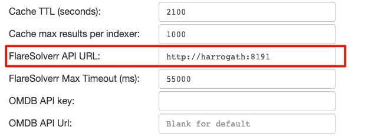

#### qBittorrent

打开 `http://harrogath:8080`，使用默认用户名密码 `admin:adminadmin` 登录。

打开 Tools » Options，将 Default Save Path 修改为 `/data/downloads`。这样做的目的是为了使 qBittorrnet 所记录的文件路径与 Sonarr 保持一致，以便不需要额外配置就能使 Sonarr 的重命名功能正常工作。若你不希望修改下载路径，或使用的是其他下载器，可以参考 [Remote Path Mappings](https://trash-guides.info/Sonarr/Sonarr-remote-path-mapping/) 来解决路径不一致的问题。
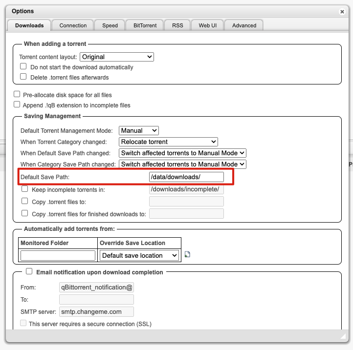

在 Options 中切换到 BitTorrent 选项卡，将 Seeding Limits 下的 "then" 修改为 "Pause torrent"，这是为了避免 Sonarr 在删除种子时产生冲突。"When ratio reaches" 代表做种分享资源的比率。BT 协议提倡共享精神，既然从别人那里获取到自己想要的资源，理应做出回馈。如果你担心硬盘过度损耗，可以将比率降低。(*也可以修改为 0 关闭做种功能，如果克服了道德感的约束*)
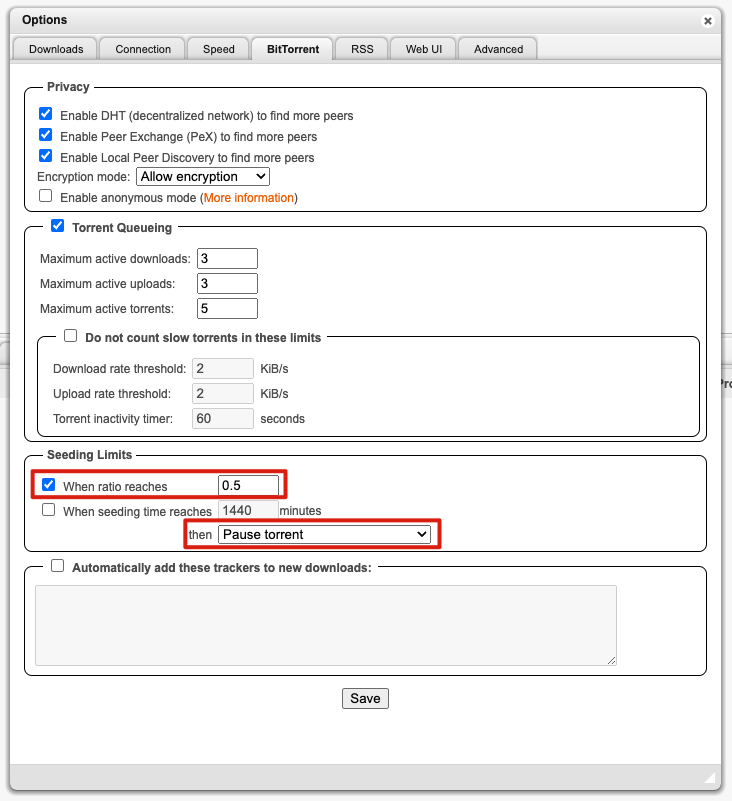

#### Sonarr

终于到了追番大计最核心的组件——Sonarr，但先不要急，在添加番剧前，还有一些设置要做。

- Indexers
    - 将先前在 Jackett 中添加的 indexers 逐个对接到 Sonarr，使用 Torznab 协议。
        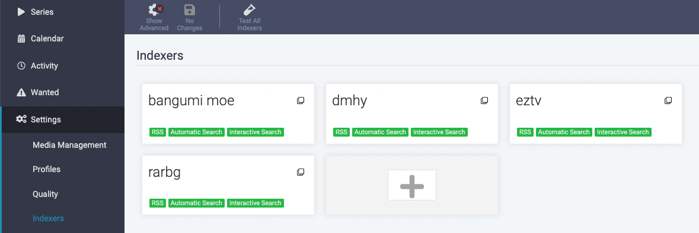
    - Bangumi.moe 的配置展示，URL 和 API Key 都是从 Jackett 中复制过来。需要注意的是， Categories 是影视剧的分类，应该留空，而在 Anime Categories 中勾选所有与番剧相关的分类项。
        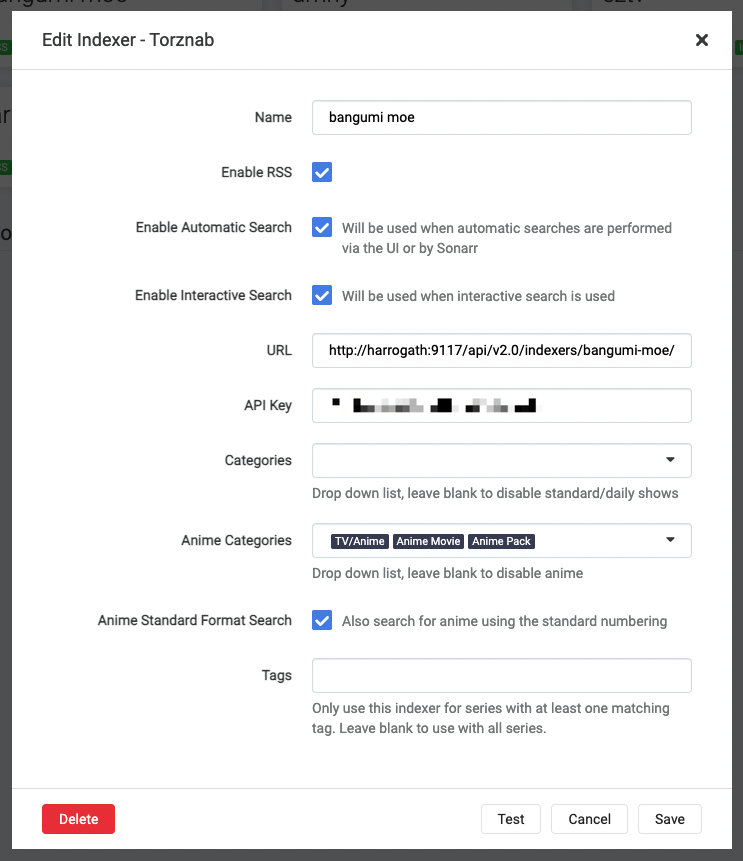
        - 若不确定自己要搜索在资源属于哪个分类项，可在 Jackett 中使用 Manual Search 来确认
            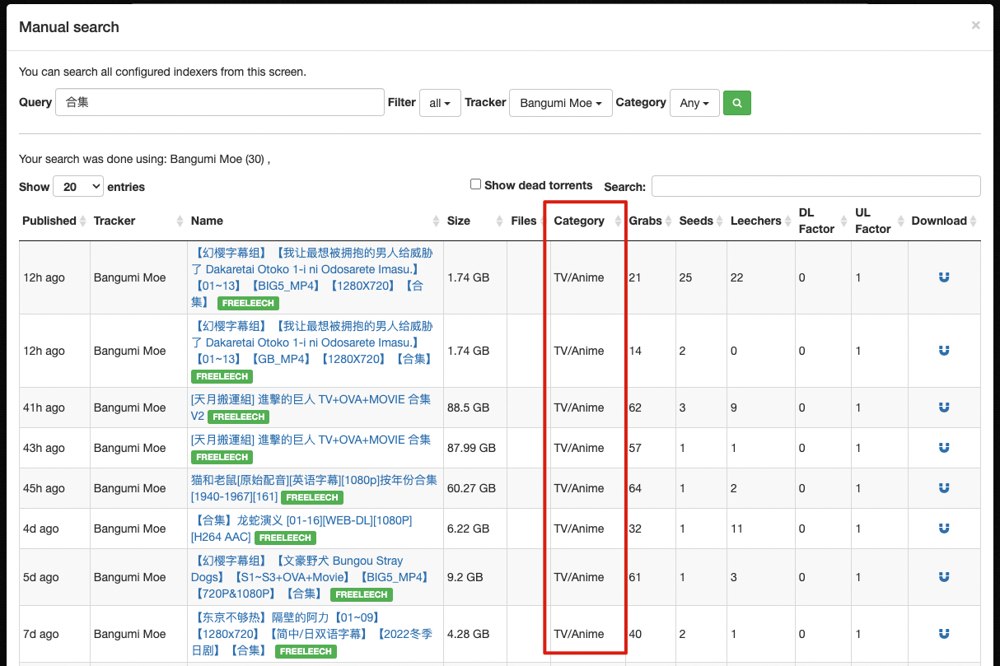
    - rarbg 的配置展示，由于 rarbg 是影视剧 indexer，我们需要在 Categories 中勾选分类项而将 Anime Categories 留空
        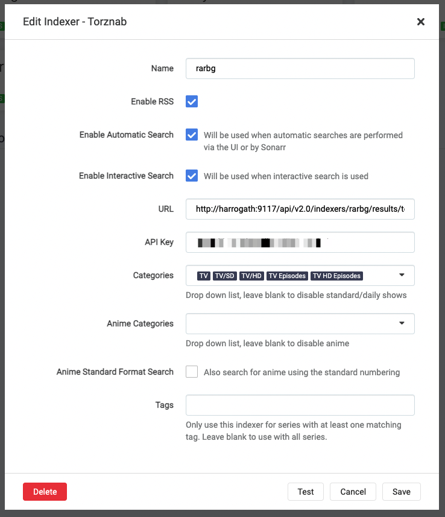
- Download Clients
    - qBittorrent 配置展示。Host 最好填写 IP，使用 hostname 可能会失败。
        
- Media Management
   这个设置关系到下载的文件能否被 Plex 或其他 media server 识别，但别被眼花缭乱的设置项吓到， 我们只需要关心下图红框圈起的部分。
    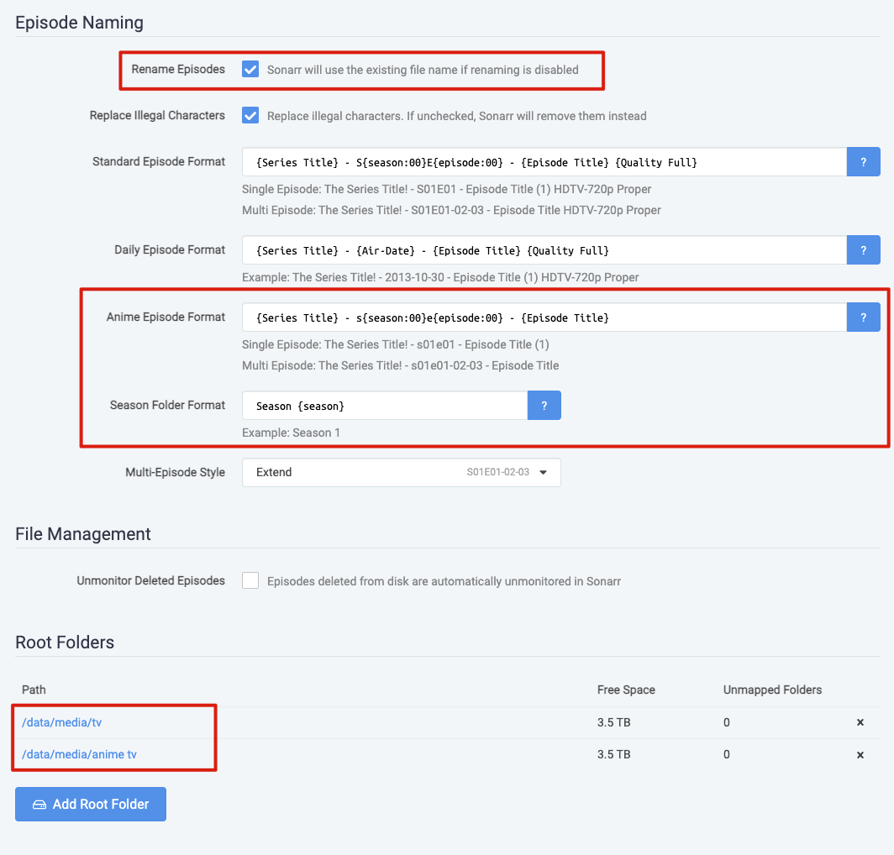
    - 首先打开 Rename Episodes 功能
    - 然后配置 Anime Episode Format 和 Season Folder Format，这代表番剧被重命名后的文件名格式和上级目录格式。你不用关心源文件的名称如何被 Sonarr 解析，你只用知道它自信并出色地完成了这项脏活，让我们可以使用变量定义想要的文件和目录名称。这里我使用的是 Plex 的 [TV Show Files](https://support.plex.tv/articles/naming-and-organizing-your-tv-show-files/) 格式，实现的结果如下: 
    - 最后配置 Root Folders，它们在添加番剧的时候会用到，作为放置番剧的目录。你可以根据自己的需求设置多个，一般来说设置两个将影视剧和动画番剧分开存放即可。还记得我们在 `docker-compose.yaml` 中配置的目录映射吗？这里的目录 `/data/media/anime tv` 在 NAS 中对应的是 `AppData/sonarr/data/media/anime tv`，在 Plex 添加媒体库时不要忘了如何找到它。
- Profiles
    默认只有 English，需要添加一个中文的 Profile 以在添加番剧时设定语言。
- Connect
    实现自动化追剧的目的是为了不需要人工检查剧集的更新情况，因此通知是必不可少的。Connect 可以连接许多通知服务，让你第一时间知道剧集何时上线，资源何时发布，何时完成下载、可以观看。下面说明如何对接 Telegram 获取通知信息。
    - 在 Telegram 搜索机器人 `@BotFather`，按照提示创建一个新的机器人，获取 API Token。我的机器人名为 `@reorx_notify_bot`。 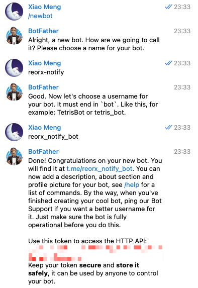
    - 创建一个群组，将 bot 加入到群组中，请求接口 `https://api.telegram.org/bot<TOKEN>/getUpdates`, 取出返回结果中的 `result[0].channel_post.chat.id` 作为 chat id
        > 方法来自 [How to obtain Telegram chat_id for a specific user?](https://stackoverflow.com/a/61215414/596206)

    - 在 Sonarr 中添加 Telegram connection，勾选自己关心的通知类型，一般至少会选择 On Download，代表新剧集下载完成的时间。
        
    - 配置好后，就可以通过 Telegram 第一时间掌握番剧的更新情况了。 

#### 开始追剧

配置完成，现在可以开始追剧了。下面以「盾之勇者成名录 第二季」为例说明在 Sonarr 添加番剧的过程。

打开 [TheTVDB.com](https://thetvdb.com/), 搜索到你想要追踪的番剧的页面 [The Rising of the Shield Hero](https://thetvdb.com/series/the-rising-of-the-shield-hero)，获取 URL 中的最后一段 `the-rising-of-the-shield-hero` 作为在 Sonarr 搜索关键词。

打开 Sonarr，在左上角的 Search 框中输入 `the-rising-of-the-shield-hero`，点击搜索结果，进入添加番剧的界面。


1. Root Folder: 选择先前在 Media Management 中设置的 `anime tv`
2. Monitor: 由于我们只想看最近的第二季，因此选择 Only Latest Season
3. Quality Profile: 选择 HD-1080p 或其他你需要的格式/分辨率
4. Language Profile: 选择 Chinese
5. Series Type: 选择 Anime，这里对应的是添加 Indexer 时的 Anime Categories 选项，告诉 Sonarr 从 Indexer 的 Anime Categories 中搜索资源。如果使用默认的 Standard（对应 Indexer 的 Categories），将会导致无法搜索到资源。
6. Season Folder: 勾选，为了对应 Plex 要求的目录结构
7. Start search for missing episodes: 勾选，这会使 Sonarr 在添加番剧后立刻根据 Monitor 所设置的条件开始搜索资源。也可以在添加完成后在详情页手动点击触发。

完成添加后，点击番剧进入详情页。

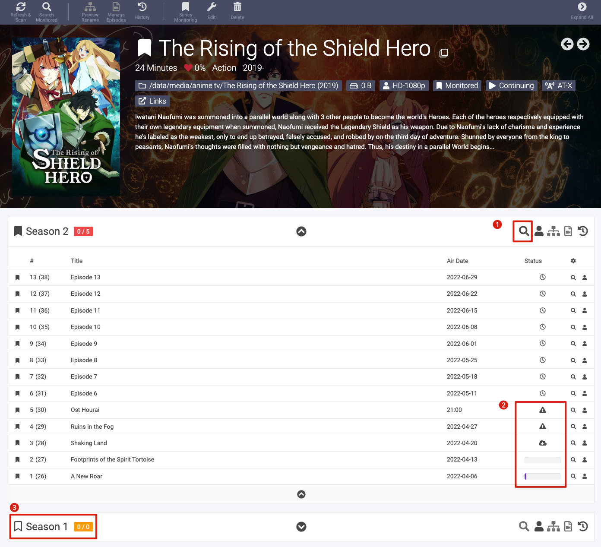

1. 点击放大镜图标对其所在的 Season 进行剧集搜索。
2. Status 列的图标说明
     - 🕓: 尚未播出，不会进行监控
     - ⚠️: 已播出，硬盘中还没有资源，正在进行监控
     - ☁️ 或进度条: 已开始下载
3. 书签符号有填充代表该季处于正在监控状态，无填充代表未监控，可以点击手动设置为监控

在 Sonarr 首页可以看到各个番剧的追踪状态，蓝色代表标记追踪的剧集都已下载完成，红色代表有缺失，正在持续监控中。


下载了一些资源后，我们打开 Plex，将 `anime tv` 对应的路径添加到「动画」Library 中，Plex 就会开始自动扫描文件、刮削元数据、下载中文字幕了。


大功告成，在 Plex 上愉快看番吧☺️。


## 番外

### Sonarr 的其他朋友们
- [Radarr](https://radarr.video/)
    Radarr 是 Sonarr 的兄弟项目，Sonarr 专精于追剧，Radarr 专精于追踪电影
- [Bazarr](https://www.bazarr.media/)
    Bazarr 用于自动下载字幕文件，由于 Plex 本身具有这个功能，以及大部分动漫资源都有内置字幕，因此不是特别有必要部署
- [Lidarr](https://lidarr.audio/)
    Lidarr 是音乐专辑的追踪和下载器，适用于喜欢收藏本地音乐文件的用户
- [Readarr](https://readarr.com/)
    Readarr 是电子书的追踪和下载器。我看书不多，偶尔需要看的书一般从 zlibrary 下载，Calibre 足够满足我的管理需求。

### LunaSea

[LunaSea](https://www.lunasea.app/) 是一个 Sonarr 和 Usenet 生态圈的远程控制器，能让你在手机上查看 Sonarr / Radarr / Lidarr 的资源和放送时间表。

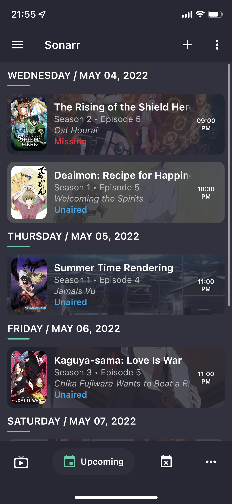

### Seedbox.io

在得知我最近的折腾后，我的好朋友 [wzyboy](https://wzyboy.im/) 向我推荐了 [seedbox.io](https://seedbox.io/), 它是一个专业的 BT 资源下载和家庭媒体服务器提供商。如果你不想自己花费功夫搭建这套设施，并且可以顺畅地访问位于荷兰的服务器，可以考虑购买 seedbox 的服务器，获得开箱即用的全套服务。

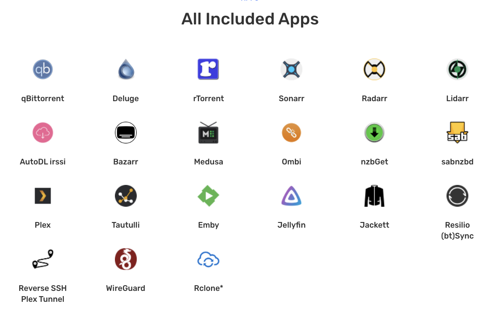

## 结语

Sonarr 和它的朋友们还有许多功能，本篇旨在引导用户完成最基本的自动化追番配置，就不一一介绍了，有兴趣的读者可以自行探索，欢迎在评论区留言分享。

近两年来，在家办公越来越融入到我们的生活，家庭网络和服务的搭建也逐渐从以往对 Geek 的刻板印象，变成或许没被意识到，但人人都有的需求。照片存储、数据备份、远程控制、环境监控、智能家居、多媒体娱乐…这些无一不是我们的日常所需。往后我会写更多这方面的文章，将我使用 NAS 改变生活方式的过程记录下来。The digital life has just begun.

## References
- [WikiArr](https://wiki.servarr.com/)
- [TRaSH Guides](https://trash-guides.info/)

## Revision
- 2022-04-19: created with "使用 QNAP Download Station"
- 2022-05-02: added "使用 Sonarr 和它的朋友们", finished "部署说明"
- 2022-05-04: finished "使用说明" and the whole article
