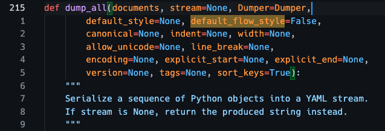

YAML is a data-serialization language that is widely used.
As a developer, I'm always dealing with YAML from time to time.
But processing YAML, especially using PyYAML in Python is painful and full of traps.
Here I want to share some tips and snippets that can make your life with PyYAML easier.

> Code in this article is only guaranteed to work in Python 3

## Always use safe_load/safe_dump

YAML's ability to construct an arbitrary Python object makes it dangerous to use blindly.
It might be harmful to your application to simply `yaml.load` a document from an untrusted source such as the Internet and user input.

See from [PyYAML official documentation](https://pyyaml.org/wiki/PyYAMLDocumentation#loading-yaml):
> **Warning**: It is not safe to call `yaml.load` with any data received from an untrusted source! `yaml.load` is as powerful as `pickle.load` and so may call any Python function.

In short, you should always use `yaml.safe_load` and `yaml.safe_dump` as the standard I/O methods for YAML.

## Keep keys in order (load/dump)

In Python 3.7+, the order of dict keys is naturally preserved [^1], thus the dict you get from `yaml.safe_load` has the same order of keys as the original file.

```python
>>> import yaml
>>> text = """---
... c: 1
... b: 1
... d: 1
... a: 1
... """
>>> d = yaml.safe_load(text)
>>> d
{'c': 1, 'b': 1, 'd': 1, 'a': 1}
>>> list(d)
['c', 'b', 'd', 'a']
```

When dumping dict into a YAML string, make sure to add keyword argument `sort_keys=False` to preserve the order of keys.
```python
>>> print(yaml.safe_dump(d))
a: 1
b: 1
c: 1
d: 1
>>> d['e'] = 1
>>> print(yaml.safe_dump(d, sort_keys=False))
c: 1
b: 1
d: 1
a: 1
e: 1
```

If your Python version is lower, or you want to make sure the keys order preserving always works, you can use this library called [oyaml](https://github.com/wimglenn/oyaml) as a drop-in replacement for `pyyaml`.

```python
>>> import oyaml as yaml
>>> d = yaml.safe_load(text)
>>> d
OrderedDict([('c', 1), ('b', 1), ('d', 1), ('a', 1)])
>>> d['e'] = 1
>>> print(yaml.safe_dump(d, sort_keys=False))
c: 1
b: 1
d: 1
a: 1
e: 1
```

## Enhance list indentation (dump)

By default, PyYAML indent list items on the same level as their parent.

```python
>>> d = {'a': [1, 2, 3]}
>>> print(yaml.safe_dump(d))
a:
- 1
- 2
- 3
```

This is not a good format according to style guides like
[Ansible](https://docs.ansible.com/ansible/latest/reference_appendices/YAMLSyntax.html)
and [HomeAssistant](https://developers.home-assistant.io/docs/documenting/yaml-style-guide/#block-style-sequences).
It is also not recognized by code editors like VSCode, making the list items unfoldable in the editor.

To solve this problem, you can use the snippet below to define an `IndentDumper` class:

```python
class IndentDumper(yaml.Dumper):
    def increase_indent(self, flow=False, indentless=False):
        return super(IndentDumper, self).increase_indent(flow, False)
```

Then pass it to the `Dumper` keyword argument in `yaml.dump` function.
```python
>>> print(yaml.dump(d, Dumper=IndentDumper))
a:
  - 1
  - 2
  - 3
```

> Note that `Dumper` cannot be passed to `yaml.safe_dump` which has its owner dumper class defined.
 
## Output readable UTF-8 (dump)

By default, PyYAML assumes the user only wants ASCII code in the output,
so it converts UTF-8 characters to Python's Unicode representation.

```python
>>> d = {'a': '你好'}
>>> print(yaml.safe_dump(d))
a: "\u4F60\u597D"
```

This makes the output hard to read for humans.

In the modern world, UTF-8 is widely supported, it's safe to write UTF-8 in the output.
Pass `allow_unicode=True` to `yaml.safe_dump` to enable that.

```python
>>> print(yaml.safe_dump(d, allow_unicode=True))
a: 你好
```


## No `default_flow_style` needed (dump)

Most of the time we don't want [flow style productions](https://yaml.org/spec/1.2.2/#chapter-7-flow-style-productions) in the output (i.e. no JSON in YAML).
According to [PyYAML documentation](https://pyyaml.org/wiki/PyYAMLDocumentation#dictionaries-without-nested-collections-are-not-dumped-correctly), `default_flow_style=False` should be passed to `yaml.safe_dump` to achieve that.

After digging into the source code of the latest PyYaml (6.0), I find it is not needed anymore.
You should remove this keyword argument to keep the code cleaner and less confusing.



## Libraries

### oyaml

Link: https://github.com/wimglenn/oyaml

As mentioned above, oyaml is a drop-in replacement for PyYAML which preserves dict ordering.

I suggest using oyaml if you already use PyYAML in your code.

It's worth mentioning that oyaml is a single-file library with only [53 lines of code](https://github.com/wimglenn/oyaml/blob/d0195070d26bd982f1e4e604bded5510dd035cd7/oyaml.py).
This makes it very flexible to use, you can just copy the code to your library and customize it according to your need.

### strictyaml

Link: https://github.com/crdoconnor/strictyaml

Some people say YAML is too complex and flexible to be a good configuration language,
but I think this is not the problem of YAML, but the problem of how we use it.
If we restrict our usage to only a subset of its features, it will be as good as it should be.

This is where StrictYAML came up. It is a type-safe YAML parser that parses and validates a [restricted subset](https://hitchdev.com/strictyaml/features-removed) of the YAML specification.

I suggest using StrictYAML if you have strong security concerns for your application.

There are tons of great articles on the [documentation site](https://hitchdev.com/strictyaml/) of strictyaml, definitely worth having a look at if you have thought about YAML and other configuration languages.

### ruamel. yaml

Link: https://yaml.readthedocs.io/en/latest/overview.html

ruamel.yaml is a fork of PyYAML, it was released in 2009 and continuously maintained in the past decade.

The differences with PyYAML are listed [here](https://yaml.readthedocs.io/en/latest/pyyaml.html#yaml-1-2-support). Generally, ruamel.yaml focuses on [YAML 1.2](https://yaml.org/spec/1.2.2/)  with some opinionated enhancements for the syntax.

What interests me most is the ability to round-trip in the loading/dumping process. It works like black magic. Here's the explanation from ruamel.yaml documentation:

> A round-trip is a YAML load-modify-save sequence and ruamel.yaml tries to preserve, among others:
> 
> -   comments
> -   block style and key ordering are kept, so you can diff the round-tripped source
> -   flow style sequences ( ‘a: b, c, d’) (based on request and test by Anthony Sottile)
> -   anchor names that are hand-crafted (i.e. not of the form``idNNN``)
> -   merges in dictionaries are preserved

I suggest using ruamel.yaml if you have the requirement to preserve the original content as much as possible.

> One thing I notice is that ruamel.yaml's `safe_load` method (`YAML(typ='safe').load`) cannot parse flow style collection (`a: {"foo": "bar"}`), this is a undocumented difference with PyYAML.

## Summary

YAML has its good and bad. It's easy to read, the learning curve is mild at the beginning,
but the specification is complex, which not only causes chaos in practice, but also makes implementations in different languages inconsistent with each other in many trivial aspects.

Despite these quirks, YAML is still the best configuration language for me, and as long as we can use it properly, problems will be avoided and the experience will be much better.

[^1]: See [What’s New In Python 3.7](https://docs.python.org/3/whatsnew/3.7.html#:~:text=the%20insertion%2Dorder%20preservation%20nature%20of%20dict%20objects%20has%20been%20declared%20to%20be%20an%20official%20part%20of%20the%20Python%20language%20spec.)
