几天前临睡时看了 2022 Google IO 的一个 presentation: [What's new for the web platform](https://www.youtube.com/watch?v=5b4YcLB4DVI), 两位 Google 员工的解说让了解 Web 新技术的过程变得充满乐趣，于是做了些笔记在 [Twitter thread](https://threadreaderapp.com/thread/1525875286096904192.html) 中。这篇文章对笔记进行了整理，并为每个特性附加详细说明的链接。



## HTML

### `<dialog>`

https://web.dev/building-a-dialog-component/

`<dialog>` 和 `<selectmenu>`，基本上所有 UI Kit 都会在组件库里实现的功能，终于被 HTML 原生实现了。如果 HTML 能多一些这种常用的交互组件，我会很乐意手写 Vanilla JS 来使用它们。

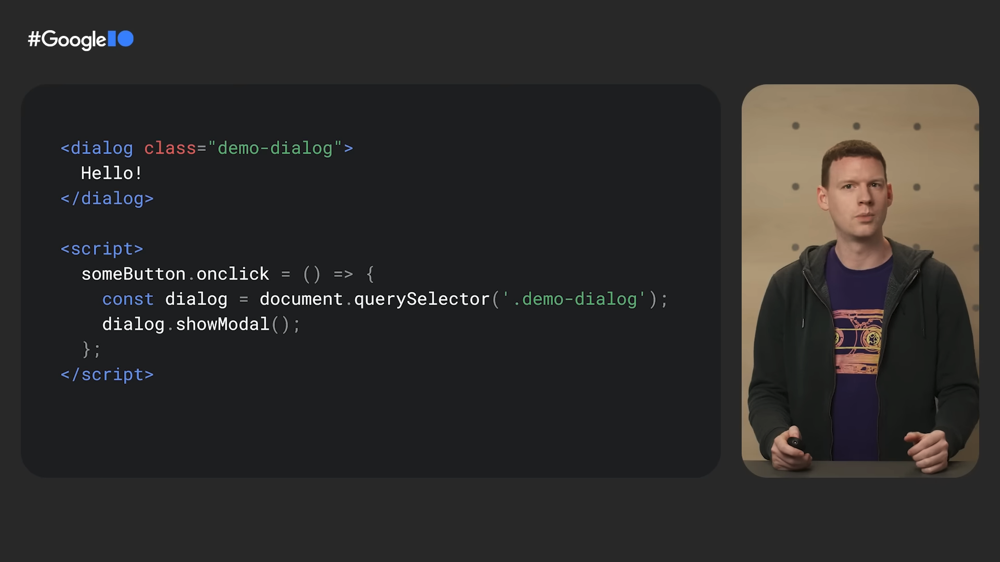

### `<selectmenu>`

https://open-ui.org/prototypes/selectmenu

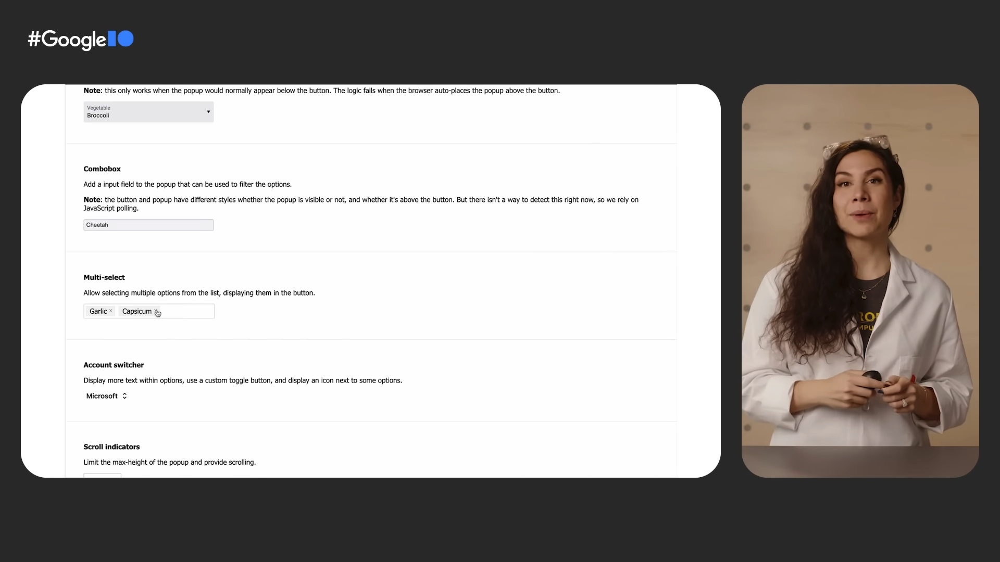

### `<input type=datetile-local>`

https://developer.mozilla.org/en-US/docs/Web/HTML/Element/input/datetime-local

记得 7 年前在豌豆荚工作时，因为这个标签不被 Firefox 支持，被迫找了一个 JavaScript 库来代替 (Pikaday, I still remember)。如今终于可以在主流浏览器上全面通用，太不容易了😭。

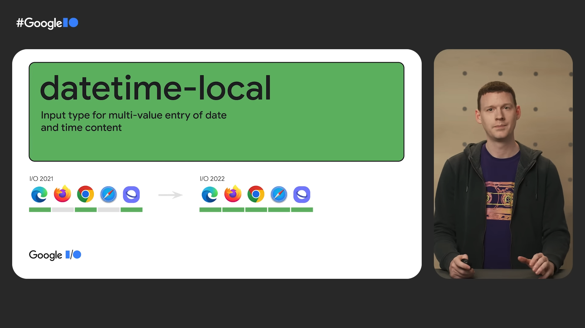

## CSS

### `:has` selector

https://developer.mozilla.org/en-US/docs/Web/CSS/:has

用于声明父子元素关系的 :has 选择器！这个功能前阵子正好搜索过，现在只能用 JavaScript 实现。

图中的代码可以解释为，在包含 `<figcaption>` 的 `<figure>` 元素中，将其 children 中的 `` 增加 1rem 的 bottom margin。

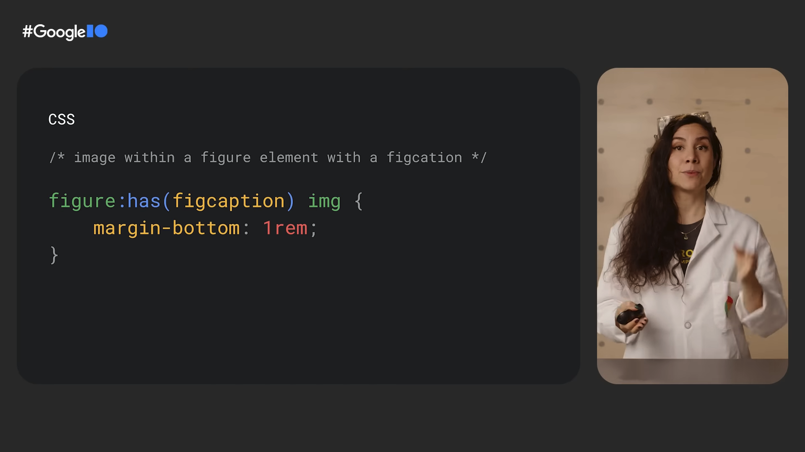

### Aspect ratio

https://web.dev/aspect-ratio/

CSS aspect-radio，使元素保持固定的宽高比。这是曾经在 `` 标签上的实验特性，如今终于被所有元素支持了。

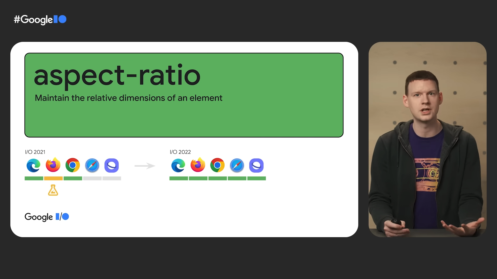

### Cascade Layer

https://developer.chrome.com/blog/cascade-layers/

Cascade Layers, 给 CSS 加上了层级的概念，layer 可以自由排列顺序，后面的比前面的有更高的优先级 (specificity)；还展示了下越来越复杂的 CSS 优先级关系图，其实也可以把每一级都当做一个 layer。

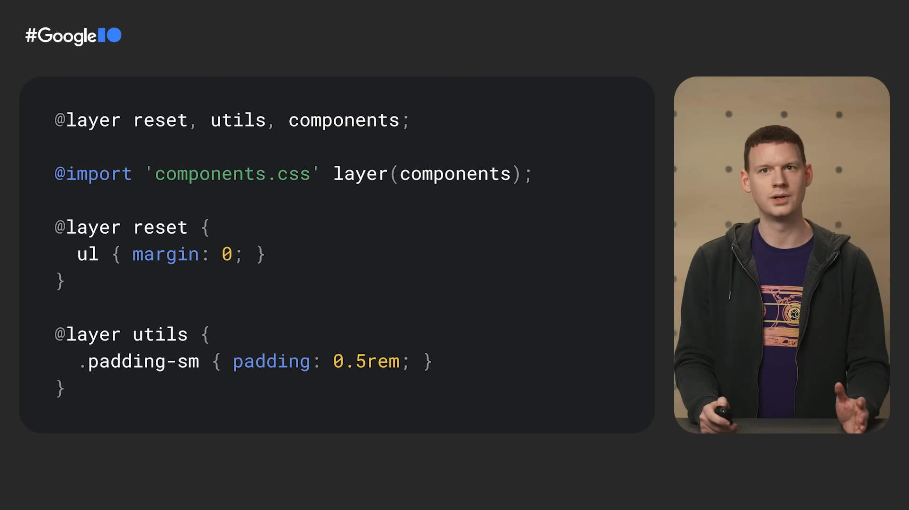

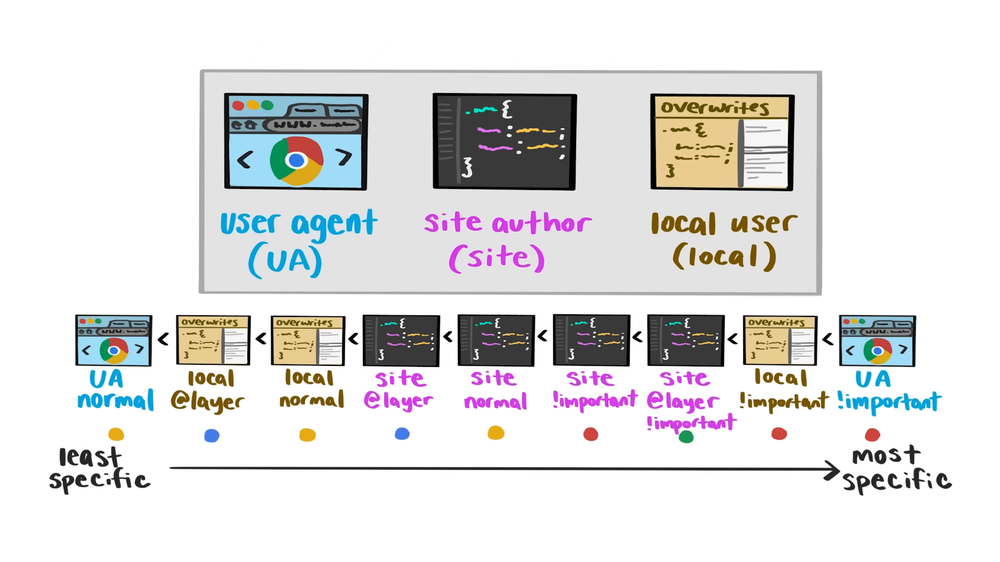

### Container queries

Container queries，在响应式中能够发挥重要作用，但我基本没听懂，未来应该会影响一些 CSS 框架的 API，到时候再来学习吧。

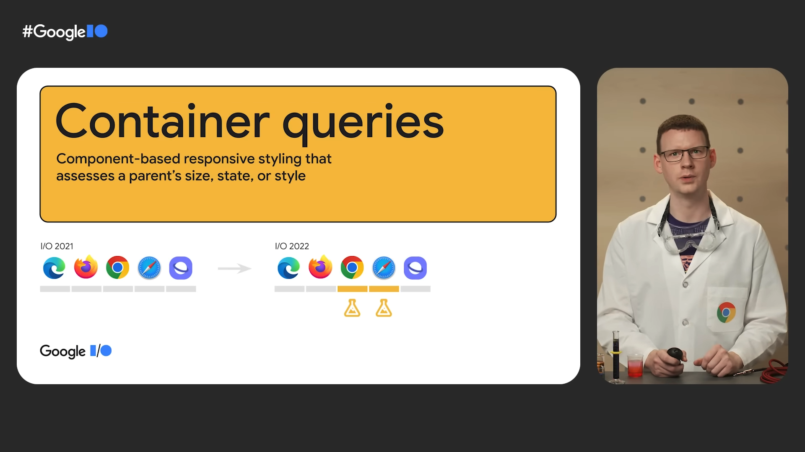

### Accent color

https://web.dev/accent-color/

CSS accent-color，为 HTML 基本元素设定一个统一的色调，主流浏览器在一年内都争先恐后地实现了😂，毕竟这是最能体现自己颜值的功能。不知道能不能和操作系统的 accent-color 互通，这样体验就更一致了。

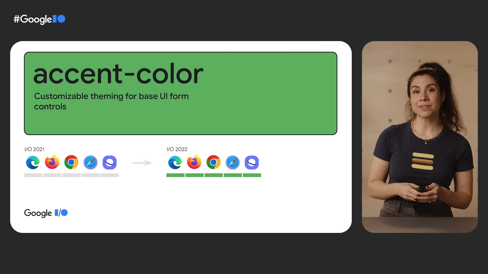

## JavaScript

### Array.prototype.at

https://developer.mozilla.org/en-US/docs/Web/JavaScript/Reference/Global_Objects/Array/at

Array 增加了 at 方法，JavaScript 终于可以用类似 Python `list[-1]` 的写法了。这曾经是我刚学习 JavaScript 时觉得它不如 Python 最主要的原因。

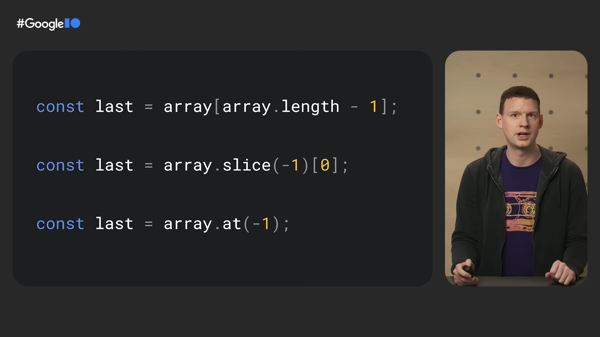

### URLPattern

https://web.dev/urlpattern/

新类型 URLPattern，定义 URL 路径中的参数并解析出对应的 object。routing library 不用再写麻烦的正则了

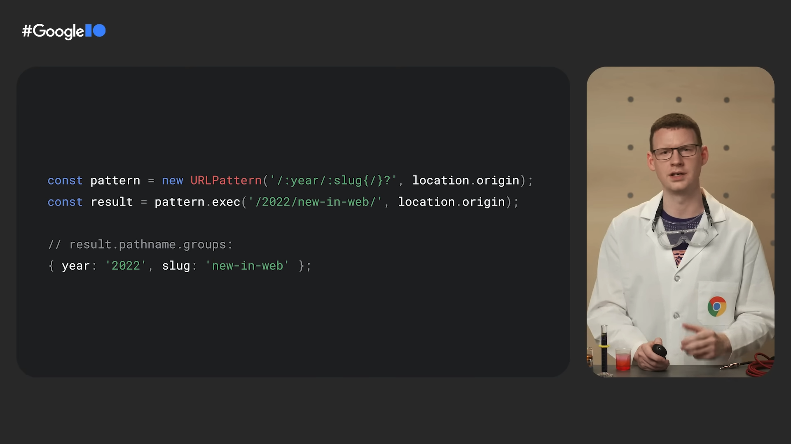

### structuredClone

https://web.dev/structured-clone/

有了 structuredClone, 再也不用写 JSON.parse JSON.stringify 这种扭曲心智的代码了，非常适合在面试官问到 deep clone 的问题时反将一军。还可以用来 clone 其他数据结构如 blobs, bitmaps, typed arrays。

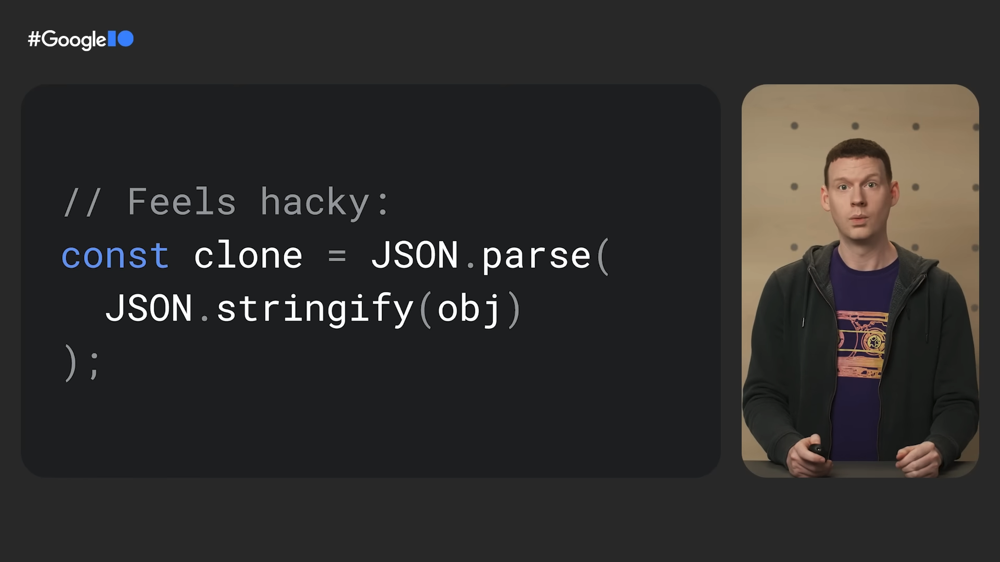

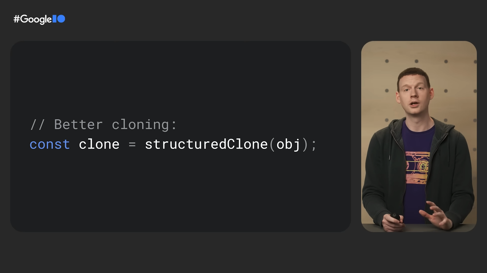

### createImageBitmap

https://developer.mozilla.org/en-US/docs/Web/API/createImageBitmap

createImageBitmap, 把 blob 直接转化成 Image 对象，改善了一直以来复杂而脆弱的写法。

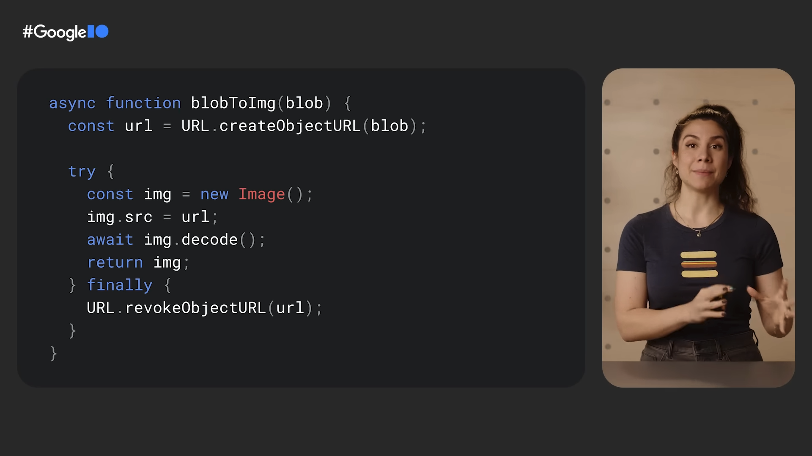

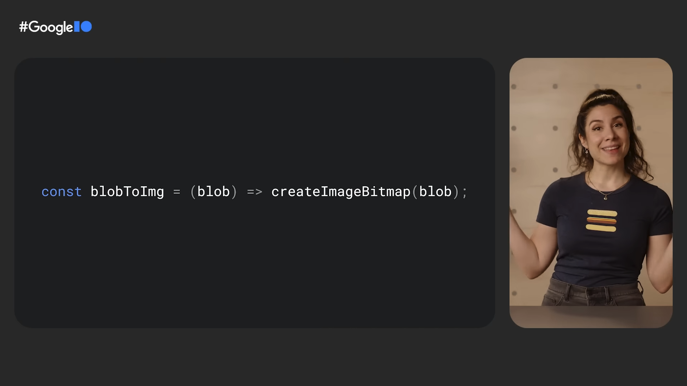

## Miscellaneous

### CHIPS

https://developer.chrome.com/docs/privacy-sandbox/chips/

CHIPS 全称 Cookies Having Independent Partitioned State, 是 Cookie 在安全策略上的新特性，为 Set-Cookie 增加了 `Partitioned` 关键词。可以使特定 cookie 在 iframe 中只用于当前站点。自两年前 `SameSite` 关键词推广后，third-party cookie 只能选择全有或者全无，这次终于有了一个折中的选择。

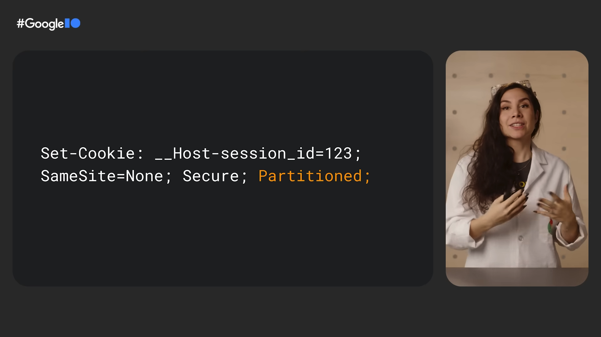

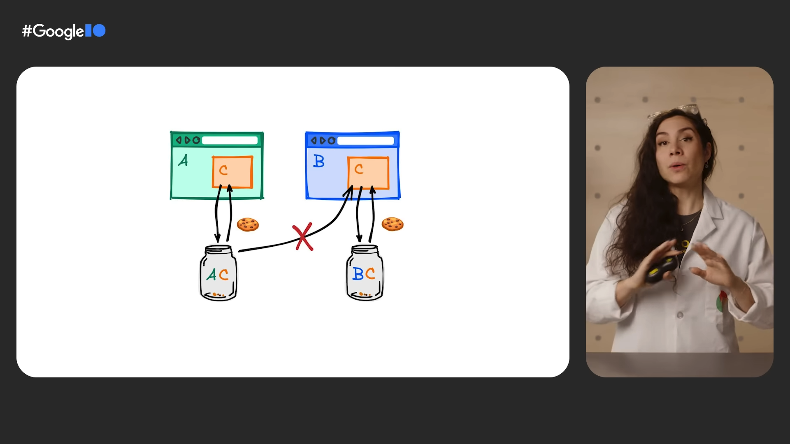

### Window controls overlay

https://web.dev/window-controls-overlay/

Window controls overlay 是一组 [Web app manifests](https://developer.mozilla.org/en-US/docs/Web/Manifest), CSS, JavaScript API 的集合，实现了定制 PWA 窗口在 window bar 部分区域的显示效果，用于获得更有沉浸感的使用体验。

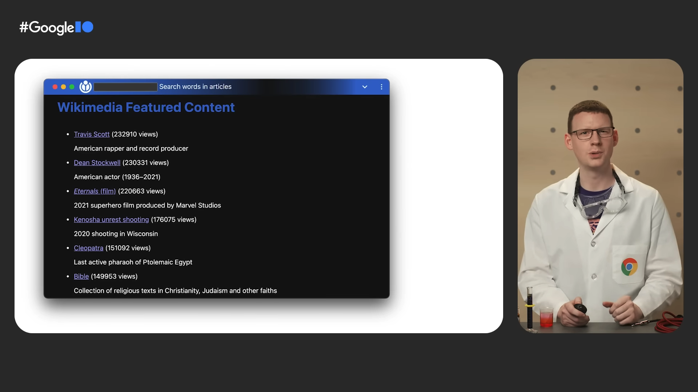
