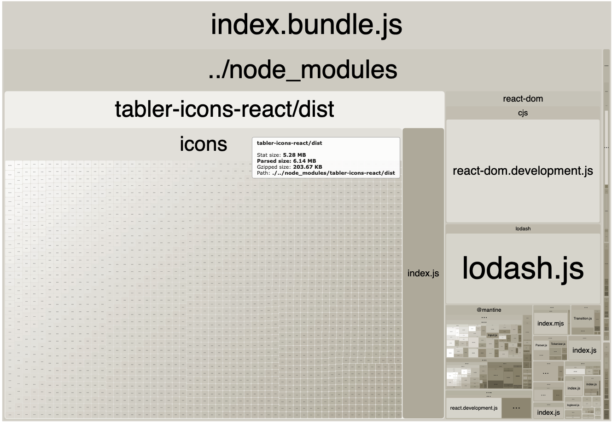
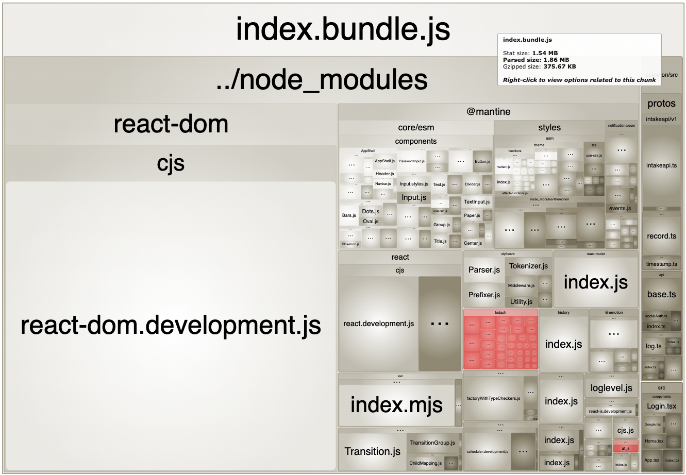

## 引子

大约在两个月前，为了做出一款属于自己的产品，我正式开始学习 TypeScript 和 React 开发[^1]。虽然接触 JavaScript 时间不短了，但一直热衷于使用 Vanilla JS，也没有正式做过比较严肃的项目。因此，我把自己定位为一个前端新手，决定从 0 开始学习现代化前端开发。

这两个月来，我在学习实践过程中累计了一些自己的心得和体会，算不上高深，但应该可以为同样在学习中的新手起到参考作用。从这篇文章开始，我会逐一将我认为有价值的部分写成博客，归类于 #frontend-guide 标签下，并在未来的学习中持续更新。作为一个非专业的前端学习者，这些文章中一定会出现错误和疏漏，请读者朋友们不吝指正，如果能从批评中学到什么，将会是我写作的最大收获。

先大致列举一些可写的话题，以作备忘：
- 如何构建一个最基本的 TypeScript 项目
    - 介绍 package.json 和基本的 devDependencies
    - 介绍 tsconfig.json 中必须了解的选项
    - tsc 和 esbuild
- 如何使用 jest 进行细粒度的 TDD
- 从零开始构建自己的 React project template
    - 不使用 create-react-app 有哪些好处
    - webpack
    - babel: modular import and hot reload
    - config and APP_ENV
- 如何构建一个最基本的 monorepo
    - npm workspace
    - tsconfig reference
    - webpack: resolve alias and tsconfig paths plugin
- TypeScript caveats and cheatsheet
- 如何使用 TypeScript 和 React 开发 Chrome Extension
- Mobx 使用指南
- 实现一个简单的 useFetch Hook
- 如何使用 swr 调用 HTTP API
- 如何使用 Protobuf 和 TypeScript 封装 HTTP API

## ts-loader

在现代化前端项目中，TypeScript 因其静态类型的特性，为代码的可维护性、健壮性带来了极大的提升，已逐渐成为前端开发的标准语言。但 TypeScript 不能直接在浏览器中运行，因此在项目构建流程中需要引入 [transpiler](https://en.wikipedia.org/wiki/Source-to-source_compiler) 来将其编译为浏览器可用的 JavaScript。[ts-loader](https://github.com/TypeStrong/ts-loader) 就是为 Webpack 设计的 transpiler 之一。

过去的开发生涯中，我虽然不是专业的前端，也对 JavaScript 世界中的基石 babel 有所耳闻目见。但在这次从零开始学习 TypeScript 开发时，因为对 babel 有种过于复杂的印象，我选择了 ts-loader 作为第一个学习和上手的插件。

ts-loader 的使用非常简单，文档也足够清晰，如果你的项目本身有正确配置 `tsconfig.json` 并可以使用 `tsc -b` 完成编译，那么在 webpack 中引入 ts-loader 后不需要额外的配置即可工作。

下面是一份简化的 `webpack.config.js` 示例:

```js
module.exports = {
  entry: {
    index: path.join(srcDir, 'index.tsx'),
  },
  output: {
    path: destDir,
    filename: '[name].bundle.js',
  },
  module: {
    rules: [
      {
        test: /\.tsx?$/,
        loader: 'ts-loader',
        exclude: /node_modules/,
      },
    ]
  }
}
```

经过一段时间的使用，我发现了对 ts-loader 不太满意的几个地方：

- 偶尔出现莫名的错误

    有的时候，当对 TypeScript 源文件进行了某种变更，或许是大量的类型变化，或许是文件重命名和移动目录，可能会触发 ts-loader 报错，但此时 VSCode 的静态检查器却没有显示出任何问题（所有源文件），重启 webpack serve 也无济于事。这时只能通过删除所有与构建过程和结果有关的文件，如 `build`, `dist`, `**/*.d.ts`, `*.tsbuildinfo`，重新运行才可以消除这个不存在的错误。
- 难以 Debug 某些 transpiling 过程中的错误

    如果你的 `tsconfig.json` 中设置了 `noEmit: true` 或 `noEmitOnError: true`, 那你很有可能会看到 `Error: TypeScript emitted no output for…` 这样的报错，这是因为 ts-loader 在将 TypeScript 转换成 JavaScript 时无法成功，于是没有输出 js 文件。但具体是什么错误，完全无法搞清楚。我在 GitHub 上跟踪了一个 [issue](https://github.com/TypeStrong/ts-loader/issues/1257), 目前仍然没有收获。
- 项目内多个 package 引用必须生成描述文件

    如果想在项目内想要拆分多个 package 并互相引用，需要使用 TypeScript 的 [Project References](https://www.typescriptlang.org/docs/handbook/project-references.html) 功能，而 `declaration`  必须设置为 true，此时 ts-loader 会为被引用的包生成 `.d.ts` 的描述文件，使文件浏览器变得混乱。
- 在插件生态中不是一等公民

    一些优化项目开发流程的插件，如 [react-refresh-webpack-plugin](https://github.com/pmmmwh/react-refresh-webpack-plugin), 优先支持 babel 而非 ts-loader；[babel-plugin-import](https://github.com/umijs/babel-plugin-import) 的 ts-loader 实现 [ts-import-plugin](https://github.com/Brooooooklyn/ts-import-plugin) 远不如其本身流行。

于是我决定对 babel-loader 进行一次尝试。

## babel-loader

[babel-loader](https://github.com/babel/babel-loader) 的项目页面有详细的安装配置说明，在此不做赘述。下面是一个在 TypeScript + React 项目中工作的最小化配置示例:

```js
module.exports = {
  module: {
    rules: [
      {
        test: /\.tsx?$/,
        exclude: /node_modules/,
        use: [
          {
            loader: 'babel-loader',
            options: {
              presets: [
                ['@babel/preset-env', { targets: "defaults" }],
                '@babel/preset-typescript',
                ['@babel/preset-react', {'runtime': 'automatic'}]
              ],
            },
          },
        ],
      }
    ]
  }
}
```

配置完成后，代码顺利编译，随后我开始了对构建配置优化的探索。

### webpack-bundle-analyzer

我首先想到的是对构建出的 bundle 的大小进行检查，一看竟然有 7MB 之大，于是安装了 [webpack-bundle-analyzer](https://github.com/webpack-contrib/webpack-bundle-analyzer), 对 bundle 中所包含的依赖进行分析。

下面是引入 webpack-bundle-analyzer 之后的 `webpack.config.js` 文件，通过环境变量 `WEBPACK_USE_ANALYZE` 判断是否进入分析模式并修改 webpack 配置。

```js
const useAnalyze = !!process.env.WEBPACK_USE_ANALYZE

const config = {...}

if (useAnalyze) {
  const BundleAnalyzerPlugin = require('webpack-bundle-analyzer').BundleAnalyzerPlugin;

  config.mode = 'development'
  config.plugins.push(
    new BundleAnalyzerPlugin({
      analyzerPort: 18888,
    })
  )
}

module.exports = config
```

运行 `WEBPACK_USE_ANALYZE=1 webpack` 在浏览器中查看分析结果。



原来 tabler-icons-react 一个库就占了 5.28MB，其他库中 lodash 也不算正常，似乎和 tabler-icons-react 一样被完整包含进来了。

### babel-plugin-import

[tabler-icons-react](https://github.com/konradkalemba/tabler-icons-react) 是一个 SVG 图标库，我只是使用了其中一部分图标。lodash 是非常通用的工具函数库，同样的，我只对其中一部分函数进行了引用。那么有没有办法按需加载依赖中的模块，只输出被 import 到的部分呢？答案就是 [babel-plugin-import](https://github.com/umijs/babel-plugin-import)。

继续修改 `webpack.config.js`，为 babel-loader 增加 plugins:

```js
{
  loader: 'babel-loader',
    plugins: [
      ['import', {
        libraryName: 'tabler-icons-react',
        libraryDirectory: 'dist/icons',
      }],
      ['import', {
        libraryName: 'lodash',
        libraryDirectory: '',
        camel2DashComponentName: false,
      }],
    ]
  }
}
```

再次运行 `WEBPACK_USE_ANALYZE=1 webpack` ，可以看出 bundle 结构有了显著的改进（红色的部分是 tabler-icons-react 和 lodash）:



> [babel-plugin-lodash](https://github.com/lodash/babel-plugin-lodash) 也可以实现 lodash 的按需加载，但它是专为 lodash 开发的，不具备 babel-plugin-import 的通用性。

### @babel/preset-env

[@babel/preset-env](https://babeljs.io/docs/en/babel-preset-env) 是 babel 中最重要的一个 preset。所谓 preset，即预设配置的封装，让需求相近的用户可以不用关注细节直接使用，preset-env 提供了非常丰富的选项，让使用者可以快速定制出符合目标需求的编译结果。

首先要关注的是 [targets](https://babeljs.io/docs/en/options#targets) 选项，它决定了 babel 所编译出的 JavaScript 能否在特定平台上运行。`targets` 支持 [browserslist](https://github.com/ai/browserslist) 语法，上文中我们的初始配置 `['@babel/preset-env', { targets: "defaults" }],` 代表使用 browserslist 的 defaults 查询[^2]，虽然可以编译，但在浏览器中是无法运行的，会产生
`Uncaught ReferenceError: regeneratorRuntime is not defined` 错误，这是为什么呢？

为了统一不同浏览器的 JavaScript 实现差异，使 ES2015+ 代码可以正确运行，babel 会根据 targets 决定是否需要在编译结果中注入 polyfill。
最早这一功能由 [@babel/polyfill](https://babeljs.io/docs/en/babel-polyfill) 实现，但它在 babel 7.4.0 之后被废弃，由 [core-js ](https://github.com/zloirock/core-js) 接替。我们的代码之所以运行报错，就是因为没有指定 preset-env 使用 core-js，导致用于模拟 ES2015+ 运行环境的 `regeneratorRuntime` 缺失。

修改后的 preset-env 配置如下:

```js
["@babel/preset-env", {
  targets: "defaults",
  corejs: 3,
  useBuiltIns: 'usage',
}]
```

重新编译，代码即可成功运行。并且通过 webpack-bundle-analyzer 可以发现 bundle 中多出了 core-js 的部分。

如果想在对浏览器的支持上激进一些，可以尝试将 targets 设为 `{browsers: '> 5%'}`，即仅支持占有率超过 5% 的浏览器，你会发现 bundle 中 core-js 的部分会再次消失，因为这些浏览器不需要 core-js 就有完整的 ES2015 支持。

### react-refresh-webpack-plugin

webpack 提供 [HMR](https://webpack.js.org/concepts/hot-module-replacement/) 热更新功能，不需要刷新页面即可将改动反映到页面中。在 babel-loader 中，需要通过 [react-refresh-webpack-plugin](https://github.com/pmmmwh/react-refresh-webpack-plugin) 插件来实现 React JSX 的热更新。

首先要在 devServer 中开启 `hot` 选项:

```js
module.exports = {
  devServer: {
    // Enable hot reloading
    hot: true,
  }
}
```

然后为 webpack 添加 `ReactRefreshWebpackPlugin` 插件:

```js
const ReactRefreshWebpackPlugin = require('@pmmmwh/react-refresh-webpack-plugin');

module.exports = {
  plugins: [
    new ReactRefreshWebpackPlugin(),
  ],
}
```

最后为 babel-loader 添加 `react-refresh/babel` 插件，通过 `isDevelopment` 决定是否存在:

```js
{
  loader: 'babel-loader',
  options: {
    plugins: [
      isDevelopment && 'react-refresh/babel'
    ].filter(Boolean)
  }
}
```

### Summary

最终结果如下:

```js
module.exports = {
  module: {
    rules: [
      {
        test: /\.tsx?$/,
        exclude: /node_modules/,
        use: [
          {
            loader: 'babel-loader',
            options: {
              presets: [
                ['@babel/preset-env', {
                  targets: {
                    browsers: '> 5%',
                  },
                  corejs: 3,
                  useBuiltIns: 'usage',
                }],
                '@babel/preset-typescript',
                ['@babel/preset-react', {'runtime': 'automatic'}]
              ],
              plugins: [
                ['import', {
                  libraryName: 'tabler-icons-react',
                  libraryDirectory: 'dist/icons',
                }],
                ['import', {
                  libraryName: 'lodash',
                  libraryDirectory: '',
                  camel2DashComponentName: false,
                }],
                isDevelopment && 'react-refresh/babel'
              ].filter(Boolean),
            },
          },
        ],
      }
    ]
  }
}
```

如果你想看到一个可运行的例子，请参考我的最小化 React 项目模板 [reorx/minireact](https://github.com/reorx/minireact)，其中有完整的 [webpack.config.js](https://github.com/reorx/minireact/blob/6e5b086e309cdbe7132c268ba8cf1e6e5d5ab32e/webpack.config.js) 文件。

## Revision
- 2022-05-18: created

[^1]: 开始学习时的推文: [学习了俩小时如何开始一个 TypeScript 项目，现在已经不省人事了](https://twitter.com/novoreorx/status/1500385952942157828)
[^2]: 根据 browerslist 文档，`defaults` 代表 `> 0.5%, last 2 versions, Firefox ESR, not dead`，是一个非常宽泛的规则，可覆盖全世界所有浏览器中的 [90%](https://browserslist.dev/?q=ZGVmYXVsdHM%3D)
