欢迎关注我的 Telegram 频道: [Reorx’s Footprints](https://t.me/reorx_share)。这篇文章讲述我为什么创建这个频道，以及如何用 n8n 将 Twitter, YouTube, GitHub, Douban 等服务的动态同步过去，实现个人数字生活的信息聚合。

## 前言

[赛博空间](https://en.wikipedia.org/wiki/Cyberspace)构成了我的精神世界。

我的大脑从苏醒的那一刻开始渴求信息，大量新鲜的信息，它们比饮用水更早地进入我的身体。每天睁开眼睛，我做的第一件事情是拿起手机，逐个查看昨夜的消息提醒。起床之后，我会在马桶上浏览 RSS 阅读器和 Telegram 频道中的新闻，让思维复苏的过程伴随新知识的冲击。我已经习惯了如此，一边加载昨日的进展并思考今日的安排，一边点开链接，使用不同的工具进行阅读、收藏和记录。

一天之中的碎片时间，我也会不断地在 Twitter、RSS、Telegram 之间切换，这对我来说并不是信息焦虑，而是自然而然的生活习惯。在工作上，我也完全依赖于网络，在解决问题的过程中搜索阅读大量的网站，将之转化为代码和学习笔记。

我就像一台不停运行的收集器和过滤器，持续地消费、生产信息。但大脑被设计用于分析和联想，却不擅长高效精确的索引，这些信息散落在各个服务中，我可以想起一些关键词或模糊的上下文，但总是很难快速获取到。我需要一个能将它们聚合在一起的工具，或者工作流，这样既可以方便自己的回溯，也可以将这些经过提纯的信息分享出来，为和我兴趣接近的人提供另一个输入管道。

## 聚合什么信息？

不是所有在赛博空间产生的信息都需要被聚合。一些被动产生的如搜索记录、地理位置记录、个人健康信息等，他们可以用作 [quantified self](https://en.wikipedia.org/wiki/Quantified_self)（这是另一个话题），但并不在我的考虑范畴内。

我要聚合的主要有两类信息，一类是是由我主动创造的，比如Twitter 上发表的看法、GitHub 上为开源项目提交的问题；一类是我主动收藏或标记的，Pinboard 上收藏的书签、YouTube 上点赞过的视频均属此列。它们有的直接流入我的知识库[^1]，有的保存在线上服务中，作为知识的原材料储备，留待日后进行消化吸收。

考虑到分享的目的，这些信息中还要去掉功能性的部分，只保留我确认有价值的那些。比如 Twitter Like 有时会用于社交目的，作为一种赞赏的回应；YouTube, Spotify 中各种 playlist 很多只是为了满足收集癖，不一定具有普适性；豆瓣的想看、想读只是待确认的 enqueue，只有看过、读过才是值得推荐的。

### 内容来源

基于以上考虑，我将自己主要摄入和产生信息的来源进行了整理，得到如下列表：

- **Telegram**

    我在 Telegram 中分享一些一闪而过的想法，菜谱，和在看其他频道时将特别有意思的内容进行转发。
    - Fleeting thoughts 💭
    - Recipe 🍳
    - Forward 🔄
- **Twitter** 🐦
  
    我的所有 Tweet 和 Retweet 都经过认真思考，是希望被阅读的内容创作。
    - Tweet
    - Retweet
- **Instapaper** 📖
  
    我这样管理我的待看列表：对于没确认是否有价值的那些，我会加入 TODO 或 Telegram Saved Messages。只有当我认真阅读过并认为值得再次阅读，我才会将其加入 Instapaper 中。
- **Blog** 📝
  
    我的个人博客，通过 RSS 发布更新。
- **Music** 🎵
  
    我主要使用 Spotify 听歌，类似 Instapaper，只有我愿意反复听的歌曲才会加入 Liked Songs，可以看做是我基于个人音乐品味的推荐。
    - Spotify
- **YouTube** ▶️
  
    YouTube 是我探索世界无限可能性的地方，it's about everything and nothing。每个 Like 过的视频都有着让我会心一笑或拍案叫绝的亮点。
- **Bookmark** 🔖
  
    我从 2013 年开始使用 Pinboard，虽然 Pinboard 的社交属性很弱，但我一直坚持用 private/public 属性来区分我的收藏，所有 public 的书签都具备一定的分享价值。
    - Pinboard
- **GitHub**
  
    由于对 Pinboard 的重度使用，大部分 GitHub 项目都收藏在 Pinboard 中，Star 的是我觉得值得鼓励的项目。每个 Issue 和 Pull-request 我都有认真撰写，他们是我参与开源活动的记录。
    - Star 🌟
    - Issue ⚡️
    - Pull-request ⤴️
- **Douban**
  
    我主要用 Douban 记录看过的电影和书。如上文所说，这里只分享在看、看过的电影和在读、读过的书籍。后续考虑对评分进行过滤。
    - Movie 📺
    - Book 📖

### 展现形式

我选择 Telegram Channel 作为信息聚合的目的地。一方面我许多信息都来源于 Telegram ，另一方面它也非常易于使用和接入。

Telegram 以下几种功能极大程度地丰富了信息的展现形式[^2]：

- 链接预览
  
    Telegram 会将消息中附带的链接进行抓取，将摘要和图片显示在消息下方。
- 富文本格式
  
    Telegram 消息支持 Markdown 和 HTML 两种富文本格式的解析，可以实现粗体、斜体、下划线、超链接、行内和块级代码等样式。
- 标签索引
  
    Telegram 的消息支持 `#` 为前缀的标签，在频道/群组内点击标签即可对消息进行筛选，这让结构化的信息索引成为可能。

## 实现自动化同步


我使用 [n8n](https://github.com/n8n-io/n8n) 来实现整套信息收集和聚合的自动化工作流[^3]。下面将对我的操作方法和配置进行讲解，参照这些说明，你也可以快速搭建一套属于自己的自动化信息分享系统。

### n8n 概念说明

- **workflow**
  
    用于定义一条自动化工作流，由多个 node 以及 node 之间的指向关系构成。
- **node**
  
   构成 workflow 的基本单位，每个 node 可以完成一个独立的任务，比如定时触发、获取数据、筛选数据、发送信息等。
- **credential**
  
    访问凭据，用于在访问在线服务接口时进行身份验证。workflow 内只存储 credential 的 id，只有在运行时才会获取其中的实际内容，这一机制确保了 workflow 在分享时不会造成凭据泄露。

### 安装 n8n

n8n 支持使用 Docker 进行自部署，它由 Nodejs 开发，使用 SQLite 作为数据库，没有其他外部依赖，因此理论上可以部署在任何 Docker 或 Nodejs 运行环境。

为了方便调试，我将 n8n 部署在家里的 NAS 上，你也可以尝试将其部署在 [Railway](https://railway.app?referralCode=XkWaVV) 等 PaaS 平台。

正常情况下，参照 n8n 的 [Docker Installation](https://docs.n8n.io/hosting/installation/docker/) 文档即可完成初步运行。但在使用中，我发现了 n8n Twitter 接入的 bug，在对代码进行了修改后，不得不在本地构建 Docker 镜像 (见 [n8n - Custom Image](https://github.com/n8n-io/n8n/tree/master/docker/images/n8n-custom))。如果你需要使用 Twitter 接入，在这个 [PR](https://github.com/n8n-io/n8n/pull/3354) 合并之前，建议使用我构建好的镜像 [reorx/n8n-custom](https://hub.docker.com/r/reorx/n8n-custom)。



```
version: '3'
services:
  n8n:
    #image: n8nio/n8n
    image: n8n-custom
    ports:
      - 5678:5678
    volumes:
      - /share/CACHEDEV2_DATA/Misc/AppData/n8n:/home/node/.n8n
      - /share/CACHEDEV1_DATA/homes/reorx/Misc_Backup/:/backup
    environment:
      - PUID=1000
      - PGID=1000
      - VUE_APP_URL_BASE_API=http://harrogath-local.com:5678/
      - WEBHOOK_URL=http://harrogath-local.com:5678/
      - GENERIC_TIMEZONE=Asia/Shanghai
      - TZ=Asia/Shanghai
      - N8N_LOG_LEVEL=verbose
    restart: unless-stopped

```


由于许多服务需要通过 OAuth 进行接入，我们运行的 n8n 需要有一个固定的访问地址，以便接收 OAuth callback url 的访问。我的做法是在局域网内将 `harrogath-local.com` 这个域名指向 n8n 所在的机器，并为 n8n 设置如下环境变量，使其显示的 OAuth callback 与域名一致。

```
VUE_APP_URL_BASE_API=http://harrogath-local.com:5678/
WEBHOOK_URL=http://harrogath-local.com:5678/
```

启动完成后，即可通过 `http://harrogath-local.com:5678/` 访问 n8n 的 web 界面了。

### 创建 Workflows

我的每个 workflow 都分享到了 GitHub [reorx/n8n-workflows](https://github.com/reorx/n8n-workflows) 仓库中，通过复制 `.json` 文件的内容、粘贴在 n8n 的 workflow 编辑界面，即可对 workflow 进行复用。也可以使用 n8n 的命令直接将 workflow 导入到 n8n 的数据库中 (见文档 [Import workflows and credentials](https://docs.n8n.io/reference/cli-commands/#import-workflows-and-credentials))。注意无论使用何种方式导入，credentials 都需要重新配置。

#### New tweet to telegram

Link: [n8n-workflows/workflows/new tweet to tg.json](https://github.com/reorx/n8n-workflows/blob/master/workflows/new%20tweet%20to%20tg.json)

这一 workflow 实现了每 5 分钟搜索一次我的 Twitter 时间线，将最新的 tweets 发送到 Telegram Channel。

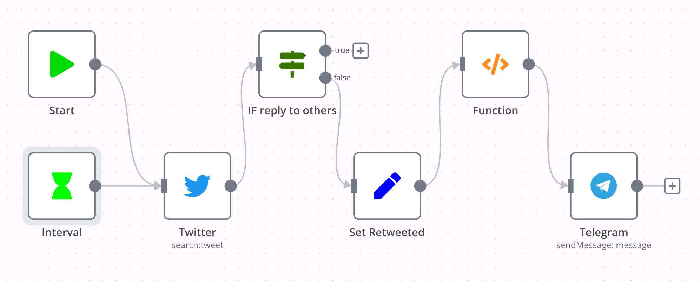

第一个 node 是 Interval，它是一个 trigger，可以设置重复运行的间隔时长。

随后是 Twitter node，它通过 OAuth 连接了我的账户，使用 `from:novoreorx` 搜索语法来获取我最近的推文条目。

IF reply to other 是一个 IF node，通过条目中的 `in_reply_to_screen_name` 字段判断推文是否是对别人的回复，只有否才可以走向下一步。意味着只有单独创建或回复自己的推文才会被转发。

Set Retweeted node 根据条目中的 `retweeted_status` 字段，识别 retweet 条目，并将原推的 URL 拼凑出来，赋值给新的字段 `retweeted` 和 `retweetedUrl`，以便后续使用。

Function 是我写的一段 JavaScript 代码，它使用了 n8n runtime 内置的 [getWorkflowStaticData](https://docs.n8n.io/integrations/core-nodes/n8n-nodes-base.function/#method-getworkflowstaticdatatype) 函数，记录每次更新的第一个条目 `lastItemId`，通过与上一次的记录进行对比，确保只有新的条目会被输送到下一个 node 执行。如果没有 `lastItemId`，则只返回第一个条目，避免冷启动时造成大量信息的无效转发。这段代码基本在每个 workflow 中都有用到，下面将不再赘述。

```js
/* only return new items */
const staticData = getWorkflowStaticData('global');
const lastItemId = staticData.lastItemId;

console.log('lastItemId', lastItemId);
const firstItem = items[0];
let newItems = [];

function getId(item) {
  return item.json.id;
}

if (lastItemId) {
  for (const item of items) {
    if (getId(item) === lastItemId) {
      break;
    }
    newItems.push(item)
  }
} else {
  newItems = [firstItem]
}

staticData.lastItemId = getId(firstItem)
return newItems
```

经过 Function 的处理后，有效条目会被送往 Telegram node，进行 message 组装，最终发送到频道。

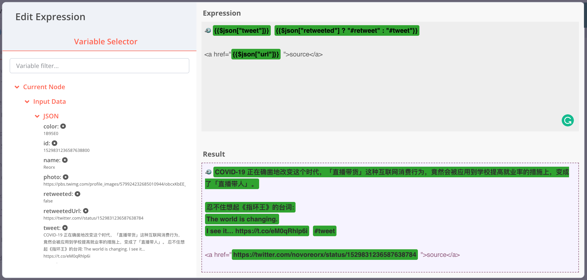


n8n 的表达式 (Expression) 有一个可以预览的编辑界面，左侧会展示当前 node 从上一个 node 获取到的输入数据 (Input Data)，点击即可将模板变量插入到 Expression 中。模板语法 `{{ }}` 中可以使用 JavaScript 语法，这里我通过 `$json["retweeted"]` 来决定 tag 为 `#retweet` 还是 `#tweet`。推文 URL 放在了 `<a>` 标签中，既可以触发 Telegram 的 link preview 功能，也避免展示太长的 URL 影响可读性。

#### Blog RSS to telegram

Link: [n8n-workflows/workflows/blog rss to tg.json](https://github.com/reorx/n8n-workflows/blob/master/workflows/blog%20rss%20to%20tg.json)

> 从第二个 workflow 开始，我将只对大致逻辑进行说明，不再详细讲解每个 node 的实现方式，有兴趣的读者可以在 workflow 编辑器中自行查看。

这一 workflow 实现了每 10 分钟检查一次博客的 RSS，将最新的文章发送到 Telegram Channel。

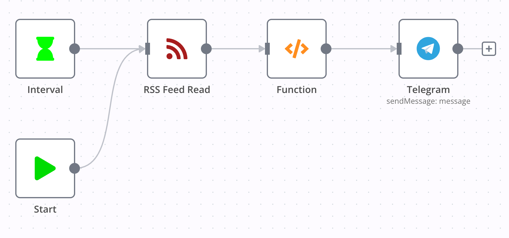

RSS Feed Read node 填写了博客的 RSS 地址，Function 同样是实现了有状态的更新判断，唯一的不同是将 `getId` 函数改为从 `item.json.guid` 获取 item id。

#### Spotify like to telegram

Link: [n8n-workflows/workflows/spotify likes to tg.json](https://github.com/reorx/n8n-workflows/blob/master/workflows/spotify%20likes%20to%20tg.json)

这一 workflow 实现了每 1 小时检查一次 Spotify Liked Tracks，将最新的歌曲发送到 Telegram Channel。

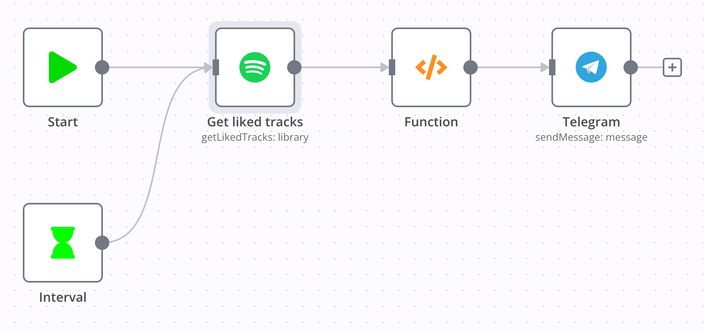

#### YouTube like to telegram

Link: [n8n-workflows/workflows/youtube like to tg.json](https://github.com/reorx/n8n-workflows/blob/master/workflows/youtube%20like%20to%20tg.json)

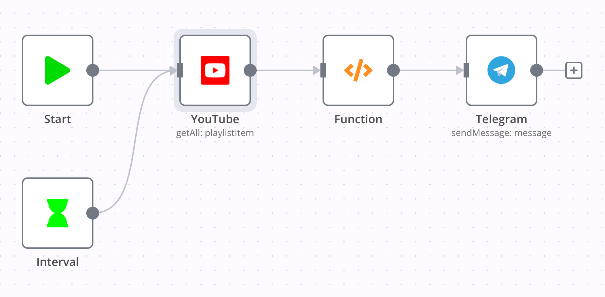

这一 workflow 实现了每 30 分钟检查一次 YouTube Liked Playlist，将最新的视频发送到 Telegram Channel。

这里需要注意的是，Liked 是一个内置的 playlist，因此其 ID 与自己创建的不一样，通过访问 YouTube get playlists API，得到其 ID 为 `LL`，顺利完成了这一 node 的配置。

#### Pinboard new bookmark to telegram

Link: [n8n-workflows/workflows/pinboard to tg.json](https://github.com/reorx/n8n-workflows/blob/master/workflows/pinboard%20to%20tg.json)

这一 workflow 实现了每 5 分钟检查一次 Pinboard 最近的书签，将最新的书签发送到 Telegram Channel。


n8n 没有 Pinboard 支持，但我们可以通过 HTTP Request 直接访问 Pinboard 的接口。古怪的是 Pinboard 没有官方的 API 文档，于是我对一些开源的 Pinboard SDK 代码进行阅读，得到了我所需要的接口 `https://api.pinboard.in/v1/posts/recent`。

Pinboard 接口返回的数据并不直接是一个列表，而是一个形如 `{"posts": [...]}` 的结构，这里用了 Item Lists 将 `posts` 字段提取出来作为 items 向后传递。

#### GitHub activities to telegram

Link: [n8n-workflows/workflows/github activities to tg.json](https://github.com/reorx/n8n-workflows/blob/master/workflows/github%20activities%20to%20tg.json)

这一 workflow 实现了每 10 分钟检查一次 GitHub 的动态，筛选出 star, pull-request 和 issue 发送到 Telegram Channel。

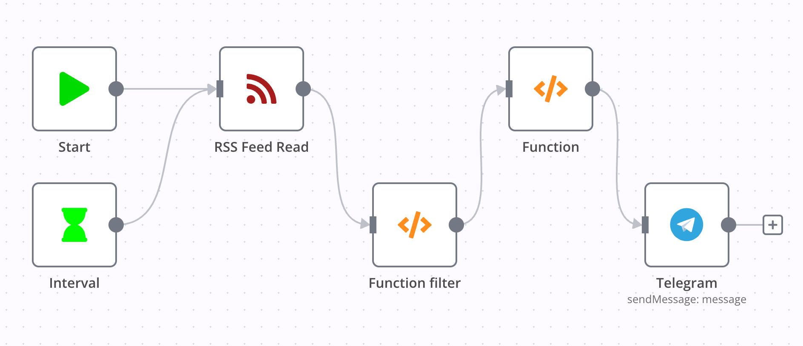

GitHub 可以通过 `https://github.com/$username.atom` 获取用户公开的动态信息，因此不需要复杂的 API 接入，直接使用 RSS Feed Read 即可获取到我们所需要的数据。

在 Function filter 中，我用正则为动态进行了分类，并组成最终所需的消息格式，代码如下:

```js
/* filter items */
const newItems = [];

const regexes = {
  'star': /^reorx starred/,
  'pull-request': /^reorx opened a pull request/,
  'issue': /^reorx opened an issue/,
}
const tagSymbols = {
  'star': '🌟',
  'pull-request': '⤴️',
  'issue': '⚡️'
}

for (const item of items) {
  const title = item.json.title
  let tag = ''

  for (const key in regexes) {
    const regex = regexes[key]
    if (regex.test(title)) {
      tag = key
      break
    }
  }
  if (tag !== '') {
    item.json.tag = tag
    item.json.tgTitle = `${tagSymbols[tag]} ${title.replace(/^reorx /, '')} #github #${tag}`
    item.json.guid = item.json.id
    newItems.push(item)
  }
}
return newItems
```

> 这个 workflow 还有一个使用 GitHub API 的版本，但 RSS 可以获得所有动态，更加方便，最终胜出。
> 
> Link: [n8n-workflows/workflows/github issues to tg.json](https://github.com/reorx/n8n-workflows/blob/master/workflows/github%20issues%20to%20tg.json)

#### Douban activities to telegram

Link: [n8n-workflows/workflows/douban activities to tg.json](https://github.com/reorx/n8n-workflows/blob/master/workflows/douban%20activities%20to%20tg.json)

这一 workflow 实现了每 10 分钟检查一次 Douban 的动态，筛选出看过、在看、读过、在读发送到 Telegram Channel。

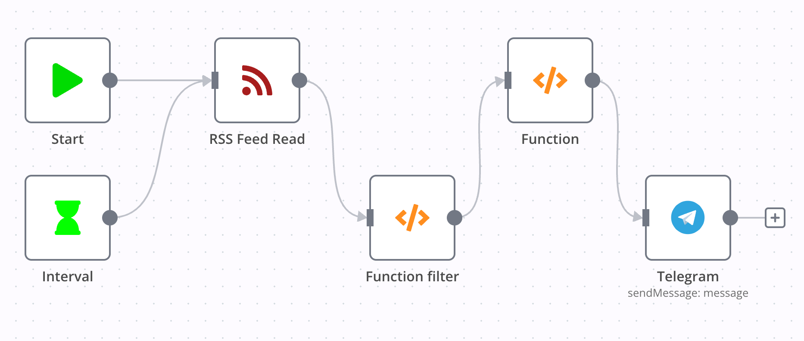

Douban 也有一个隐藏的 RSS 订阅源 `https://www.douban.com/feed/people/$username/interests`，包含书影音的所有动态。

Function filter 与上一个 workflow 类似，这里做了一些优化，将正则和符号定义在一个 object 中。

```js
const SYMBOL_MOVIE = '📺'
const SYMBOL_BOOK = '📖'

const tagInfoMap = {
  watched: { re: /看过/, symbol: SYMBOL_MOVIE },
  watching: { re: /在看/, symbol: SYMBOL_MOVIE },
  read: { re: /读过/, symbol: SYMBOL_BOOK },
  reading: { re: /在读/, symbol: SYMBOL_BOOK },
}
```

### 异常通知

n8n 作为一个自动化服务，在配置完成后，一般我们不会去主动查看系统的运行情况，因此需要有监控手段得知异常的发生，以便及时维护。

n8n 支持通过 [Error Trigger](https://docs.n8n.io/integrations/core-nodes/n8n-nodes-base.errortrigger/) 创建 Error Workflow，用于接收其他 workflow 的错误信息。这一步虽然不是必须，但我强烈建议创建一个全局的 Error Workflow，并在每个 workflow 的 Settings 中设置错误处理指向它。

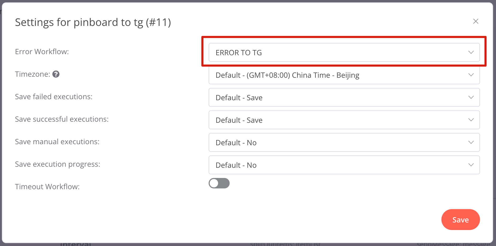

我在 [n8n-workflows/workflows/ERROR TO TG.json](https://github.com/reorx/n8n-workflows/blob/master/workflows/ERROR%20TO%20TG.json) 中实现了将错误信息发送到 Telegram Group 的功能，效果如下。


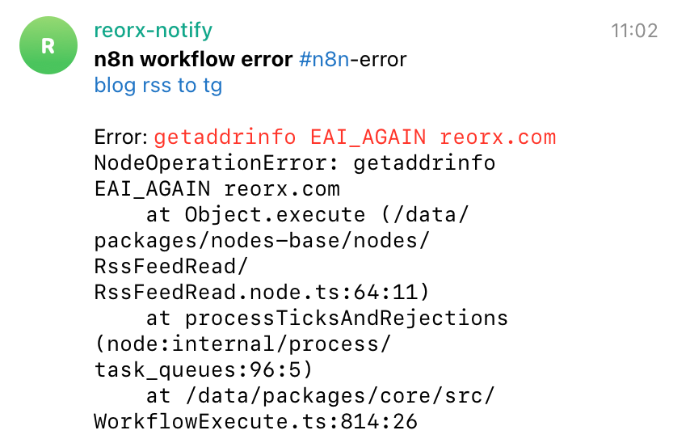



### 使用 SaaS 自动化服务

对于一些 n8n 尚不支持，或配置比较麻烦的服务，也可以通过 SaaS 服务来实现自动化。IFTTT 是一个不错的选择，它应该是最早被广泛使用的自动化服务，免费用户可以设置 5 个 applet (即 workflow)，同步间隔 1 小时。

下图是我在 IFTTT 中配置的 Instapaper 新文章推送到 Telegram 频道的 applet。


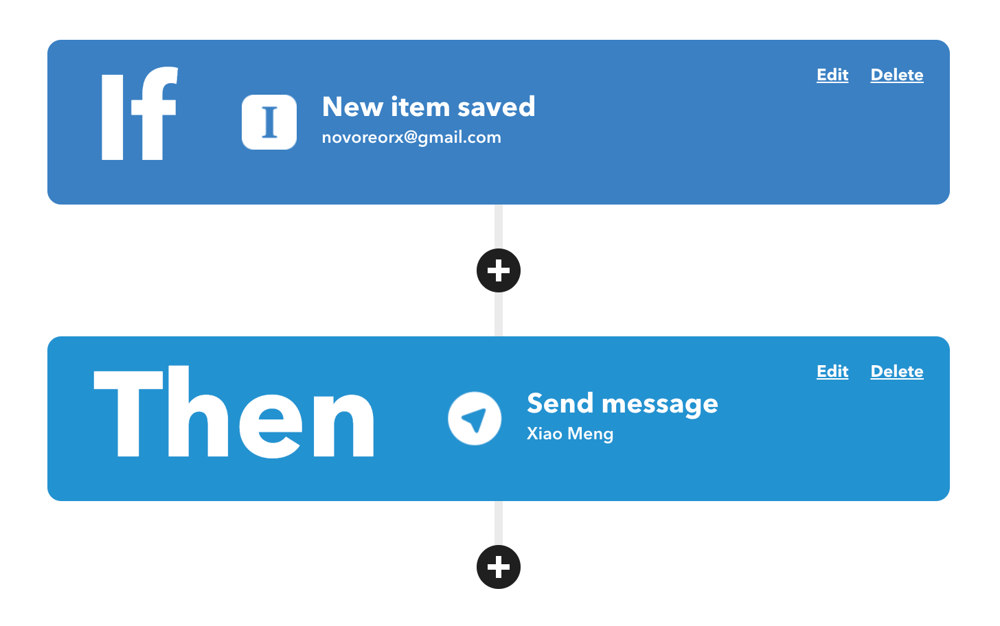


[Integromat](https://www.integromat.com/) 曾是一个非常好用的 IFTTT alternative，有着现代化的交互界面，和更为灵活的定制功能，但后来 rebrand 成 make.com，变得非常难用，不仅加载速度缓慢，而且连 migration 都无法正常完成[^4]。建议大家远离这个奇怪的公司。


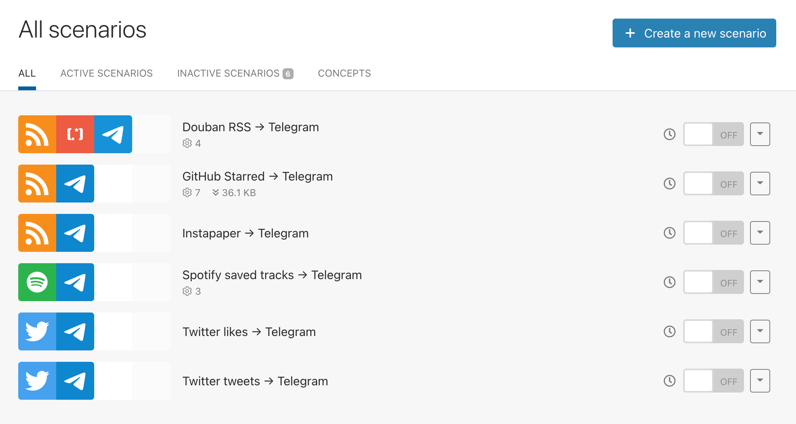






## 结语

使用 n8n 的过程总体是非常顺畅的，虽然一开始就在 Twitter 上栽了跟头，好在我能看懂 Nodejs 代码，自己动手修复后一路坦途。

曾经我特别痴迷于自己实现工具、制造轮子，现有工具稍有不顺就要全盘抛弃，自己解决。后来我在 happy xiao 的[忘记系统](https://happyxiao.com/system/)一文中看到 [John Voorhees](https://twitter.com/johnvoorhees) 的一段话，改变了我对使用工具的态度:

> If there's anything I've learned about productivity systems, it's that the best one is the one that works for you. Approaching the problem is tricky, but my advice is to use an app first and adopt a system later. That way, you'll have a better understanding of what your needs are before you dive in.

实现的结果才是最重要的，工具只是手段，不是目的。

这也让我对自己正在开发的产品有了更多的思考，它是一个用于信息前处理的工具，同样是为了解决信息的分散和封闭而做出的努力，我设想了很多功能要去开发，但哪些是核心需求，哪些有代替品，或者换个思路通过其他方式实现，则必须放在实际场景中去考虑，而不是凭自己作为开发者的喜欢来武断确定。

回到赛博空间这个话题，我一直觉得人类对电子设备的依赖是一个不可逆的过程，人脑与电脑的边界会逐渐模糊。这是当我们有了智慧、抛弃自然为我们提供的进化之路后，自己所选择的进化方式。正如 Ghost In The Shell 开篇所描绘的越来越近的未来：

> 企業のネットが星を被い、電子や光が駆け巡っても
> 国家や民族が消えてなくなるほど、情報化されていない近未来

而在这一天到来之前，我在精神上已经完成了自然人向 [cyborg](https://en.wikipedia.org/wiki/Cyborg) 的转变。

[^1]: 我的知识库中有三个分类:「制品」、「技术」、「事实」。制品 (artifacts) 是人所创造的作品、产品，如一个开源项目、一个软件；技术 (techniques) 是完成一类事情的方法或经验，也可以叫做 know-how，比如做饭的菜谱、编程语言的技巧、健身动作说明；事实 (facts) 是对概念、词汇的客观解释，多数来源于维基百科的词条。这三个分类可以基本涵盖我摄入的各类信息。

[^2]: 预计微信还需要 100 年才能赶上

[^3]: self-hosted workflow automation 的另一个选择是 [Huginn](https://github.com/huginn/huginn), 我没有尝试和对比，在看过它的项目页面，感觉 UI 非常简陋就放弃了。

[^4]: 见我在 Twitter 的吐槽: [http://make.com 大概是我 10 年来用过最糟糕的服务](https://twitter.com/novoreorx/status/1528985317847736320)