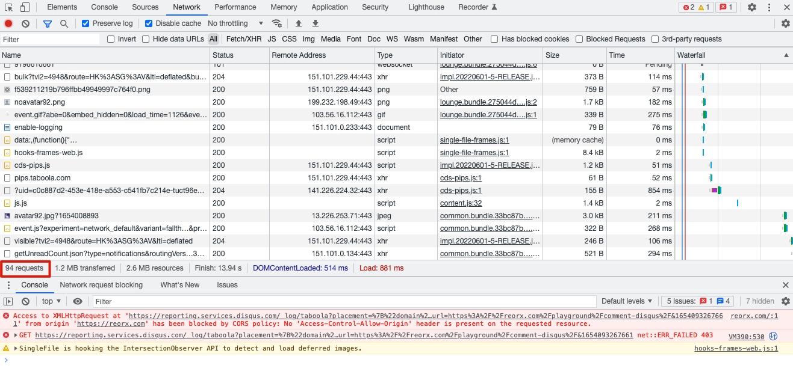
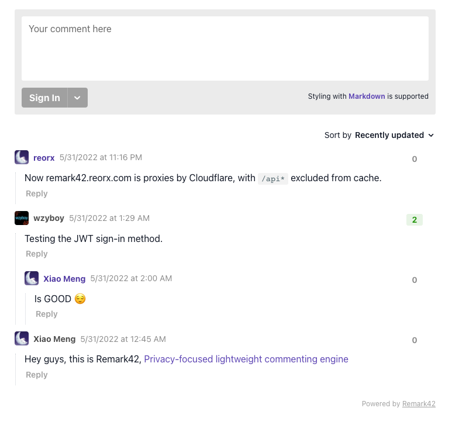

## 告别 Disqus

博客建成也有一段时日了，渐渐也会收到一些读者的评论，在和大家交流中学到了很多新的知识，我很喜欢这种感觉，把评论看做我和读者之间重要的交流渠道。有一天我收到了 [@geekdada](https://twitter.com/geekdada) 在 [搭建 umami …](/blog/deploy-umami-for-personal-website/) 下的留言:

> 非常感谢推荐。不知道作者有没有想把 Disqus 换掉，又臃肿又收集数据。

于是我开始留意起 Disqus 的使用体验。其实我在 2013 年就注册了 Disqus，用在了自己最早的一版个人网站上，对它也算是有些感情，这也是一开始快速实现时选择它的原因。

我打开 Chrome Dev Tools，刷新文章页，果然看见一大堆请求，一共有 94 次，这可太恶心了！且不论它收集了哪些统计数据和用户隐私，光是数量之多就让有代码洁癖的我无法忍受。

再试探性地关掉 ublock，这下更不得了，显示出有半个屏幕之大的广告区域，充斥着猎奇的图片和 clickbait 标题的链接。去设置页看了下，果然只有付费用户才可以关闭广告，但接连被恶心到，我已经彻底决定抛弃 Disqus。

就像之前从 Google analytics 换到 umami 那样，我踏上了寻找新的评论系统的旅程。

## 评论系统的选择

经过一番调查，我大致将评论系统分为了如下几类，每类都放上我认为最好的几种可选项，为同样带着自己的需求寻找评论系统的读者提供参考。

- **Full-fledged**
  
    全功能的评论系统，从前端的 UI 组件到后端的 API、数据存储都完整实现。其下又分为 SaaS 和 Self-hosted 两类。
    
    - **SaaS**
      
        Disqus 就是属于这一类产品，优点是配置便捷，不用操心；缺点则是可能会收集隐私数据，缺乏可控性，并且价格都比较贵。
        - [Commento](https://commento.io/): 目前是我最喜欢的一个 SaaS 评论系统，界面简洁清爽，能适应大部分博客的主题样式，无广告和追踪。价格为每月 $10。
        - [CommentBox](https://commentbox.io/): 我很早收藏过的一个评论系统，和 Commento 一样的 slogan 和价格，就是功能和设计看起来要弱一些。
    - **Self-hosted**
      
        与一般的互联网服务不同，评论系统中 Self-hosted 的比例反而比 SaaS 化的大很多，这大概是因为自建博客的市场比较小众，且使用者也多为喜欢造轮子的程序员。Self-hosted 虽然较为麻烦，但优势也非常明显——由开源带来的高可控性、高定制性，并且近年来 PaaS 平台的蓬勃发展大大降低了部署成本，不需要拥有服务器便可一条龙 0 元购搭建起来。因此如果你有一定的技术基础，非常建议尝试自部署一套评论系统。
        - [Remark42](https://github.com/umputun/remark42): 我最喜欢的一个 self-hosted 评论系统，也是本文接下来所要讲解的对象。
        - [Isso](https://github.com/posativ/isso): 使用 Python 开发，数据库为 SQLite。界面复古而简洁，适合 minimalist。Isso 可以配置评论自动通过，或者先审核再通过。
        - [Cusdis](https://github.com/djyde/cusdis): 我很佩服的开发者 [Randy](https://lutaonan.com/) 的作品，也是使用 SQLite 作为数据库，就像是 Isso 的 Nodejs 翻版，但界面更加美观。与 Isso 不同的是，Cusdis 要求评论必须通过人工审核才可以显示，提供了 Email 和 Dashboard 两种审核方式。
        - [Commento](https://github.com/adtac/commento): SaaS Commento 的开源版，使用 Go 开发，支持各种 social auth 登录，甚至可以配置 SSO。但这个项目已经停止更新一年多了，如果你有兴趣，可以考虑使用社区 fork 维护的 [Commento++](https://github.com/souramoo/commentoplusplus)，作者的更新还挺活跃的。
        - [Twikoo](https://twikoo.js.org/), [Artalk](https://artalk.js.org/), [Valine](https://valine.js.org/): 三者都是面向国内用户所开发的评论系统，有很多相似之处，因此放在一起介绍。与上述其他项目不同的是，三者的接入方式并非 ifame，而是直接操作网页的 DOM 元素。
            - Twikoo 主要支持腾讯云 CloudBase，也可以部署到 Vercel。数据库是 MongoDB。更新[比较活跃](https://github.com/imaegoo/twikoo/graphs/contributors)。
            - Artalk 使用 Go 开发，无部署环境限制，支持常见的 RDBMS。更新[近期较为活跃](https://github.com/ArtalkJS/Artalk/graphs/contributors)。
            - Valine 似乎只支持 LeanCloud 部署，已经[很久没有更新](https://github.com/xCss/Valine/graphs/contributors)了。
- **Proxied**
  
    类似 full-fledged，有自己实现的 UI 和 API，但数据存储依托于一个已有的其他服务。我个人并不偏爱此类应用，一者登录方式被限制在其所依托的服务上，再者数据也不好维护。
    - [utterances](https://github.com/utterance/utterances): 应该是最早的基于 GitHub 的评论系统，提供了一个用于接入评论的公开服务。
    - [giscus](https://github.com/giscus/giscus): utterances 的 fork 版，增加了自部署的能力。
- **IM Plugin**
  
    由即时通讯服务提供的插件。这是个顺理成章的思路，对于即时通许服务商来说，可以利用已有的基础设施提供更多的 user engagement，何乐而不为呢。其中最为知名的当属 Facebook，Google 曾经也有，但和 Google Plus 一同被埋葬了。这种评论系统也存在登录方式单一的问题，请谨慎选择。
    - [Comments.app](https://comments.app/): Telegram 提供的网站评论插件，使用简便，界面美观，支持 dark mode 和 accent color。
    - [Discussion Widget](https://core.telegram.org/widgets/discussion): 同样是 Telegram 的服务，但与 Comments.app 的不同在于，Discussion Widget 原本的设计目的是将 Channel 消息中的评论嵌入到网页中，但我发现这同样是一种评论系统，并且多出了将评论对应到 Channel 消息的功能。我在探索中已经顺便将 Discussion Widget 实现到了博客主题中，你可以在这个页面中预览和尝试: [Commenting System: Telegram Widget](/playground/comment-telegram/)
    - [Meta Comments Plugin](https://developers.facebook.com/docs/plugins/comments/?locale=en_US): Meta (Facebook) 的评论插件，我的社交圈里基本没人使用 Facebook，因此不予评价。
- **Static**
  
    静态评论，即评论作为静态网站原始数据的一部分，跟随网站的构建流程生成到页面中。不同于其他评论系统可以灵活嵌入到任何页面，静态评论只能用于静态网站中。评论的数据是否应该属于网站本身呢？这是一个非常两极分化的问题。
    - [Welcomments](https://welcomments.io/): 静态评论 SaaS 服务，需要用户绑定自己网站的 GitHub 仓库。当有人评论时，Welcomments 会生成一个 commit 包含评论的数据提交到仓库中，触发 GitHub 的自动构建流程，将评论更新到静态网页中。Welcomments 支持在它的网站上进行评论审核，还接入了 [Akismet](https://akismet.com/) anti-spam 服务，每月 $6，年付减为 $4。
    - [Staticman](https://github.com/eduardoboucas/staticman): 更为强大的 Welcomments，并且是 self-hosted。Staticman 支持更多的代码托管平台，并且可以通过 pull-request 的方式审核评论，这才是基于 Git 的工作流应有的样子。但 Staticman 已经有 2 年没更新了，在进行更深入的调研之前，不建议作为第一选择。
    - 手动维护: 任何手动维护评论的方式。有的博主会在网站会留下邮箱、即时通讯号等联系方式，让读者将想要评论的内容发送过去，然后将评论内容手动更新到文章的评论区。这种方式虽然简陋，但也不失为一种最简单的实现手段，毕竟评论的本质就是交流。

## 我的选择: Remark42

基于如下这些原因，我在众多评论系统中选择了 Remark42。

### 技术层面
- 它使用 Go 语言实现，我很难抗拒二进制单文件的诱惑。
- 它使用基于文件的数据库。我最喜欢的数据库是 SQLite，单文件无任何依赖，Remark42 使用的 [boltdb](https://github.com/etcd-io/bbolt) 也是基于文件，对我来说和 SQLite 一样美好。
- 它有较为现代化的前端技术栈，使用 TypeScript, Peact, Postcss 开发。
- 它是一个成熟的开源项目，文档全面、开发时间长，基本上我的任何问题都可以在文档和 Issues 中找到解答。
- 它的 [API](https://remark42.com/docs/contributing/api/) 非常完善，比如导入导出都可以用一行 curl 来完成。在其他方面作者也显示出很高的[技术品味](https://remark42.com/docs/contributing/technical-details/)。

### 视觉层面

Remark42 界面简洁美观，虽然比 Isso 和 Cusdis 复杂，但依然保持了足够的适应性和可塑性。





### 功能层面

我其实不喜欢 pre-moderation，即评论必须先通过审核才可以显示，这会给我带来额外的工作量，并且评论者也没法得到即时的效果反馈。但我也不想开放无审核的匿名评论，给自己带来被评论机器人攻击的风险。

我想到的折中方案是，首先提供尽可能多的 social auth 登录方式，比如 Twitter, Google, GitHub，这些 Remark42 都支持；再提供一种基于邮箱的认证方式，这是 Remark42 最大的亮点——Passwordless Authentication。评论者输入邮箱，点击 login，Remark42 会向其发送一个含有 token 的邮件，评论者使用这个 token 完成登入便可以进行评论。

邮箱认证是我个人最喜欢的登录方式，因为社交账号登录总是会存在风险，服务会拿到可以访问用户数据的 access token，你不知道它会做些什么 [^1]。而邮箱不存在用户数据，唯一的担忧是被 spam 骚扰，但有很多匿名邮箱和邮件转发服务帮助我们解决这个问题。使用邮箱登录进行的评论，在评论被回复后也会发送邮件提醒评论者，确保了双向沟通的流畅性。

Remark42 还有一个特别的地方，它没有 Admin 界面，或者 Dashboard，这得益于其清晰的设计理念和完善的功能实现。一般对于评论系统来说，Admin 主要用于查看和审核评论，但 Remark42 不需要审核，而对评论和评论者的操作（隐藏、删除、屏蔽）都集成在评论控件中。加上 API 简单易用，去掉 Admin 不仅没有让人感到不便，反而成为一个值得一提的 feature 了。

最后，Remark42 在设计上就支持 multi-site，只需要部署一个实例，便可以为多个不同域名的站点提供评论服务。

### 隐私层面

Remark42 的标语是「Privacy-focused lightweight commenting engine」，而它的确在隐私这件事情上做了许多事情。无追踪和广告自不必说，尽可能少的申请 OAuth 权限也只是基操，Remark42 还对用户数据做了这些考虑：

> Users can request all information Remark42 knows about them and receive the export in the gz file.

用户可将自己在一个 Remark42 服务中的所有评论数据导出，多希望我高中时使用的百度空间也有这个功能。

> Supports complete cleanup of all information related to user's activity by user's "deleteme" request.

用户可以通过 "deleteme" 请求将所有与自己相关的数据全部清除，类似近年来用户呼吁各大网站去支持的 opt-out [^2]。

## 小结

Remark42 还有许多功能，比如评论的 RSS 输出、Telegram 通知接入、Webhook 等等，限于本文篇幅，就不做展开了。下一篇博客我会对如何在 [Fly.io](https://fly.io/) 部署 Remark42、自定义 UI、接入 CDN 等内容进行详细的讲解，让读者也可以快速搭建自己的 Remark42 实例，敬请期待。

[^1]: 虽然一个优秀的服务应尽可能少的申请用户权限（减少 scope），但遇到糟糕的服务申请过多权限，我们一个不留神点了 Allow 的风险依然存在。

[^2]: [JustDeleteMe](https://justdeleteme.xyz/) 列出了各大网站对删除账户数据的支持情况，并提供直达链接。