时间回到两个月前的某天，和好友 [@iwendellsun](https://github.com/xwjdsh) 一起在咖啡馆工作时，他提出了一个问题：有没有一种路由器，它可以先连接一个已有的 Wi-Fi，再发射一个新的 Wi-Fi 供自己的设备连接？

我立刻理解了这个诉求的来源。咖啡馆、图书馆等场所的公共 Wi-Fi 一般都有身份验证机制，连接超过一个设备就会感觉很不方便，更不用说每个设备都还要独立设置代理；如果多人在一起工作，联机调试很可能会遇到公共 Wi-Fi 的端口限制而无法成功。我们对这个需求讨论了一番，但两人都缺乏对这类产品的认识，便不了了之。

最近在 Twitter 上看到 [@酱紫表](https://twitter.com/pengchujin) 分享了一款产品，突然意识到这可能正是我们想要的东西:



虽然没有提及这款名为 [GL-AXT1800](https://www.gl-inet.com/products/gl-axt1800/) 的路由器是否可以连接已有 Wi-Fi，但既然设计的这么小巧便携，应该是针对出门在外的应用场景吧？我如此寻思，注意到它在 GL.iNet 的产品矩阵中属于 Travel Router 这一分类，于是顺着这个关键词进行了一番搜索，果然发现这类产品大都有着和我们的需求一致的应用场景。

我随后去阅读了 GL.iNet 的[官方使用手册](https://docs.gl-inet.com/en/4/user_guide/)，弄清了 GL-AXT1800 所支持的四种连接互联网的模式：

-   [Connect to the Internet via an ethernet cable](https://docs.gl-inet.com/en/4/tutorials/internet_ethernet)
  
    通过网线连接互联网。GL 的路由器都有一个 WAN 口，这种用法与通常的家用路由器一致，连接在光猫或已有路由器的后面。
-   [Connect to the Internet via an existing Wi-Fi](https://docs.gl-inet.com/en/4/tutorials/internet_repeater)
  
    通过已有 Wi-Fi 连接互联网。这就是本文一开始所提到的在咖啡馆中的使用场景，将公共 Wi-Fi 扩展成为相对安全可控的局域网。
-   [Connect to the Internet via usb tethering](https://docs.gl-inet.com/en/4/tutorials/internet_tethering)
  
    通过 USB-A 口连接手机，使用手机的移动网络连接互联网。这种模式需要打开手机的热点功能，使用有线以降低传输损耗。
-   [Connect to the Internet via usb modem](https://docs.gl-inet.com/en/4/tutorials/internet_cellular)
  
    通过 USB 调制解调器连接互联网。这种模式将只能插在笔记本电脑上的传统的无线上网卡变成可供多人使用的 Wi-Fi。

这些模式基本可以定义出 Travel Router——无线便携路由器的主要功能，读者可思考其中是否有符合自己需求的功能，从而对这种产品做出种草或拔草的判断。

## 同类产品介绍

说完了什么是无线便携路由器，我们再来看看有哪些可供选择的同类产品。

### 单板机 DIY

弄清楚产品功能之后，我发现家里被用作软路由[^1] 的 [NanoPi R2S](https://www.friendlyelec.com/index.php?route=product/product&product_id=282) 是可以成为无线便携路由器的，只不过还需要对系统和配件进行一些 DIY 配置。

一个未经雕琢的 R2S 长这样:


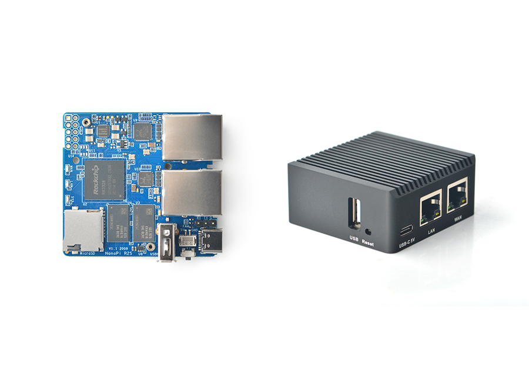


插上一个外置的无线扩展模块，它从结构上就与 GL-AXT1800 一般无二了:


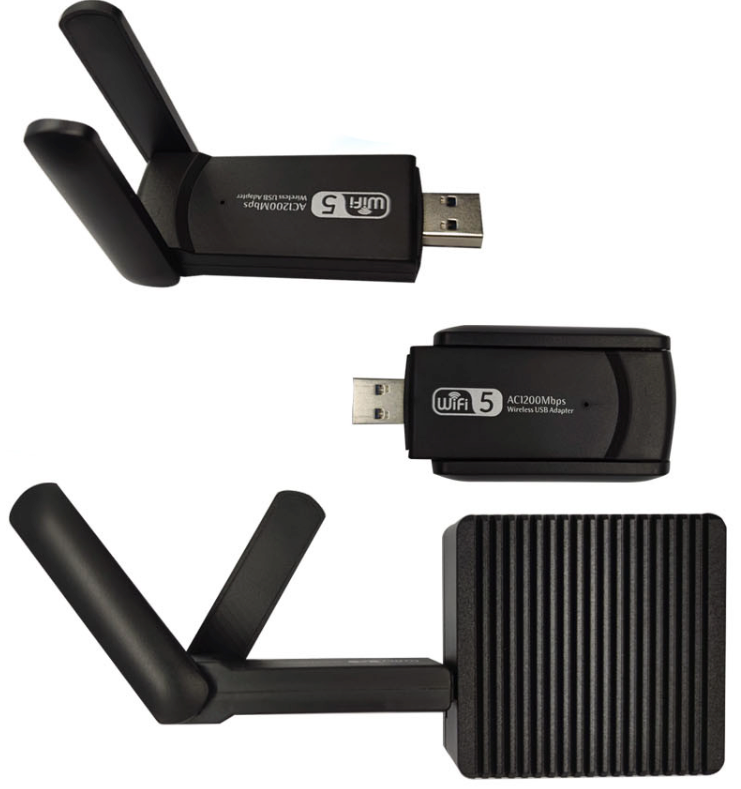


> 不过这样使用也有局限，由于 R2S 只有一个 USB-A 口，当扩展为 Wi-Fi 天线后，就无法实现上文提到的 USB tethering/modem 模式了。

实际上树莓派等其他 [SBC](https://en.wikipedia.org/wiki/Single-board_computer) 也可以用同样的思路配置实现，不过我更喜欢 NanoPi 的外形和亲民的价格（去年好像涨价了），感兴趣的读者可以在淘宝认准 FriendlyElec 官方店购买。

固件方面，使用 OpenWrt 或其发行版即可，通过 Wi-Fi 连接互联网是 OpenWrt 的基础功能之一，官方文档对此有着非常详细的说明: [Wi-Fi extender / repeater / bridge configuration](https://openwrt.org/docs/guide-user/network/wifi/relay_configuration).

### 纯硬件产品

[GL-AXT1800](https://www.gl-inet.com/products/gl-axt1800/) 即属于此类，在硬件层面已经高度集成和完善，但固件、代理等还需用户自行配置。GL.iNet 系产品的优点之一是自带基于 OpenWrt 开发的固件 [^2]，功能足够强大，省去了自己刷的麻烦。

下面列举 GL.iNet 的其他几款 Travel Routers:

- [GL-MT300N-V2](https://www.gl-inet.com/products/gl-mt300n-v2/)
  
    昵称 Mango 芒果，有着鲜明的颜色和与 R2S 近似的小巧外形。电源输入是 5V/2A，相比 GL-AXT1800 的 5V/4A 对充电头更加友好。
    
    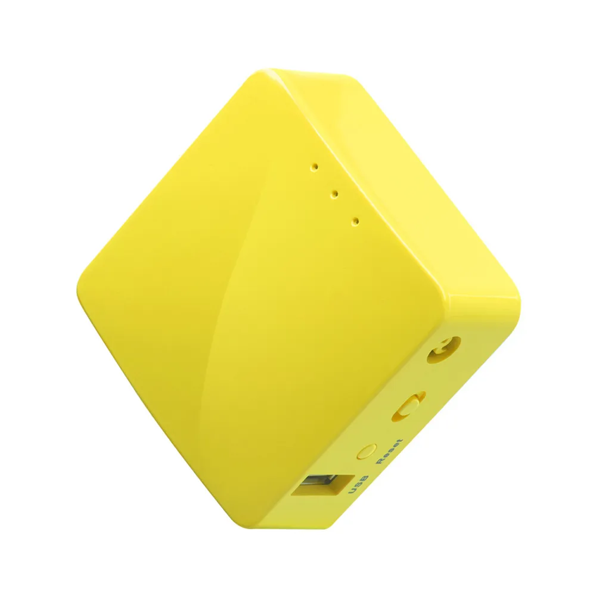
- [GL-AR300M](https://www.gl-inet.com/products/gl-ar300m/)
  
    黑色并升级了 CPU 的 GL-MT300N-V2。
    
    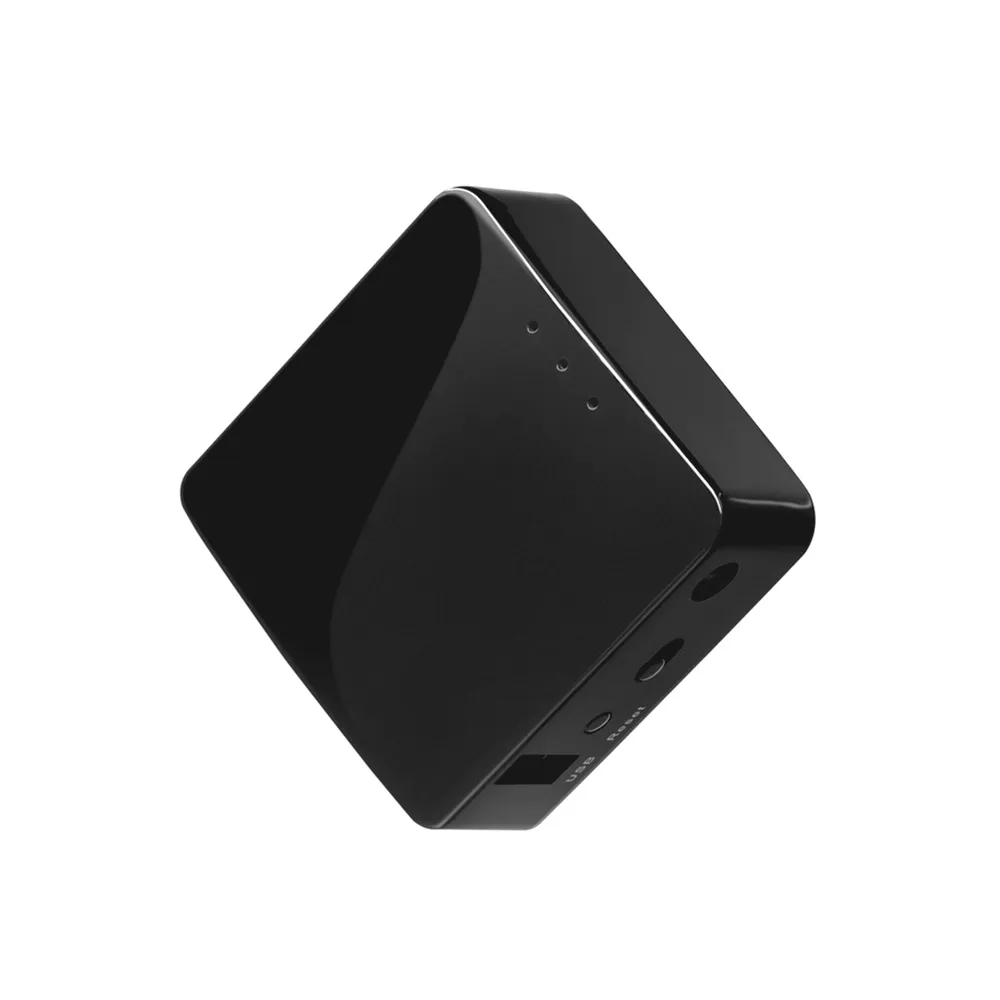
- [GL-USB150](https://www.gl-inet.com/products/gl-usb150/)
  
    传统 U 盘的大小，可以直接插在充电器 USB-A 口上使用。
    
    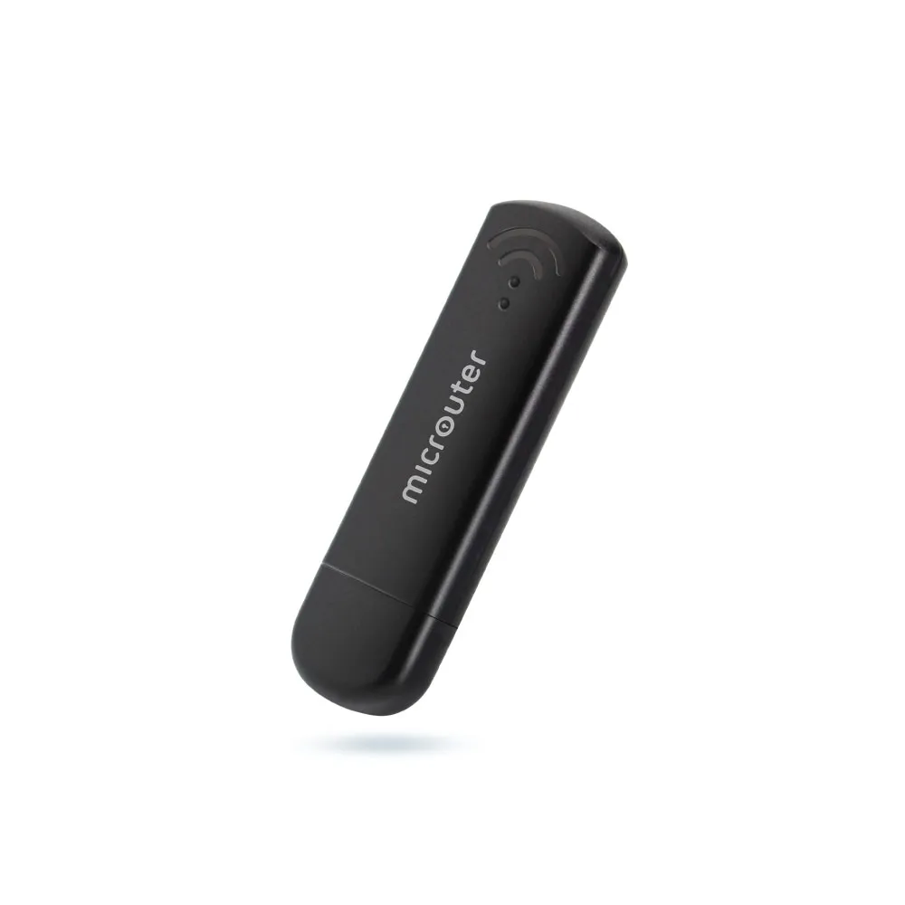

其他品牌中，TP-Link 有一款 [TL-WR902AC](https://www.tp-link.com/us/home-networking/wifi-router/tl-wr902ac/) 和 GL-MT300N-V2 类似，支持刷入 OpenWrt [^3].


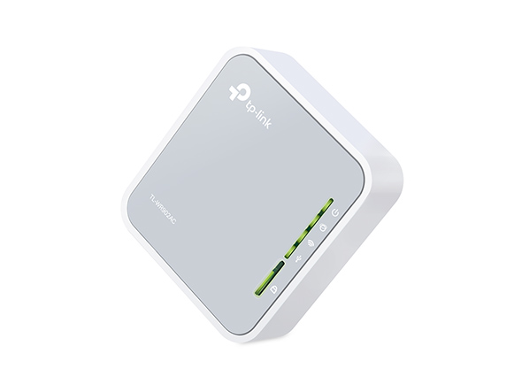


### 硬件 + 服务

推友 [@BigEyeSmolMouth](https://twitter.com/BigEyeSmolMouth)  向我分享了[梅花VPN](https://www.meihuavpn.com/) [^4]，使我得知有这类产品的存在。它们就像网易的 UU 加速盒，在硬件上内置了自己的网络代理服务，实现成软硬一体化的翻墙 Wi-Fi。

在我看来，这种产品优缺点都很明显。优点是开箱即用，省事不折腾；缺点是可控性差，无法更换代理提供商，且商品的溢价较高，其硬件性能不会有多少剩余空间。从安全的角度考虑，这样一个黑盒设备也无法让人信任。


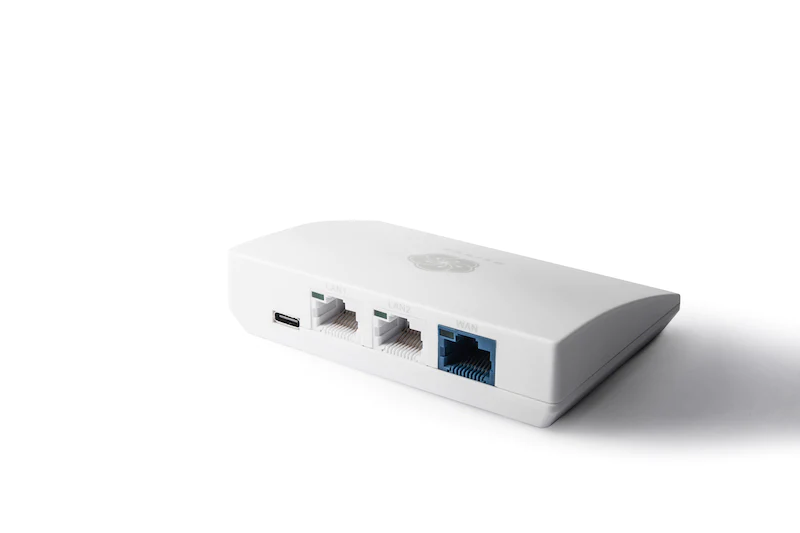



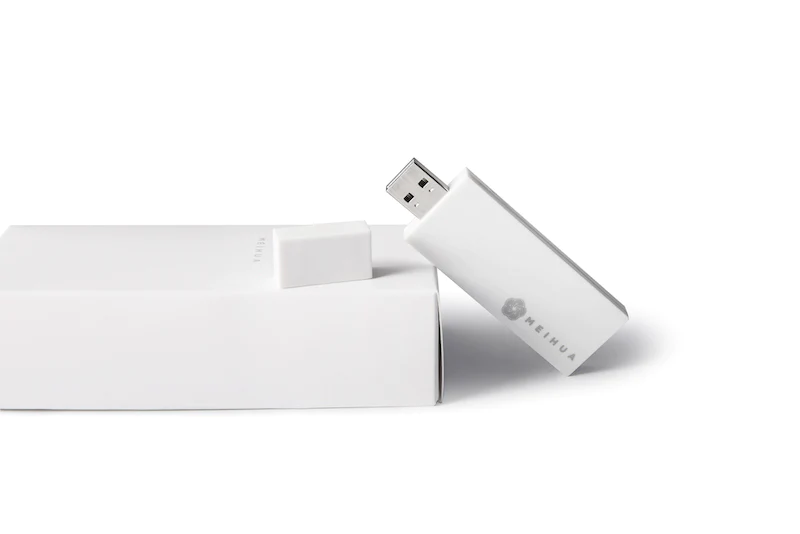


> [官网](https://www.meihuavpn.com/collections/shop/products/11offer-h)的 spec 中没有关于 CPU、固件、协议等信息的描述。

## 相似但不同的产品

看过上文对无线便携路由器的介绍后，你是否有种似曾相识的感觉？没错，其实有一些与之类似但却不同的产品存在，平时没有用过也多少见过，这也是我在一开始未能准确把握自己想要什么产品的原因，它们都存在硬件或功能上的共性。下面我将针对两种可以明确定义出功能边界的设备进行阐述。

### Wi-Fi 信号放大器

也有人将其称为「无线中继」，比较准确的英文名称应该是 Range Extender。这类产品的核心用途是接收已有 Wi-Fi 的信号，作为 [AP](https://en.wikipedia.org/wiki/Wireless_access_point) 发射出相同的 SSID，以达到延长其信号范围的目的。一般用在家庭、办公室等空间较大、Wi-Fi 信号容易衰减的环境。

它和无线便携路由器在接收 Wi-Fi 信号这件事情上使用了相同的技术 [WDS](https://en.wikipedia.org/wiki/Wireless_distribution_system)，但一个是扩展已有的 LAN，一个是创建新的 LAN，用途的差异使两者最终呈现出不同的产品形态。可以把 Wi-Fi 信号放大器看做特化的无线便携路由器。

TP-Link 有很多[此类产品](https://www.tp-link.com/hk/home-networking/range-extender/)，它们的外形通常像耳朵长着天线的机器人🤖


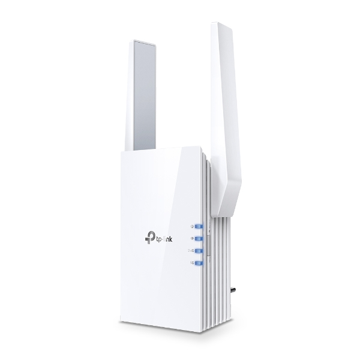


### 随身 Wi-Fi

也叫「无线上网卡」，比较准确的英文名称应该是 Mobile Wi-Fi Router (or 4G Wi-Fi Router)。这类产品的目的是使用 3G/4G LTE 创建随时随地可供使用的 Wi-Fi。分为内置 eSIM 卡和依赖外部 SIM 卡两种。

国内的随身 Wi-Fi 一般都是内置 eSIM 卡的，外形像 U 盘或充电宝，在设计上并没有提供多少可定制性，但由于其普及程度非常高，广大 DIY 爱好者早已将其研究通透。[@酱紫表](https://twitter.com/pengchujin) 分享过一篇 [4g 随身 Wi-Fi 刷 openwrt 变成软路由](https://qust.me/post/msm8916/) 教程，成品展示在这条[推文](https://twitter.com/pengchujin/status/1536310680109735936)中。

> 其实在刷上 OpenWrt 后，随身 Wi-Fi 就等同于上文中 [Connect to the Internet via cellular](https://docs.gl-inet.com/en/4/tutorials/internet_cellular/) 模式下的  GL.iNet，因此它同样可以看做无线便携路由器的特化版。

Netgear 的 [MR1100](https://www.netgear.com/home/mobile-wifi/hotspots/mr1100/) 则是插卡的，黑色金属质地体现出服务器特有的冷酷和科技感，还有着让我无法抗拒的数据指示屏。


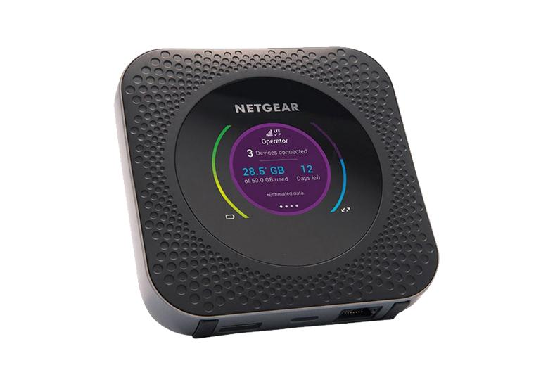


另一款值得一提的产品是 GL.iNet 的 [GL-E750](https://www.gl-inet.com/products/gl-e750/)，它同时具备无线便携路由器和随身 Wi-Fi 的功能，并且可以通过内置的 7000mAh 供电，相当于 GL-MT300N-V2 + 上网卡 + 充电宝的 all-in-one 组合。在咖啡馆可以连接公共 Wi-Fi 并接线充电，在户外则可以使用移动网络不依赖电源，简直是理想中的产品。但一般来说，越是什么都会，越可能什么都不精，GL-E750 具体表现如何，只有真正入手使用后才能知道。


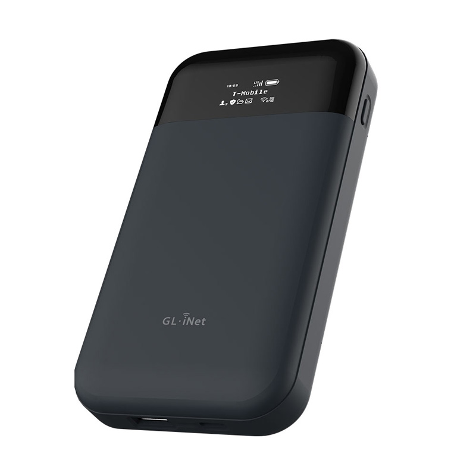


## 结语

在移动办公越来越广泛的今天，无论你是时常出差办公的技术工作者，还是四海为家的数字游民，无线便携路由器都是值得了解和尝试的产品。数据和隐私是无价的，当连接到公共 Wi-Fi 时，我们的设备便存在被攻击和窃取数据的风险，而通过无线便携路由器，我们可以在一个可控的局域网中管理设备、增加防护，获得更安全的办公环境和更高效的生产力。

本文仅对一些无线便携路由器做了简单的列举，不涉及传输和加密性能的测评，由于我还没有实际使用过，因此无法对这些产品的好坏做出评价，读者将本文当做科普知识的分享即可。在未来我会补充一篇实际的产品使用体验，如果你使用过这一类产品，欢迎在评论区或 Twitter 分享你的经验。

## Revision
- 2022-06-30: created
- 2022-07-02: add GL-E750

[^1]: 见推文 https://twitter.com/novoreorx/status/1412406192845033473

[^2]: 见 GitHub 项目页 https://github.com/gl-inet/openwrt

[^3]: 见 OpenWrt 官网的硬件支持页面: https://openwrt.org/toh/tp-link/tl-wr902ac_v3

[^4]: 见推文 https://twitter.com/BigEyeSmolMouth/status/1542379014970417153