在前文 [使用自动化工作流聚合信息摄入和输出]() 中，我介绍了如何在 NAS 提供的 Docker 环境安装 n8n，以及 n8n workflow 的使用方式。经过 3 个月的使用，我有了一些新的体会和尝试，重新设计了 n8n 的部署方案。本文将对这套新的方案进行说明，并分享数据迁移和第三方服务接入的实践。

## 系统架构


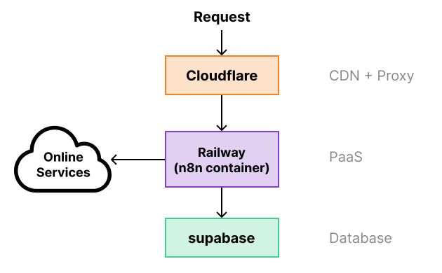


我们所要搭建的这套服务有着如图所示的系统关系。

- Cloudflare: CDN 和 Proxy，用于加速网站访问，可选组件
- Railway: PaaS 平台，提供 Docker 环境运行 n8n 的后端进程
- Supabase: 作为数据库供 n8n 使用

## 完整部署流程

### Supabase: 创建数据库

首先我们要在 [Supabase](https://supabase.com/) 上注册一个账号，登入之后，点击 New project 创建新的数据库，命名为 n8n，注意要记住创建流程中输入的密码。

定位到 Project settings / Database / Connection info，将图中的信息记录下来即可进入下一步。

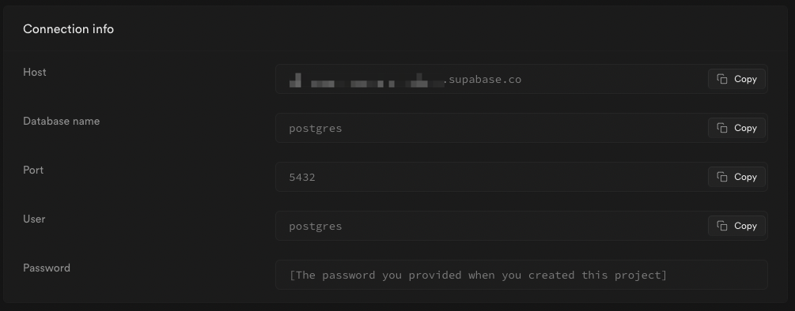


### GitHub: 创建 Repo

在 Railway 上部署服务最便捷的方式就是关联一个 GitHub repo，你可以 fork 我准备好的: [reorx/n8n-on-railway](https://github.com/reorx/n8n-on-railway)

这个 repo 的内容非常简单，其中最核心的就是 `Dockerfile`，只有一行代码：

```dockerfile
FROM reorx/n8n-custom
```

它的作用是基于 [reorx/n8n-custom](https://hub.docker.com/repository/docker/reorx/n8n-custom/) 定义新的镜像。Railway 会使用这个 `Dockerfile` 来自动构建和部署服务。

[reorx/n8n-custom](https://hub.docker.com/repository/docker/reorx/n8n-custom/) 是我个人维护的镜像，基于版本 [0.193.5](https://github.com/n8n-io/n8n/tree/n8n%400.193.5) 构建 [^1]，目的是提前使用 [PR](https://github.com/n8n-io/n8n/pull/3354) 的代码，以解决无法接入 Twitter 的问题。如果你对安全性有所担忧，也可以使用官方镜像 [n8nio/n8n](https://hub.docker.com/r/n8nio/n8n)。

Repo 中还有 `example.env` 和 `export_workflow.sh` 两个文件，稍后我们会用到。

### Railway: 创建 Project

注册或登入 [Railway](https://railway.app/)，点击 New Project，选择 Deploy from GitHub repo，找到上一步创建的 repo 名字（n8n-on-railway）并选择，在下一个界面点击 Deploy now 开始部署。

#### 修改域名

不需要等待部署完成，我们直接进入 Project，点击代表 service 的卡片，打开 Settings。


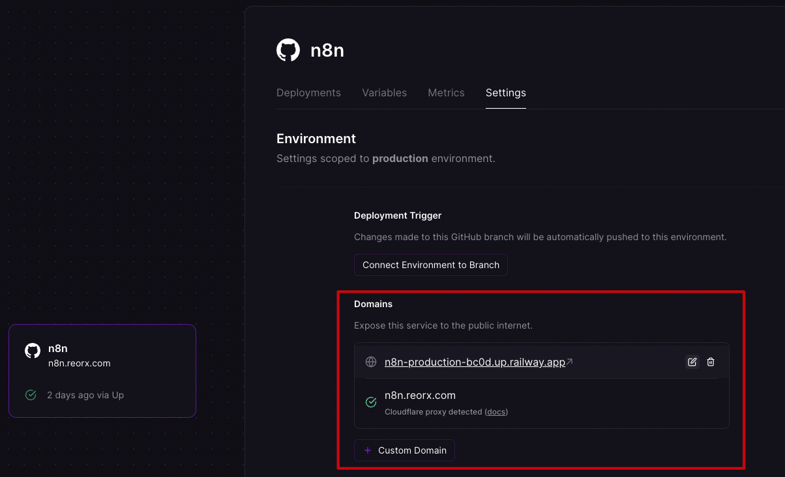


可以看到 Railway 已经为我们的服务分配了一个 `.up.railway.app` 的四级域名，这将是你访问 n8n Web UI 的入口。如果你对域名没有要求，可以保持不变，将这个域名记录下来；如果你希望使用自己的域名，请参考 [Exposing Your App](https://docs.railway.app/deploy/exposing-your-app#custom-domains) 文档中的 Custom Domains 章节进行设置。

下图是我的域名 `n8n.reorx.com` 在 Cloudflare 的配置信息。由于 n8n 是一个重前端交互的网站，需要加载很多庞大的 JavaScript 文件，直接通过 Railway 访问效率很低。使用 Cloudflare 的 Proxy 功能，可以让这些静态资源走 Cloudflare CDN，加速网站访问。因此我非常推荐用 Cloudflare 来托管 n8n 自定义域名。


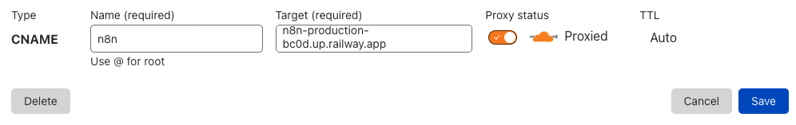


#### 设置环境变量

确认域名后，我们要切换到 Variables 页面对环境变量进行设置。


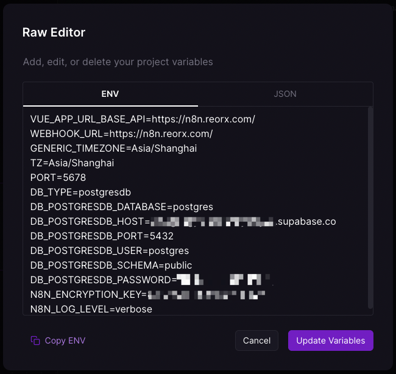


点击 Raw Editor 按钮，在弹出的输入框中粘贴 GitHub repo 中的 `example.env` 文件的内容，并调整各变量的值。其中：

- `DB_` 开头的部分要根据 Supabase 的 Connection info 对号入座
- `VUE_APP_URL_BASE_API` 和 `WEBHOOK_URL` 填写上一步中所使用的域名。
- `N8N_ENCRYPTION_KEY` 是 n8n 加密 credentials 所使用的 key，请务必使用自己生成的随机字符串。如果没有这个变量，n8n 会随机生成一个并保存到文件系统中，在 Railway 的运行环境下重启后就会丢失，导致已保存的 credentials 无法解密 [^2]。

以上这些变量均可在官方文档 [Configuration](https://docs.n8n.io/hosting/configuration/) 中找到详细说明。

编辑完成后，点击 Update Variables，Railway 会开始新的部署任务。至此，我们就完成了 n8n 在 Railway 上使用 Supabase 数据库的部署流程。

## 初始化和数据迁移

如果一切正常，等 Railway 的部署任务完成后，即可通过 [修改域名](#修改域名) 环节所确定的域名打开 n8n 网站。第一次访问时，n8n 会引导用户创建管理员账号，安全起见，请尽快完成这一步骤。

### Workflow 导入

如果你有已经备份好的 workflow，此时就可以进行导入了。先创建一个空的 workflow，然后在左侧菜单点击 "Import from File"，选择已有 workflow 的 json 文件即可完成导入。导入后，原 workflow 所使用的 credentials 会失效，需要手动选择或创建新的 credentials 才可以正常使用。

[reorx/n8n-workflows](https://github.com/reorx/n8n-workflows) 是我自己使用的一些 workflow，供读者参考。

### Workflow 导出

出于备份或分享的目的，我们可以导出 n8n 的 workflows。下面讲解如何将运行在 Railway 中的 n8n 的 workflows 进行导出。

1. 准备一个 Docker 环境，包含一个 Docker host 以及命令行工具 `docker`
2. 安装 Railway 的命令行工具 `railway` [^3]
3. 进入 GitHub Repo 所在的目录，执行 `railway link`，选择 n8n 对应的 project
4. 执行如下命令

    ```bash
    EXPORT_ROOT=/path/to/volume railway run bash export_workflows.sh
    ```

    其中 `EXPORT_ROOT` 是文件输出路径，将作为 volume 挂载到所要执行的 Docker 容器中。

    `railway run` 会将线上 project 的环境变量注入到当前 shell 中，使最终执行的脚本 `export_workflows.sh` 使用与线上一致的环境。

    执行完毕后，即可在 `EXPORT_ROOT` 下找到当前日期命名的目录，其中的 json 文件即为导出的 workflows。这些文件是以 workflow 的 id 命名，你还可以使用我的 [get_workflows.py](https://github.com/reorx/n8n-workflows/blob/master/get_workflows.py) 脚本修改文件名为实际的可读名称，并清理其中的无用数据:

    ```bash
    python get_workflows.py $EXPORT_ROOT/n8n-$(date +%Y%m%d) workflows/
    ```

这个导出方法同样适用于 NAS Docker 中部署的 n8n，只需要去掉 Railway 相关的步骤即可。

## 接入第三方服务

n8n 的强大在于它内置了很多线上服务的 Integrations，仅需简单的配置即可完成接入。虽然官方有文档说明，但仍然有一些不大不小的坑，这里记录下我的一些配置技巧，希望能帮助你节省一些时间。

### Google

Google 的接入相对比较复杂，请跟随文档 [Integrations: Google](https://docs.n8n.io/integrations/builtin/credentials/google/) 的详细说明进行操作。这里只说下文档中没有提到的一个细节：在创建 OAuth consent screen 后，要将 Publishing status 设为 Testing，否则 Google 的 OAuth 页面会显示应用未通过审核的警告。还要将想要接入的 Google 账号邮箱加入 Test users 列表，否则无法再 Testing 模式下通过 OAuth 验证。


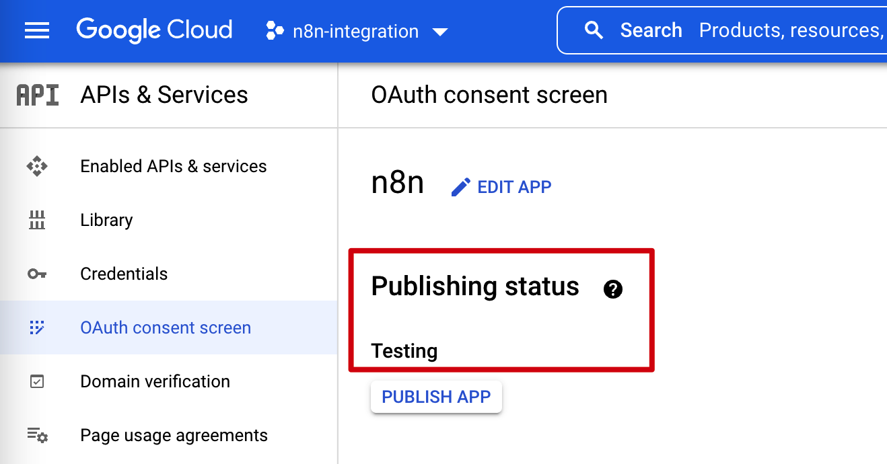



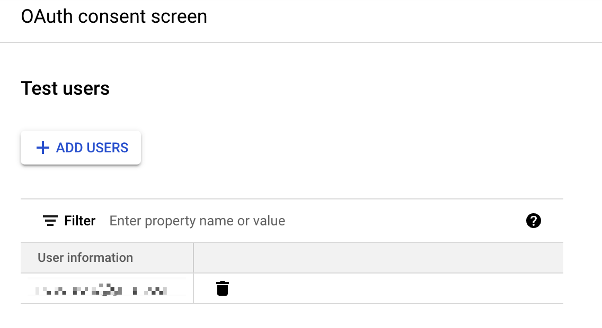


### Twitter

Twitter 由于这两年来 Developer Portal 的大幅改造，实际操作中可能与文档 [Integrations: Twitter](https://docs.n8n.io/integrations/builtin/credentials/twitter/) 有许多不一致，但只要确保以下几点，应该可以避免大部分问题。

1. 确保创建的 App 在 "Standalone app" 这个分类下
2. 确保 "User authentication settings" 按下图所示配置

  
  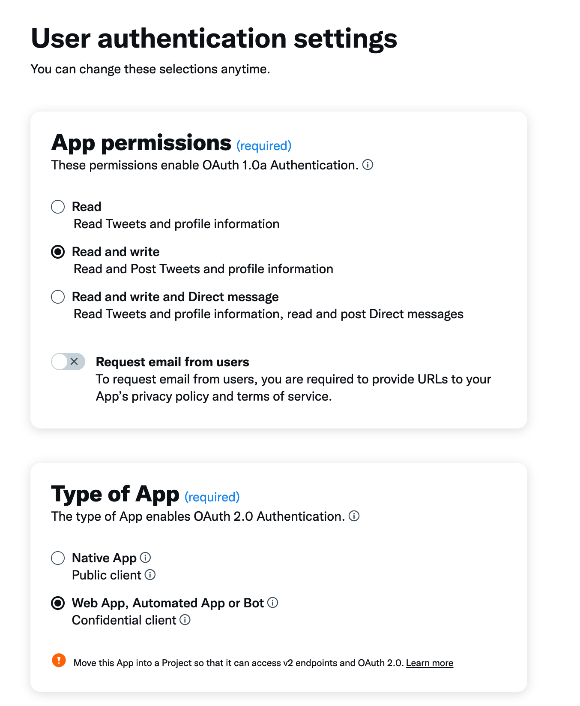
  
3. 确保向 n8n 填入的 Consumer Key 和 Consumer Secret 来自下图中红框所在的位置
    
  
  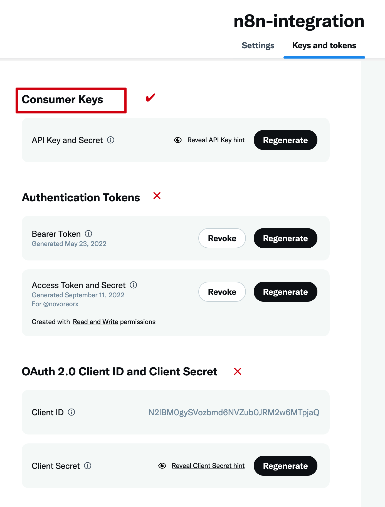
  


### Pinboard

n8n 没有内置 Pinboard 接入，不过 [Pinboard API](https://www.pinboard.in/api/) 设计非常简洁，我们可以手动实现接入。

创建 credential 时选择 "Query Auth"，向 "Name" 填入 `auth_token`，向 "Value" 填入从 [Pinboard password](https://pinboard.in/settings/password) 页面得到的 API Token。完成后，即可在 HTTP Request node 中使用。


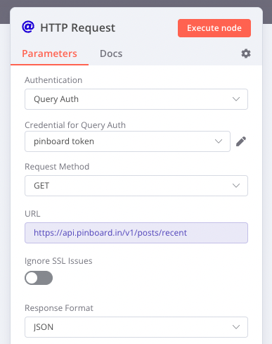



### GitHub

n8n 虽然有内置的 GitHub 接入，但并非所有 API 都被支持，因此我建议使用 HTTP Request 手动配置验证。

GitHub 提供 PAT (Personal Access Token)，与 Pinboard 的 API Token 类似，相比 OAuth 更容易配置。

GitHub API 支持在 HTTP Header 中通过 `Authorization` 字段进行验证，其值为 `Bearer` + PAT [^4]。

首先打开 https://github.com/settings/tokens, 点击 Generate new token，勾选所需权限。具体根据所要请求的 API 来决定，一般来说至少要勾上 `repo` 和 `user`。创建完成后复制结果即为 `$PAT`。

然后在 n8n 中创建 Header Auth，"Name" 填写 `Authorization`，Value 填写 `Bearer $PAT`（将 `$PAT` 替换为上一步的结果）。完成后，即可在 HTTP Request node 中使用。


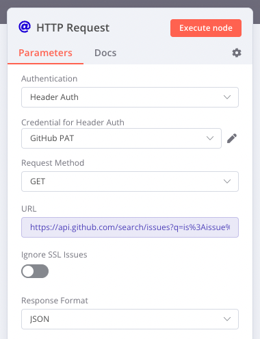


## 总结

随着 PaaS 和 Serverless 平台的兴起，在很多场景下它们都能够代替 NAS 成为自托管服务的最佳选择。个人使用免费额度一般都绰绰有余，无论对于想要快速试验新产品的开发者，还是喜欢体验 SaaS 服务的业余爱好者，现在都是一个非常好的时代。

之前将 n8n 部署在 NAS 上平均每天会有几十条错误报警，一部分是 SQLite 在机械硬盘上频繁读写触发事务锁竞争，一部分则是代理不稳定造成网络访问失败。在迁移到 Railway + Supabase 的方案后，两个问题都得到了解决。PostgreSQL 有着更好的连接和并发性能；而 Railway 的运行环境本身就处于外网，自然也不会遇到代理失效的问题。

Railway 也可以提供包含 PostgreSQL 的全托管方案，但独立运行 PostgreSQL 不仅资源消耗大，显著占用免费额度，而且不如 Supabase 这种专业的 DaaS 稳定和安全。Cloudflare 的免费 CDN 服务，补充了 Railway 分发能力的不足，也降低了出口带宽的成本。几个平台相互搭配，取长补短，使新的方案可以用最低的成本实现最佳的性能和体验。


[^1]: 代码见 https://github.com/reorx/n8n/tree/self-use
[^2]: 论坛里有人遇到过同样的问题: https://community.n8n.io/t/credentials-error/181
[^3]: 参考官方文档 [CLI](https://docs.railway.app/develop/cli)
[^4]: 见 GitHub 文档 [Getting started with the REST API - Authenticating](https://docs.github.com/en/rest/guides/getting-started-with-the-rest-api#authenticating)
