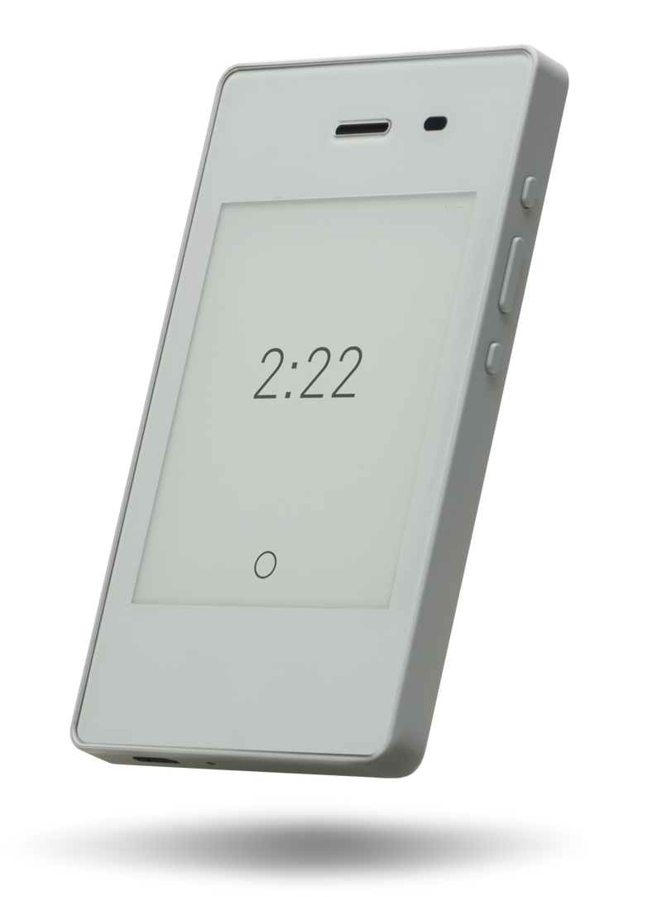
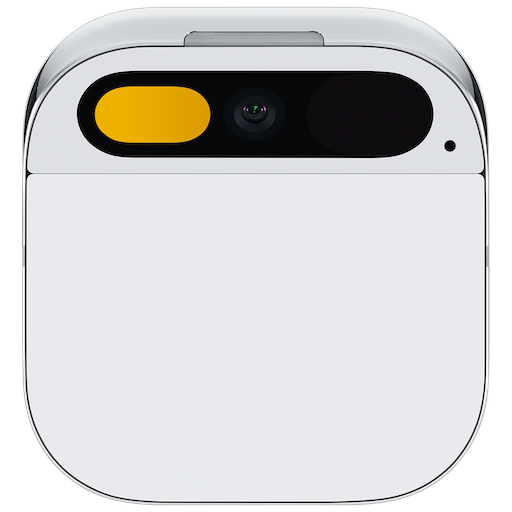
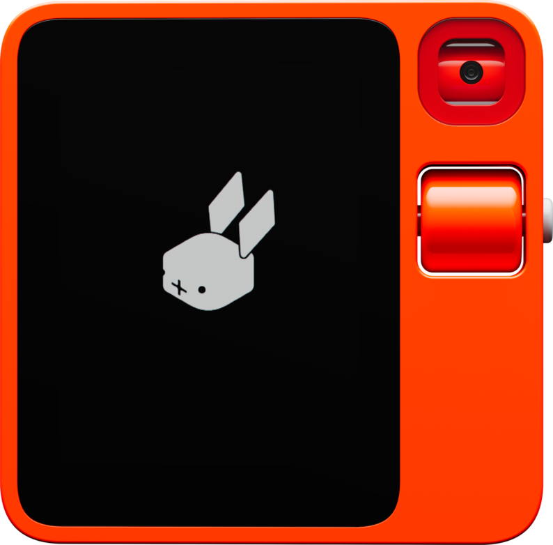

It all started with *The Light Phone*.

Living in a world full of technology and digital devices today, I constantly feel distracted, unfocused, and lost. The smartphone has become a part of our bodies, and we have already evolved into a new species - cyborgs. We no longer solely rely on our biological brains for looking and thinking; much of our important information is stored in our phones, our new "organ." However, it is dumb in comparison because the only efficient way to interact with it is to use our fingers, which is much slower than other natural organs connected and controlled by neural networks. I want to get rid of it, but deep down I know I cannot live without it.

After discovering [The Light Phone](https://www.thelightphone.com/), I realized that we may not rely on apps and information as much as we think. However, despite initially being intrigued, I eventually found myself unable to resist returning to my iPhone 7. This begs the question: why did I make this decision?





It's a downgrade of a person's capabilities. I can no longer take photos wherever I find something interesting, listen to music whenever I feel like it, or call a taxi wherever I want to go.

It shouldn't be this way when it comes to enhancing our lifestyle. From a young age, I have never held a high opinion of those individuals in history who chose to live in the wilderness as a means to find mental tranquility. I greatly admire those who can actively engage in society while maintaining a clear mind, living in a manner that brings them personal satisfaction.

Years passed, and it suddenly came to the era of LLMs. One day, I found [AI Pin](https://hu.ma.ne/aipin), a wearable device made by Humane with the power of OpenAI. My eyes lit up; I sensed a similar aesthetic and philosophy to the Light Phone. However, that was not enough. The AI Pin has no screen, meaning that I cannot interact with it through vision and touch, a significant loss of HCI technology of the past 60 years.





That being said, AI Pin is heading in the right direction, because what wastes our time and distracts us when using smartphones are the tedious and complex operations with apps. LLM excels at converting natural language into a sequence of machine-understandable commands, which is clearly the way to reduce the friction of using a digital device. I feel that the future is near, only a few steps away, but I didn't expect it to arrive so quickly.

Today, [Rabbit R1](https://www.rabbit.tech/) has been released, and I view it as a milestone in the evolution of our digital organ.





R1 is definitely an upgraded replacement for smartphones. It's versatile and fulfills all everyday requirements, with an interaction style akin to talking to a human. Other devices, such as the Light Phone and AI Pin, though minimalist and distraction-free, fall short of enabling us to accomplish our daily tasks. The disadvantages outweigh the benefits in the ultimate goal of improving our lifestyle.

So, why is R1 great? In my opinion, it's primarily due to the two new technologies it employs: Agent and LAM.

The concept of an Agent is simple: you instruct the AI what to do, and it will analyze your words to formulate a clear goal. Subsequently, it breaks this goal down into various tasks, orchestrates the completion of these tasks, and finally assembles the results to fulfill the goal. The Agent resolves the issue of LLM's inefficiency at task completion. [AutoGPT](https://github.com/Significant-Gravitas/AutoGPT) is the first proof-of-concept that has popularized the Agent. From a certain perspective, R1 can be perceived as a physical embodiment of an Agent.

The following is [LAM](https://www.rabbit.tech/rabbit-os), which I believe is the most impressive and exciting feature in R1's presentation. LAM, or Large-Action-Model, possesses the capability to comprehend any user interfaces and act accordingly. Utilizing LAM, Rabbit has developed a framework. This endows R1 with its most potent tool - the ability to learn.

With the power of teaching mode, R1 can acquire a new skill simply through screen recording and voice instructions. In the [presentation](https://twitter.com/rabbit_hmi/status/1744781083831574824), Jesse showed how to instruct R1 to use Midjourney for creating images from user voice commands. This proves that R1 is not limited to what the developers built in; users can tweak it to tailor it to their own needs. There's no compromise of losing capacities while maintaining a minimalist shape and intuitive use.

Someone once stated, the primary distinction between humans and robots is self-learning. While R1 cannot learn independently, it certainly serves as a commendable human companion.

Generally, I believe R1 has the potential to change the world. This is a thought that seldom comes to my mind, as I have seen numerous new technologies and inventions. However, R1 is different; it's not just another device to please a certain niche. It's meticulously designed to serve one significant goal for all people: to improve lifestyle in the digital world.
