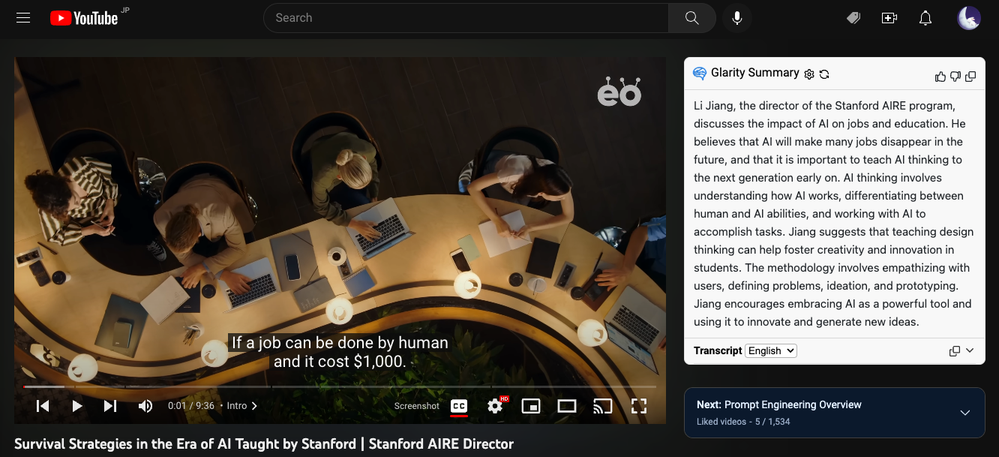
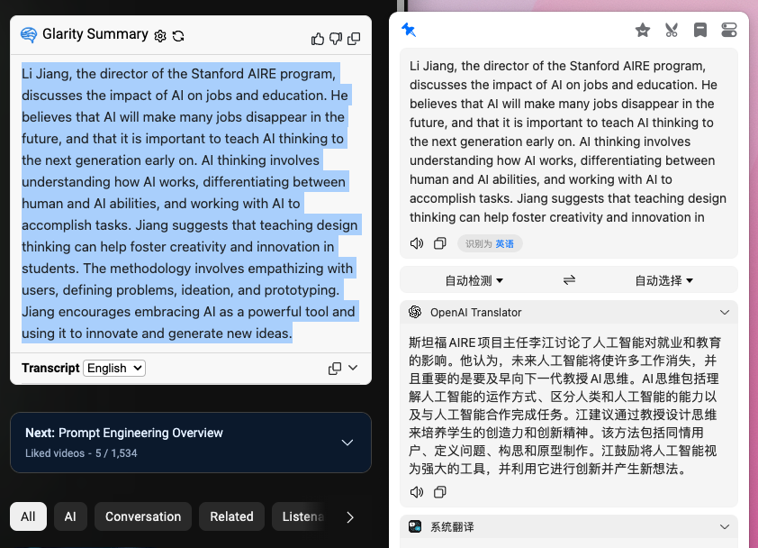
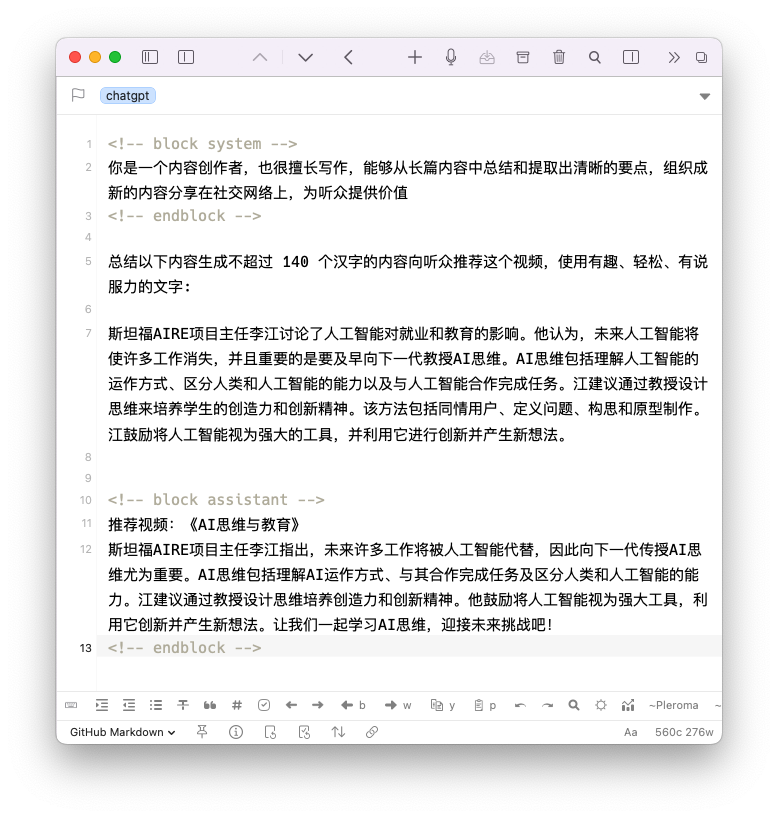

前几天刷到一个 [YouTube 视频](https://www.youtube.com/watch?v=ZA9K0JMrbWg)，内容是斯坦福大学一位教授介绍它对 AI 的看法和 “AI Thinking” 思维观，感觉很有收获，于是就一如既往地想把我的所得分享到 Twitter 上。以往我都是自己来写推荐语，或许是受视频主题的影响，我便想到，要不要试试用 AI 来帮助我完成这次内容创作呢？

由于近期 ChatGPT 的火爆，我早已经安装尝试了许多基于 ChatGPT API 的工具，甚至自己开发了一些，因此也没有花功夫去寻找其他的，直接使用已有的工具来完成创作流程。

第一个也是最重要的工具是 [Glarity](https://glarity.app/)，它是一个 Chrome 扩展，为许多网站提供使用 ChatGPT 提取摘要的功能，比如 Google、YouTube、GitHub 等，效果很好，非常实用。Glarity 支持 OpenAI API 和 ChatGPT Webapp 两种后端，前者需要用户自己提供 API key，后者只需要登录 ChatGPT 网页版即可使用，完全免费。Glarity 的开发者来自中国，近期他们在 [Product Hunt](https://www.producthunt.com/posts/glarity-summarize-google-and-youtube) 发布了产品，大家可以多多点赞支持。

Glarity 在 YouTube 播放器右侧注入了一个小组件，点击 "Ask ChatGPT to summarize" 即可用当前视频的字幕生成摘要，效果如下:





由于字幕是英文，因此总结内容也是英文，我使用 [Bob](https://bobtranslate.com/) 的 [OpenAI Translator](https://github.com/yetone/bob-plugin-openai-translator) 插件将摘要翻译成了中文:





看着效果还不错，读起来也很通顺，但是内容太长了，如果想发表到 Twitter 上，就要受到 280 个字符（140 个汉字）的限制，需要再精简一下。用我自己写的 [Drafts](https://getdrafts.com/) 插件 [ChatGPT Conversation](https://directory.getdrafts.com/a/2HJ)，通过定义 system message 创建了一个专门用于生成社交媒体内容的笔记，让它基于上一步的翻译结果进行创作：





结果为：

> 斯坦福AIRE项目主任李江指出，未来许多工作将被人工智能代替，因此向下一代传授AI思维尤为重要。AI思维包括理解AI运作方式、与其合作完成任务及区分人类和人工智能的能力。江建议通过教授设计思维培养创造力和创新精神。他鼓励将人工智能视为强大工具，利用它创新并产生新想法。让我们一起学习AI思维，迎接未来挑战吧！

只需稍稍修改便是一个合格的文案了。不过其实我是自己把第二步的翻译结果进行了重编排，推文如下:



## 总结

本文探索了使用 AI 技术将有趣的内容总结成文案后发布到社交网络上的流程。用到了以下工具：

- [Glarity](https://glarity.app/)
- [Bob](https://bobtranslate.com/) and [OpenAI Translator](https://github.com/yetone/bob-plugin-openai-translator) plugin
- [Drafts](https://getdrafts.com/) and [ChatGPT Conversation](https://directory.getdrafts.com/a/2HJ) action

虽然是一个简单的任务，但有 AI 的帮助确实加速了生产力，如果我从头看完视频 + 自己写，至少需要 30 分钟，AI 则可以将这个步骤压缩在 5 分钟内完成。

当然了，这对我来说只是一个实验，我并不想完全以这种方式来创作，一则我并非内容农场，我只创作我认为有价值的内容；二则使用 AI 生成并不能帮助我去思考或深入了解问题。写作是一个创造性的过程，我享受它所带来的成就感，甚至挫败感，它们都能使我得到成长。但我依然非常喜欢 GPT AI，因为它会持续优化我的生产力，帮助我分担非创造性劳作，让我能投入更多时间在创造性工作上。这又让我想起那句话，技术本身是无罪的，只看你怎样使用它。任何结果都是使用者的选择，而不能将原因归咎在完成这件事的工具上。