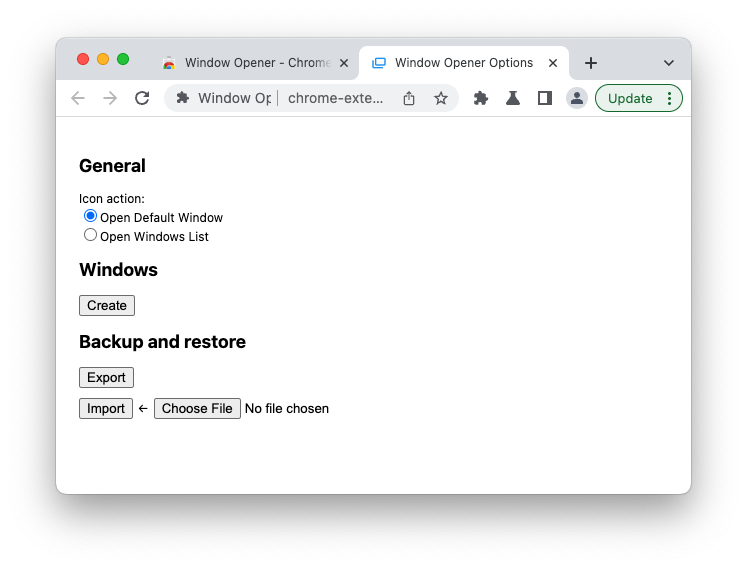
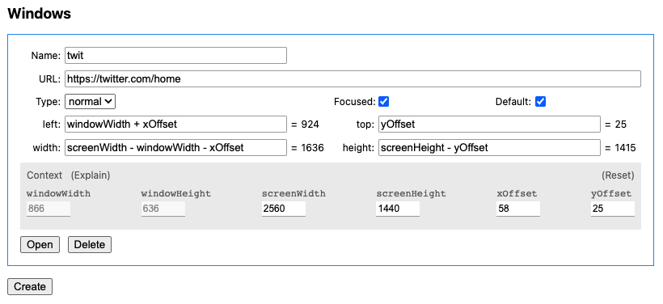
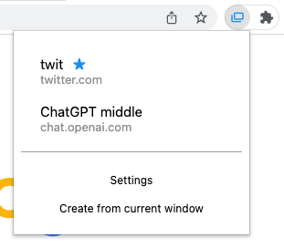

最近又做了一个新的扩展——[Window Opener](https://github.com/reorx/window-opener)，这篇文章介绍它的动机、开发过程和用法说明。

## 动机

我平时主屏的窗口布局一般是 Chrome 占 3/5 靠左，VSCode 占 1/2 靠右，交叠的部分一般不会影响两边的浏览。
最近关于 AI 的新闻几乎都从 Twitter 上获取，我很希望它以一个单独的窗口出现在主窗口的右侧，这样我在打开来自 Twitter 的链接时仍然可以继续向下滚动，得到更好的浏览体验。
我在 Moom [^1] 上添加了让窗口以 1/5 的屏幕大小靠 Chrome 右侧的布局，但仍然觉得很麻烦，因为我在专注工作时会关闭 Twitter，而每次打开时，都要走一遍 `[打开新窗口] → [输入 twit 回车] → [快捷键唤出 Moom] → [快捷键应用布局]` 的流程。于是我便想，要是能够一键把 Twitter 在当前窗口的侧边以特定大小打开就好了，既然没有这样的工具，何不自己做一个呢？


## 开发过程

> 如果你对此不感兴趣，可以直接跳到下一个章节查看插件的功能和用法介绍

说干就干，我从自己的 [webpack-chrome-boilerplate](https://github.com/reorx/webpack-chrome-boilerplate) 脚手架中复制了 `vanilla-ext` 到新的项目，为它取了一个简单直接的名字 `window-opener`. 我的脚手架的 tech stack 为 TypeScript + Webpack，其中内置了一些常用的库比如用于 DOM 操作的 cash-dom 和用于记录日志的 loglevel，不过最重要的一个包是 [@reorx/webpack-ext-reloader](https://www.npmjs.com/package/@reorx/webpack-ext-reloader), 这是我维护的用于自动重载扩展的工具，能够减少开发时每次保存就要手动点击 reload extension 的心智负担。

为了快速实现一个 demo，我首先想到的是让扩展的图标点击就可以打开 Twitter。我在 manifest.json 里添加了下面的配置

```
  "action": {
    "default_title": "Open a window"
  },
```

这使得当扩展的图标被点击时可以触发一个事件，从而执行打开新窗口的操作。以下是 `background.ts` 的代码:

```ts
chrome.action.onClicked.addListener(async () => {
  const window = await chrome.windows.getCurrent()
  const context = {
    windowWidth: window.width ?? 0,
    windowHeight: window.height ?? 0,
    screenWidth: 2560,
    screenHeight: 1440,
    xOffset: 58,
  }

  const windowArgs = {
    left: context.windowWidth + context.xOffset,
    top: 0,
    width: context.screenWidth - context.windowWidth - context.xOffset,
    height: context.screenHeight,
  }

  chrome.windows.create({
    url: 'https://twitter.com',
    focused: true,
    ...windowArgs,
  })
})
```

一个简单的 Proof-of-Concept 便完成了，点击扩展，便会在当前窗口右侧打开高度和屏幕一致、宽度占满剩余空间的 Twitter 窗口。这里用到的最核心的 API 是 chrome.windows [^2]，实现了当前窗口大小的获取，和新窗口的大小、位置的控制。为了计算出相对于屏幕的空间，我将自己所用屏幕的大小赋值给了 `screenWidth` 和 `screenHeight`, 但这样做不具备通用性，我希望动态获取当前窗口所在屏幕的大小。讽刺的是，Chrome 扩展的 API 竟然无法实现[^3]，经过各种尝试，最终我通过在扩展的设置页获取 `window.screen` 对象的方式得到了这些数值。(注意这里的 `window` 并非 `chrome.windows.Window`, 而是 DOM 的 `window`。)

核心功能完成后，我又为扩展增加了易于使用的界面。如果是非常简单的扩展 (比如 [refgen](https://github.com/reorx/refgen)，未来会写篇单独的文章介绍), 我会直接使用原生的 DOM 接口来实现页面交互，但这次我感觉到编辑界面有一定的复杂度，于是将脚手架换为 [webpack-chrome-boilerplate](https://github.com/reorx/webpack-chrome-boilerplate) 中的 `react-ext`，用 React 来增加代码的模块化和可维护性。

一直以来我一直都习惯用 Vanilla JS 来调用 Chrome 扩展接口，但引入 React 后不得不考虑状态管理，于是我找到了 [use-chrome-storage](https://github.com/onikienko/use-chrome-storage)，它能够以 hooks 的方式获取和保存扩展数据，使我免于用 `useEffect` 重新实现。下面是代码示例:

```ts
/* define settings store hook */

export interface Settings {
  iconAction: IconAction
  windows: WindowData[]
}

export const INITIAL_SETTINGS: Settings = {
  iconAction: IconAction.defaultWindow,
  windows: [],
}

export const useSettingsStore = createChromeStorageStateHookSync(STORAGE_KEY, INITIAL_SETTINGS);


/* use settings store hook */

const Popup = () => {
  const [settings, setSettings, isPersistent, error, isInitialStateResolved] = useSettingsStore();

  if (!isInitialStateResolved) {
    return (
      <div>loading</div>
    )
  }

  return (
    ...
  )
}
```

在 Options 页面中，我实现了一个窗口管理器组件 `WindowsManager`，它会循环渲染所有窗口的编辑界面，而每个窗口都需要用到 `chrome.windows.Window` 来计算。我不希望每个窗口都调用一次 `chrome.windows.getCurrent`，便想在整个页面初始化时获取 Window 对象，向下传递给子组件来使用。如果传递的层级很深，React 推荐的方式是使用 [useContext](https://react.dev/reference/react/useContext)[^4]，但我觉得比较麻烦，而且不够灵活，于是引入了 [zustand](https://github.com/pmndrs/zustand) 来做全局状态的同步。下面是代码示例:

```ts
/* define app store hook */

export interface AppStore {
  chromeWindow: chrome.windows.Window|null
}

export const useStore = create<AppStore>()((set) => ({
  chromeWindow: null,
}))


/* use app store hook */

// options.tsx: update chromeWindow
chrome.windows.getCurrent().then(window => {
  useStore.setState({
    chromeWindow: window
  })
})

// WindowManager.tsx: get chromeWindow
const WindowItem = ({data, defaultId, onDataChanged, onDelete}: WindowItemProps) => {
  const chromeWindow = useStore(state => state.chromeWindow)
  const context = getContext(data.staticContext, chromeWindow!)
  ...
}
```

以上是一些开发中的心得和收获，如果你有更多兴趣，可以直接阅读[源码](https://github.com/reorx/window-opener)。还有一些技巧不再赘述，以下是一个简单的列举:

- 通过 `chrome.action.setPopup` 实现切换点击扩展按钮的行为（显示 popup 或触发 action click 事件) → [code-0](https://github.com/reorx/window-opener/blob/14e2cc3bbc880d27f3f0fa36e1dc6d11da5819fc/src/utils/action.ts#L4-L16), [code-1](https://github.com/reorx/window-opener/blob/14e2cc3bbc880d27f3f0fa36e1dc6d11da5819fc/src/background.ts#L20-L23)
- 通过 `chrome.windows.onBoundsChanged` 监听窗口大小的改变，并控制事件的发生间隔 → [code](https://github.com/reorx/window-opener/blob/14e2cc3bbc880d27f3f0fa36e1dc6d11da5819fc/src/options.tsx#L23-L36)
- 使用 [expr-eval](https://github.com/silentmatt/expr-eval) 进行数学表达式计算，避免使用 Chrome 扩展所不支持的 `eval` → [code](https://github.com/reorx/window-opener/blob/14e2cc3bbc880d27f3f0fa36e1dc6d11da5819fc/src/window.ts#L154)
- 使用 data url 创建一个临时的窗口来显示错误信息 → [code](https://github.com/reorx/window-opener/blob/14e2cc3bbc880d27f3f0fa36e1dc6d11da5819fc/src/window.ts#L37-L45)
- 通过 `key` 属性值的变化使得设置了 `defaultValue` 的 input 元素在 rerender 时仍可以改变数值 → [code](https://github.com/reorx/window-opener/blob/14e2cc3bbc880d27f3f0fa36e1dc6d11da5819fc/src/WindowsManager.tsx#L289-L291)


## 用法说明

### Options

在安装了 Window Opener 之后，首次点击扩展按钮，会打开设置页面:



- **Icon action**: 点击扩展按钮的行为，有两种模式，Open Default Window 会直接打开默认的窗口，Open Windows List 会打开窗口列表供选择。
- **Windows**: 用户自定义的窗口，在这里进行添加、修改和删除
- **Backup and restore**: 导出和导入扩展配置。点击 Export 会直接下载 JSON 格式的配置文件。若要导入，请先点击 Choose File 选择文件，再点击 Import 完成导入。

点击 Create 按钮，开始创建第一个窗口。下面的截图是我定义的用于满足最初需求的 Twitter 窗口。



参数说明如下:

- Name: 窗口名称
- URL: 窗口链接
- Type: 窗口类型，normal 是平时使用的正常窗口，popup 仅有边框，没有地址栏和扩展按钮
- Focused: 是否在打开后聚焦到该窗口
- Default: 是否为默认窗口。仅能设置一个，需要先取消勾选才能更改为其他窗口。
- left: 窗口到屏幕左边的像素距离
- top: 窗口到屏幕顶部的像素距离
- width: 窗口的宽度
- height: 窗口的高度
- Context: 用于参与 left, top, width, height 表达式计算的变量
  - windowWidth: 当前窗口宽度，动态数值
  - windowHeight: 当前窗口高度，动态数值
  - screenWidth: 屏幕宽度。静态数值，与窗口绑定（以下3个变量与此相同）
  - screenHeight: 屏幕高度
  - xOffset: 屏幕X轴的不可用宽度，比如 MacOS 的 Dock 放在屏幕左侧就会使得一部分空间对于窗口来说是不可用的。
  - yOffset: 屏幕Y周的不可用高度，比如 MacOS 的 menubar。

这里我希望 Twitter 在当前窗口的右侧，而我的屏幕将 Dock 放在左侧，因此新窗口距离屏幕左侧的距离 `left` 应该是 xOffset + windowWidth；与屏幕顶部的距离 `top` 可以简单设置为 0，Chrome 会考虑 menubar 所占用的空间，自动将窗口下移，也可以像我这样精确设置为 yOffset。宽度 `width` 要填满右侧可用空间，因此是 screenWidth - (windowWidth + xOffset)；高度 `height` 则可以直接使用 screenHeight，与 `top` 同理，超出可用长度的部分会被自动处理，也可以填为精确计算的数值 screenHeight - yOffset。

> Tips: 要实现一个宽 600px, 高 500px 的居中窗口，请参考以下参数
>
> `width=600, height=500, left=(screenWidth - 600) / 2, top=(screenHeight - 500) / 2`

### Popup

当 Icon action 设置为 Open Windows List 时，就可以打开 popup，界面如下:



蓝色 ★ 表示默认窗口，鼠标点击窗口条目即可打开。

下方 Settings 是设置页的链接。点击 Create from current window 会基于当前窗口的 URL, left, top, width height 创建新的窗口。

> 目前 Popup 存在 accessibility 上的问题，应该使所有按钮可以通过 tab 键切换 focus，实现仅用键盘导航和打开窗口。

### Keyboard shortcut

Window Opener 默认的快捷键是 <kbd>⌘ ⌃ T</kbd>, 也可以在 `chrome://extensions/shortcuts` 进行自定义。


## 结语

开发 Chrome 扩展越来越成为我的一大爱好。浏览器是我们在赛博世界赖以生存的基本工具，能让它变得更好用，意味着我可以用更短的时间做更多的事，并享受更好的体验。开一个新的 side project，可以让我短暂离开主线任务和生活中的琐事，专注在具体明确的目标上，不仅是精神上的放松，也是对开发技术的淬炼。

希望你能喜欢 Window Opener :)

[^1]: Moom 是我使用多年的窗口管理工具 https://manytricks.com/moom/
[^2]: https://developer.chrome.com/docs/extensions/reference/windows/
[^3]: [chrome.system.display](https://developer.chrome.com/docs/extensions/reference/system_display/#type-DisplayUnitInfo) 可以获得所有屏幕的数据，但无法知道当前窗口所在的是哪一个屏幕，而 Window Opener 需要在 background 中运行，此时是无法使用 DOM 的 `window.screen` 对象的，因此最终将 `screenWidth`, `screenHeight` 设计成了绑定在每个用户添加的 window 上的静态数值，但可以在编辑界面动态更新。
[^4]: [Passing Data Deeply with Context](https://react.dev/learn/passing-data-deeply-with-context)
